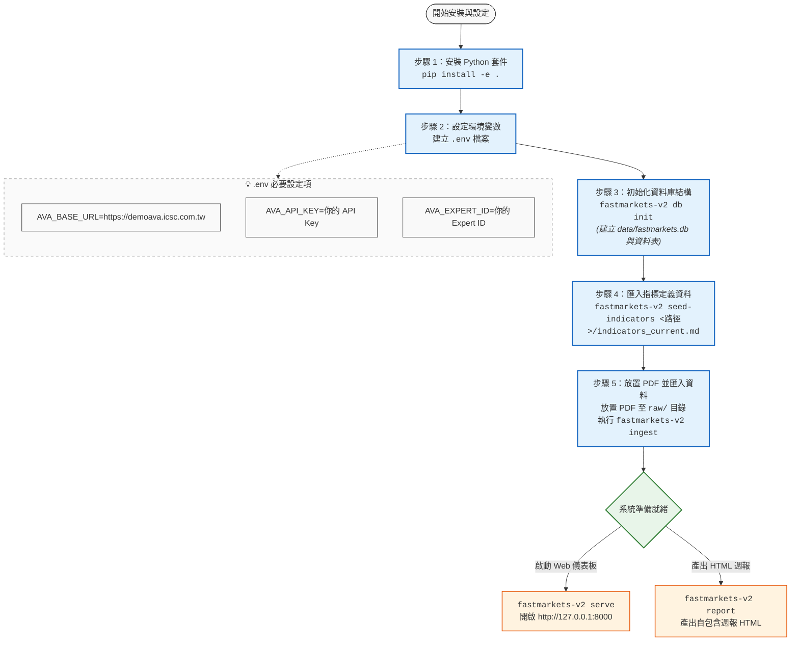

# Fastmarkets V2 安裝與設定流程

本文件說明 **Fastmarkets V2** 專案的安裝、設定與初始資料庫建立流程。

---

## 流程圖



---

## 詳細步驟說明

### 步驟 1：安裝 Python 套件
在專案根目錄下以開發模式安裝套件與相依函式庫：
```bash
pip install -e .
```

### 步驟 2：建立並設定 `.env`
在專案根目錄下建立 `.env` 檔案，並填入 Ava API 連線資訊：
```env
AVA_BASE_URL=https://demoava.icsc.com.tw
AVA_API_KEY=你的 API Key
AVA_EXPERT_ID=你的 Expert ID
```

### 步驟 3：初始化 SQLite 資料庫
建立 `data/fastmarkets.db` 以及所需資料表（`indicator`, `price_weekly`, `summary`）：
```bash
fastmarkets-v2 db init
```

### 步驟 4：匯入指標定義
將各鋼鐵產品規格與指標定義匯入資料庫：
```bash
fastmarkets-v2 seed-indicators path/to/indicators_current.md
```

### 步驟 5：匯入 PDF 原始報告
將 Fastmarkets Daily PDF 報告檔案放置於 `raw/` 資料夾，接著執行自動掃描與批次匯入：
```bash
# 批次匯入所有尚未處理的 PDF
fastmarkets-v2 ingest

# 或匯入指定檔案
fastmarkets-v2 ingest --file raw/20260708.pdf
```

---

## 常用操作指令速查

| 指令 | 說明 | 備註 |
| :--- | :--- | :--- |
| `fastmarkets-v2 serve` | 啟動 Web 儀表板 | 預設監聽 `http://127.0.0.1:8000` |
| `fastmarkets-v2 report` | 產出最近週三的 HTML 週報 | 預設存至 `output/YYYY/MM/` |
| `fastmarkets-v2 db stats` | 查詢資料庫目前紀錄統計 | 顯示指標數、價格筆數、摘要篇數 |
