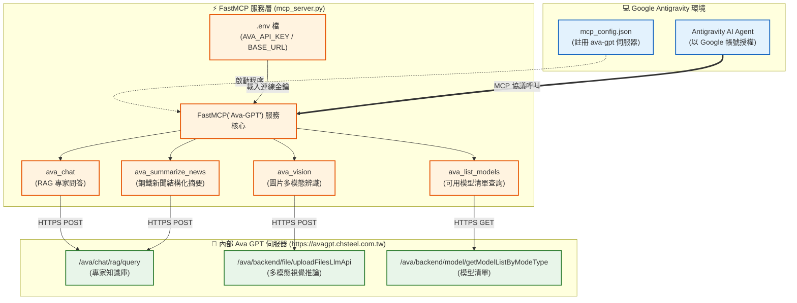

# Ava GPT MCP 整合工具指南 (mcp_server_guide.md)

本文件詳細說明 `mcp_server.py` 的架構設計、Model Context Protocol (MCP) 整合方式、提供的工具函式、環境變數配置以及在 **Google Antigravity** 中的使用方式。

---

## 1. 模組定位與架構概觀

`mcp_server.py` 是一個基於 **FastMCP** 框架建構的 MCP Server，作為 **Google Antigravity** 與內部 **Ava GPT 服務** 之間的雙向橋樑。

透過此 MCP 伺服器，Antigravity Agent 能在保持 Google 帳號授權的同時，直接調用公司內部 Ava GPT 專家知識庫、視覺多模態辨識以及鋼鐵新聞結構化摘要等專屬能力。

---

## 2. 系統架構流程圖



---

## 3. 環境設定與配置

### ① 專案環境變數 (`.env`)
MCP 伺服器會自動載入專案根目錄的 `.env` 檔案：

```env
AVA_BASE_URL=https://avagpt.chsteel.com.tw
AVA_API_KEY=ak_xpPY9id4YhRacNYx0dlnhw8JERfckxtZIsxbbWPHIk
AVA_EXPERT_ID=28999566-b676-4449-aa41-0077857ace8a
```

| 變數名稱 | 說明 | 預設值 |
| :--- | :--- | :--- |
| `AVA_BASE_URL` | Ava GPT 伺服端點網址 | `https://avagpt.chsteel.com.tw` |
| `AVA_API_KEY` | 內部 API 驗證金鑰 | `""` |
| `AVA_EXPERT_ID` | 預設對話的專家 ID | `28999566-b676-4449-aa41-0077857ace8a` |

---

### ② 全域 MCP 註冊 (`mcp_config.json`)
在 `~/.gemini/config/mcp_config.json` 中配置，利用 `uv` 執行環境自動解析套件：

```json
{
  "mcpServers": {
    "ava-gpt": {
      "command": "C:/Users/ch26788/.local/bin/uv.exe",
      "args": [
        "run",
        "--directory",
        "C:/aiTest/fastmarkets-daily-v2",
        "--with",
        "fastmcp",
        "--with",
        "requests",
        "--with",
        "python-dotenv",
        "python",
        "C:/aiTest/fastmarkets-daily-v2/mcp_server.py"
      ]
    }
  }
}
```

---

## 4. MCP 工具清單與參數說明

### 1. `ava_health_check`
- **功能**：檢測內部 Ava GPT 伺服器的連線狀態、API-Key 驗證與模型推論端點反應時間（延遲分析）。
- **參數**：無。
- **回傳**：即時系統健康報告（包含 Web Gateway 狀態、模型數量與 RAG 端點延遲）。

---

### 2. `ava_chat`
- **功能**：向內部 Ava GPT 專家發送提問，並取得基於知識庫的回答 (RAG 對話模式)。
- **參數**：
  - `prompt` (`str`, 必填)：要向 Ava GPT 詢問的問題或指令。
  - `expert_id` (`str`, 選填)：指定的專家 ID。未填時自動沿用 `.env` 的 `AVA_EXPERT_ID`。
  - `timeout` (`int`, 選填，預設 `120`)：請求逾時秒數。
- **回傳**：純文字回答內容及 Token 使用量統計。

---

### 2. `ava_vision`
- **功能**：上傳圖片至 Ava GPT 進行多模態辨識、圖表判讀與文字提取。
- **參數**：
  - `image_path` (`str`, 必填)：本機圖片路徑（支援 `.jpg`, `.jpeg`, `.png`, `.gif`, `.webp`, `.pdf`）。
  - `prompt` (`str`, 選填，預設 `"請描述這張圖片的內容"` )：針對圖片的提問或分析指示。
  - `model_list_id` (`str`, 選填，預設 `"12"` 為 `caf-azure-gpt-4o`)：多模態模型 ID。
  - `timeout` (`int`, 選填，預設 `120`)：請求逾時秒數。
- **回傳**：圖像分析結果文字與 Token 統計。

---

### 3. `ava_list_models`
- **功能**：查詢 Ava GPT 平台上所有可用的 LLM 模型清單、供應商與啟用狀態。
- **參數**：
  - `mode_type` (`str`, 選填，預設 `"search"`)：模型分類篩選。
- **回傳**：格式化表格字串（包含 Model ID、模型名稱、供應商與啟用狀態）。

---

### 4. `ava_summarize_news`
- **功能**：將鋼鐵產業新聞原文送入 Ava GPT，輸出結構化的繁體中文 JSON 摘要。
- **參數**：
  - `article_text` (`str`, 必填)：鋼鐵新聞英文原文。
- **回傳**：包含標題、市場區域、摘要、關鍵價格、市場情緒的 JSON 字串。

---

## 5. 在 Google Antigravity 中的使用範例

在與 Antigravity 對話時，您可以直接使用自然語言指示 Agent 使用 Ava 工具：

### 範例 1：查詢 Ava 平台模型
> **使用者**：「請幫我查詢 Ava GPT 平台目前支援哪些 AI 模型？」
> **Agent 行為**：自動調用 `ava_list_models()` 並回報模型清單。

### 範例 2：專家知識庫提問
> **使用者**：「請透過 Ava GPT 專家查詢最新鋼鐵市場分析方針。」
> **Agent 行為**：自動調用 `ava_chat(prompt="最新鋼鐵市場分析方針")`。

### 範例 3：圖片與圖表辨識
> **使用者**：「請用 Ava 多模態模型分析這張報表截圖 C:/data/chart.png」
> **Agent 行為**：自動調用 `ava_vision(image_path="C:/data/chart.png", prompt="請分析報表中的趨勢")`。

---

## 6. 注意事項與容錯設計

1. **網路逾時處理**：內部模型推論可能因伺服器負載耗時較長，工具內建可自訂 `timeout` 參數（預設 120 秒），若逾時會給予友善提示而非造成進程崩潰。
2. **多模態格式相容**：自動根據副檔名判定 MIME Type，並在缺少檔案時回傳防禦性錯誤訊息。
3. **無縫共用環境設定**：MCP Server 程式碼與 Fastmarkets 專案共用同一個 [`.env`](file:///C:/aiTest/fastmarkets-daily-v2/.env)，金鑰更新時無需重複修改多個設定檔。
