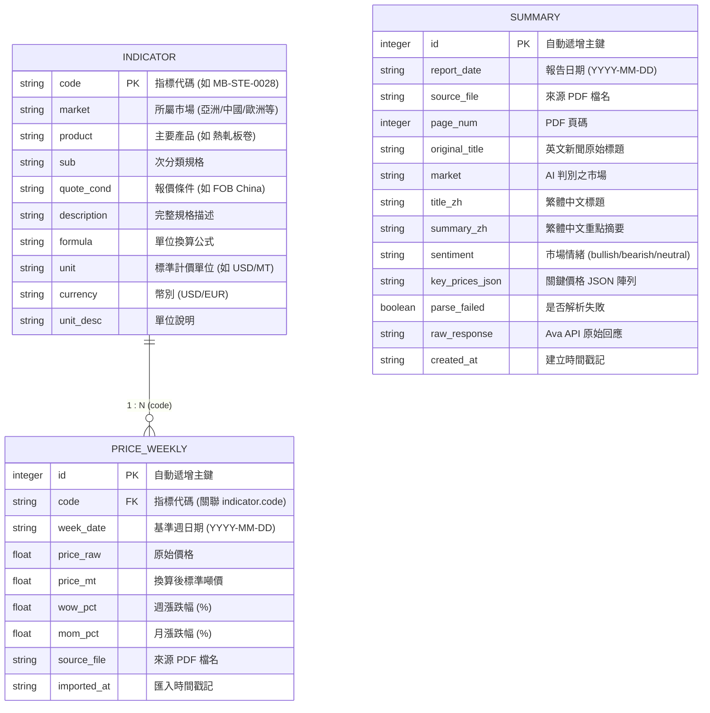

# Fastmarkets V2 — 資料模型與資料表結構 (models.py) 說明

本文件詳細說明 `src/fastmarkets_v2/models.py` 中的 SQLAlchemy ORM 資料模型、實體關聯圖（ER Diagram）、資料表結構與約束條件。

---

## 1. 模組定位

`models.py` 是本專案的 **資料庫結構與 ORM 模型定義中心**，基於 **SQLAlchemy 2.0+** 的 `DeclarativeBase` 建構。定義了系統中用以儲存鋼鐵指標規格、每週價格走勢以及 AI 新聞摘要的三大核心實體表。

---

## 2. 實體關聯圖 (ER Diagram)

---

## 3. 資料表詳細欄位定義

### ① 指標定義表：`Indicator` (`indicator`)
儲存所有追蹤的鋼鐵規格定義與計價公式。

| 欄位名稱 | 型別 | 屬性 | 說明 |
| :--- | :--- | :--- | :--- |
| `code` | `String` | **Primary Key** | 指標代碼（如 `MB-STE-0028`） |
| `market` | `String` | 可為空 | 所屬市場（如 `中國`、`亞洲`、`歐洲`、`美國`） |
| `product` | `String` | 可為空 | 鋼鐵品項（如 `熱軋板卷`、`冷軋板卷`、`螺紋鋼`） |
| `sub` | `String` | 可為空 | 次規格／子分類說明 |
| `quote_cond` | `String` | 可為空 | 報價條件（如 `FOB China`、`CFR Vietnam`） |
| `description` | `String` | 可為空 | 完整規格描述文字 |
| `formula` | `String` | 可為空 | 價格轉換為噸價的換算公式（如 `USD/CWT * 22.0462`） |
| `unit` | `String` | 可為空 | 標準計價單位（預設 `USD/MT` 或 `EUR/MT`） |
| `currency` | `String` | 可為空 | 計價幣別（`USD`、`EUR`） |
| `unit_desc` | `String` | 可為空 | 單位額外描述 |

---

### ② 每週價格歷史表：`PriceWeekly` (`price_weekly`)
儲存每週從 PDF 解析出的各指標價格與漲跌幅。

| 欄位名稱 | 型別 | 屬性 | 說明 |
| :--- | :--- | :--- | :--- |
| `id` | `Integer` | **Primary Key**, 自增 | 唯一紀錄識別碼 |
| `code` | `String` | **Foreign Key** (`indicator.code`), NOT NULL | 對應的指標代碼 |
| `week_date` | `String` | NOT NULL | 對齊到週三的基準日期（格式：`YYYY-MM-DD`） |
| `price_raw` | `Float` | 可為空 | PDF 原始擷取數值 |
| `price_mt` | `Float` | 可為空 | 依據公式換算為標準「每公噸價格（MT）」 |
| `wow_pct` | `Float` | 可為空 | 週環比漲跌幅百分比（Week-over-Week %） |
| `mom_pct` | `Float` | 可為空 | 月環比漲跌幅百分比（Month-over-Month %） |
| `source_file` | `String` | 可為空 | 擷取自哪一份原始 PDF 檔名 |
| `imported_at` | `String` | 預設 `func.now()` | 資料寫入時間 |

> **唯一性約束（Unique Constraint）**：`(code, week_date)` 組合唯一，確保同一個指標在同一週不會有重複價格紀錄。

---

### ③ 新聞中文摘要表：`Summary` (`summary`)
儲存透過 Ava LLM 解析出的新聞繁中摘要與市場情緒分析。

| 欄位名稱 | 型別 | 屬性 | 說明 |
| :--- | :--- | :--- | :--- |
| `id` | `Integer` | **Primary Key**, 自增 | 唯一紀錄識別碼 |
| `report_date` | `String` | 可為空 | 報告日期（`YYYY-MM-DD`） |
| `source_file` | `String` | NOT NULL | 來源 PDF 檔案名稱 |
| `page_num` | `Integer` | 可為空 | 所在 PDF 頁碼（0-indexed） |
| `original_title`| `String` | 可為空 | 英文原始新聞標題 |
| `market` | `String` | 可為空 | 所屬市場區域（美國／歐洲／亞洲／中國／其他） |
| `title_zh` | `String` | 可為空 | AI 翻譯與生成的繁中標題 |
| `summary_zh` | `String` | 可為空 | AI 生成的繁中精簡摘要（200字以內） |
| `sentiment` | `String` | 可為空 | 市場情緒標籤（`bullish` / `bearish` / `neutral`） |
| `key_prices_json`| `String` | 可為空 | 結構化關鍵價格清單（JSON 格式字串） |
| `parse_failed` | `Boolean` | 預設 `False` | 是否解析失敗或格式異常 |
| `raw_response` | `String` | 可為空 | Ava API 回傳的原始文字（便於除錯） |
| `created_at` | `String` | 預設 `func.now()` | 建立時間戳記 |

> **唯一性約束（Unique Constraint）**：`(source_file, page_num)` 組合唯一，避免同一份 PDF 的同一頁重複生成並寫入資料庫。
