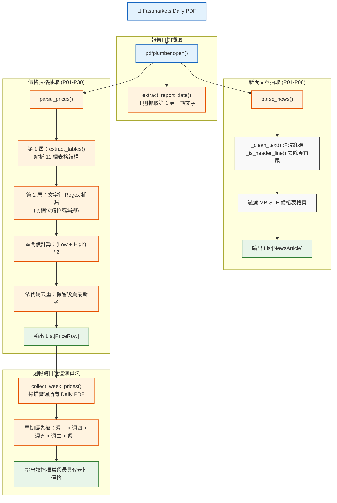

# Fastmarkets V2 — PDF 解析核心 (parser.py) 說明

本文件詳細說明 `src/fastmarkets_v2/parser.py` 的架構、PDF 解析機制、價格容錯抽取策略、跨日選值演算法以及資料結構。

---

## 1. 模組定位

`parser.py` 是本專案的 **PDF 報告抽取與資料清洗核心**，基於 **`pdfplumber`** 與 **正則表達式（Regex）** 建構。主要職責包括：
1. **新聞抽取與文字清洗**（過濾頁首、頁尾、版權宣告與特殊控制字元）。
2. **價格表格解析與雙層容錯**（支援價格區間計算中位數、月漲跌百分比提取，並以純文字掃描作為 Fallback）。
3. **跨日 PDF 週價智慧選值演算法**（週報模式下綜合多天 Daily PDF 挑選最優評估值）。
4. **標準噸價公式換算**。

---

## 2. 處理流程與架構圖



---

## 3. 資料結構定義 (Dataclasses)

### ① `NewsArticle` (新聞物件)
```python
@dataclass
class NewsArticle:
    title: str       # 新聞標題（預設取首行文字）
    body: str        # 清洗後的完整新聞內文
    page: int        # 所在 PDF 頁碼（1-indexed）
    day_label: str   # 週報模式下的來源日期標籤（如 "05-27"）
```

### ② `PriceRow` (價格列物件)
```python
@dataclass
class PriceRow:
    symbol: str              # 指標代碼（如 MB-STE-0028）
    description: str         # 品名與規格說明
    date: str                # 評估日期字串（如 "10 Jun 2026"）
    price: Optional[float]   # 價格數值（若為區間則為中位數）
    change_month: Optional[float] # 月環比漲跌幅百分比
    monthly_avg: Optional[float]  # 月均價
    page: int                # 所在 PDF 頁碼
    source_day: str          # 來源星期標記
    price_mt_override: float | None # 直接指定噸價覆蓋值（可選）
```

---

## 4. 核心函式詳細解析

### ① `parse_news(pdf_path, page_start=0, page_end=6) -> list[NewsArticle]`
- **範圍**：預設讀取 PDF 前 6 頁。
- **文字清理**：
  - `_clean_text()`：移除 ASCII 控制字元與亂碼殘留。
  - `_is_header_line()`：自動辨識並移除 Fastmarkets 頁首、版權宣告、CSC 內部郵件轉發字樣等雜訊。
- **過濾機制**：若頁面內包含 `MB-STE-\d{4}` 價格代碼，代表該頁為價格表，自動跳過以防誤當新聞。

---

### ② `parse_prices(pdf_path, page_start=0, page_end=30) -> list[PriceRow]`
- **雙層抽取架構**：
  1. **第一層（表格抽取）**：利用 `page.extract_tables()` 解析 Fastmarkets 的 11 欄標準價格表格，計算區間中位數與月漲跌幅。
  2. **第二層（純文字 Fallback）**：針對部分品項因版面換行導致表格解析欄位錯位或遺漏的情況，使用正則表達式（`_TEXT_RE_A` 與 `_TEXT_RE_B`）從純文字逐行重掃並補足遺漏的指標。
- **去重邏輯**：當同一個 `symbol` 在多頁出現時，保留頁碼最大（後頁）的一筆。

---

### ③ `collect_week_prices(pdf_paths, week_monday) -> dict[str, tuple[PriceRow, Path]]`
- **目的**：在週報模式下，跨當週多份 Daily PDF 為每個指標挑出最正確的「當週代表價」。
- **選值優先序規則**：
  1. **評估日期優先**：取評估日落在本週（週一至週五）且日期最新的紀錄。
  2. **來源星期權重**：同評估日若出現在多份 PDF，依星期偏好權重挑選：**週三 (5) > 週四 (4) > 週五 (3) > 週二 (2) > 週一 (1)**。
  3. **歷史值 Fallback**：若全週皆未評估該品項，則沿用最後已知值。

---

### ④ `convert_price(price: float, formula: str) -> float`
- **目的**：依據指標定義的公式，將不同計價單位（如每短噸、每英擔 CWT 等）轉換為統一的標準「每公噸（MT）」價格。
