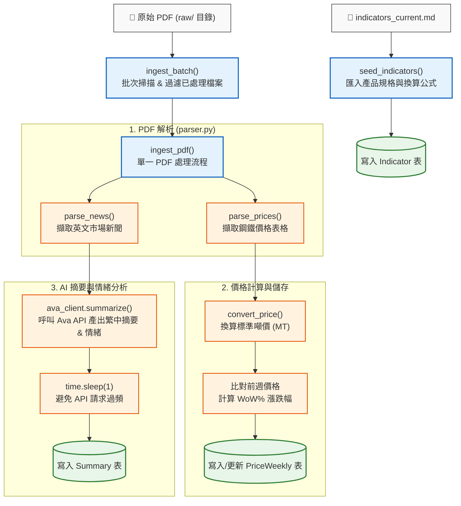

# Fastmarkets V2 — Pipeline 架構與運作說明

本文件詳細說明 `src/fastmarkets_v2/pipeline.py` 的核心架構、資料處理流程（ETL）、主要函式以及設計機制。

---

## 1. 模組定位

`pipeline.py` 是本專案的 **ETL 資料處理管道（Data Pipeline）**，負責協調以下三大環節：
1. **PDF 解析**（透過 `parser.py`）
2. **AI 中文摘要與情緒分析**（透過 `ava_client.py` 呼叫 Ava API）
3. **資料持久化**（透過 SQLAlchemy ORM 與 `models.py` 存入 SQLite 資料庫）

---

## 2. 處理流程圖

---

## 3. 主要函式詳細說明

### ① `seed_indicators(md_path: Path, session: Session) -> int`
- **目的**：匯入鋼鐵規格與價格指標定義（種子資料）。
- **邏輯**：
  1. 讀取 Markdown 檔案（如 `indicators_current.md`）。
  2. 使用正則表達式解析表格內容，提取：
     - 指標代碼（如 `MB-STE-0028`）
     - 市場分類（如 `中國`、`亞洲`、`歐洲`）
     - 產品名稱、規格條件
     - 換算公式（如 `USD/CWT * 22.0462`）
     - 幣別與計價單位
  3. 寫入或更新至 `Indicator` 資料表。

### ② `ingest_pdf(pdf_path: Path, session: Session) -> dict`
- **目的**：執行單份 PDF 報告的完整資料擷取與入庫流程。
- **價格處理**：
  1. 呼叫 `parser.parse_prices()` 提取價格資料。
  2. 依據指標公式進行單位換算（`parser.convert_price()`），轉換成統一標準的「噸價（USD/MT 或 EUR/MT）」。
  3. 自動查詢資料庫中前一週的價格記錄，計算週環比漲跌幅（`wow_pct`）。
  4. 儲存至 `PriceWeekly` 資料表。
- **新聞處理**：
  1. 呼叫 `parser.parse_news()` 提取各頁新聞內文。
  2. 呼叫 `ava_client.summarize(article.body)` 經由 Ava LLM API 產出繁體中文標題、內文摘要、市場分類與情緒標籤（sentiment）。
  3. API 呼叫間隔等待 1 秒（`time.sleep(1)`），避免超過 API 頻率限制。
  4. 儲存至 `Summary` 資料表；若解析異常則標記 `parse_failed=True`。

### ③ `ingest_batch(raw_dir: Path | None = None) -> dict`
- **目的**：批次掃描並匯入目錄下的所有 PDF 檔案。
- **邏輯**：
  1. 遞迴搜尋 `raw/` 目錄下的所有 `.pdf` 檔案。
  2. 查詢資料庫中已處理過的檔案名稱（`Summary.source_file`）。
  3. **自動略過已存在的 PDF**（增量匯入），僅針對新檔案執行 `ingest_pdf()`。
  4. 回傳已處理檔案數、新聞篇數與價格筆數統計。

### ④ `_filename_to_week_date(pdf_path: Path) -> str`
- **目的**：日期標準化。
- **邏輯**：從 PDF 檔案名稱解析出 YYYYMMDD 日期，並將其**對齊（Snap）至該週的「週三」**，確保每週數據的時間基準一致。

---

## 4. 關鍵設計機制

| 機制 | 實作方式 | 好處 |
| :--- | :--- | :--- |
| **增量匯入** | 比對資料庫內已處理的 `source_file` 清單 | 避免重複執行時重複消耗 Ava API 額度與重複寫入 DB |
| **限速保護** | 每次 Ava API 呼叫後暫停 1 秒 (`time.sleep(1)`) | 確保請求穩定，避免觸發遠端 API 限流 (Rate Limit) |
| **容錯機制** | 當 AI 摘要解析異常時，記錄 `parse_failed=True` 及原始回應 | 單一新聞解析異常不中斷整體流程，便於後續除錯排查 |
