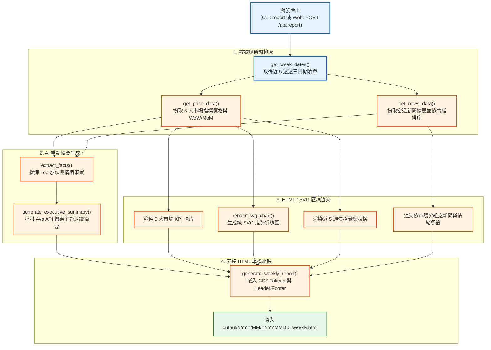

# Fastmarkets V2 — 週報產出核心 (report.py) 說明

本文件詳細說明 `src/fastmarkets_v2/report.py` 的架構、自包含 HTML 週報產出流程、SVG 純向量圖表繪製、AI 本週重點生成以及列印支援機制。

---

## 1. 模組定位

`report.py` 是本專案的 **自動化週報產出引擎**。主要職責包括：
1. **資料聚合**：整合資料庫中近 5 週價格趨勢、指標漲跌（WoW/MoM）與當週新聞摘要。
2. **AI 高階主管摘要**：透過 Ava API 自動撰寫 3-5 句精簡的「本週重點（Executive Summary）」。
3. **無外部依賴渲染**：使用純 Python 產生**原生 SVG 折線圖**，產出的 HTML 為自包含單檔，無需連網下載外部 JS/CSS。
4. **專業列印排版**：內建 `@media print` A4 橫向列印樣式與防分頁裁切機制。

---

## 2. 週報產出架構與流程圖



---

## 3. 週報四大核心版塊

### ① 本週重點（Executive Summary & KPI Cards）
- **KPI 卡片**：精選 5 大市場代表性商品（如美國板材 `MB-STE-0184`、歐洲板材 `MB-STE-0892`、越南 `MB-STE-0139` 等），展示最新價格與 WoW 漲跌幅（含箭頭與漲紅跌綠色彩）。
- **AI 速讀摘要**：整合波動最大品項與市場新聞情緒，由 Ava AI 生成 3-5 句精練分析，供主管 30 秒掌握全貌。

---

### ② 一、價格趨勢（純 SVG 向量圖表）
- 由 `render_svg_chart()` 動態計算 X/Y 座標與網格線。
- **特點**：
  - 純 SVG 繪製，無須載入 ECharts 或 Chart.js，體積輕巧且列印清晰。
  - 末端自動標記最新點位與價格標籤。
  - 支援色盲友善的高對比色彩調色盤（`_CHART_COLORS`）。

---

### ③ 二、價格指標彙總（Price Summary Table）
- 依 5 大市場（美國板材、美國鋼管、歐洲板材、越南市場、鋼胚市場）分組。
- 展示近 5 週完整歷史價格數列，最新當週價格以**黃底高亮（`.cur-col`）**強調。
- 自動計算標註 **WoW（週環比）** 與 **MoM（月環比）** 漲跌幅。

---

### ④ 三、市場新聞摘要（Market News）
- 依市場區域（美國、歐洲、中國、亞洲、其他）分區展示。
- **排序邏輯**：負面新聞（`bearish`）優先排在前面，輔以中性（`neutral`）與正面（`bullish`）。
- 標註情緒徽章與來源 PDF 檔名及頁碼。

---

## 4. 關鍵函式說明

| 函式名稱 | 說明 |
| :--- | :--- |
| `get_week_dates(session, week_date, n=5)` | 查詢小於等於指定日期的最近 5 週週三清單 |
| `get_price_data(session, week_dates)` | 依市場順序整理各指標近 5 週價格與最新漲跌幅 |
| `get_news_data(session, week_date)` | 取得當週（週一至週五）的新聞摘要，依市場與情緒排序 |
| `extract_facts(...)` | 提煉當週 Top Movers 與新聞情緒統計，作為 AI Prompt 事實依據 |
| `render_svg_chart(...)` | 純 Python 繪製 560x200 響應式 SVG 折線圖 |
| `generate_weekly_report(...)` | 主進入點：組裝完整 HTML 檔案並儲存至 `output/` 目錄 |

---

## 5. 列印與輸出特性

- **輸出路徑**：預設為 `output/{年}/{月}/{YYYYMMDD}_weekly.html`。
- **列印樣式支援**：
  ```css
  @media print {
      @page { size: A4 landscape; margin: 10mm; }
      .chart-group, .table-group, .news-item { page-break-inside: avoid; }
  }
  ```
  直接在瀏覽器按下 `Ctrl + P` 即可完美列印成 A4 橫向報表或儲存為 PDF，表格與圖表自動避免被跨頁裁切。
