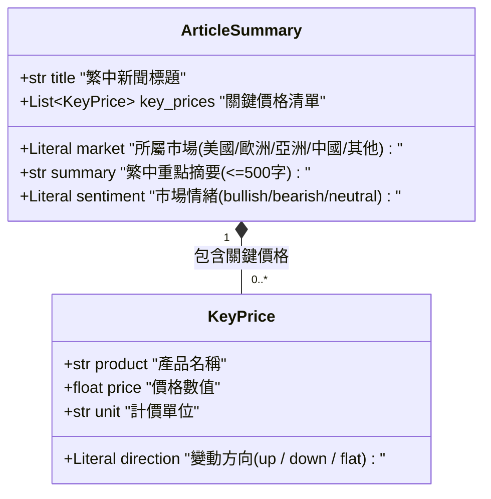
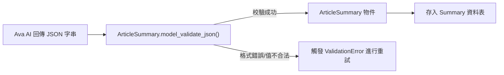

# Fastmarkets V2 — 資料驗證與結構定義 (schemas.py) 說明

本文件詳細說明 `src/fastmarkets_v2/schemas.py` 的架構、Pydantic 模型定義、型別約束以及其在 AI 結構化輸出解析中的作用。

---

## 1. 模組定位

`schemas.py` 是本專案的 **資料驗證與強型別結構定義中心**，基於 **Pydantic V2** 建構。其主要職責包括：
1. **規範 AI 結構化輸出格式**：作為 Prompt 生成與輸出規格的參照契約。
2. **自動型別校驗與轉換**：解析 Ava AI 回傳的 JSON 字串，自動驗證欄位、限制枚舉值（Literal）與檢查字數長度。
3. **配合重試機制**：若 AI 回傳內容不符合 Schema 規範，觸發驗證異常以利 `ava_client.py` 執行重新請求。

---

## 2. 資料結構架構圖



---

## 3. Pydantic 模型詳細解析

### ① `KeyPrice` (關鍵價格模型)
用於捕捉單篇新聞內提及的具體價格點位。

```python
class KeyPrice(BaseModel):
    product: str
    price: float
    unit: str
    direction: Literal["up", "down", "flat"]
```

| 欄位名稱 | 型別 | 限制／說明 | 範例 |
| :--- | :--- | :--- | :--- |
| `product` | `str` | 鋼鐵品項名稱 | `"熱軋板卷"` |
| `price` | `float` | 價格數值（強制轉換為浮點數） | `650.0` |
| `unit` | `str` | 計價單位 | `"USD/MT"` |
| `direction` | `Literal` | 嚴格限定為 `"up"`（上漲）、`"down"`（下跌）或 `"flat"`（持平） | `"up"` |

---

### ② `ArticleSummary` (新聞摘要主模型)
由 Ava AI 解析英文新聞後產出的完整結構化物件。

```python
class ArticleSummary(BaseModel):
    title: str
    market: Literal["美國", "歐洲", "亞洲", "中國", "其他"]
    summary: str = Field(max_length=500)
    key_prices: list[KeyPrice] = []
    sentiment: Literal["bullish", "bearish", "neutral"]
```

| 欄位名稱 | 型別 | 限制／說明 | 範例 |
| :--- | :--- | :--- | :--- |
| `title` | `str` | AI 翻譯與提煉之繁體中文標題 | `"歐洲熱軋價格因需求疲軟小幅下跌"` |
| `market` | `Literal` | 嚴格限定為 5 大市場：`"美國"`、`"歐洲"`、`"亞洲"`、`"中國"`、`"其他"` | `"歐洲"` |
| `summary` | `str` | 繁中重點摘要，限制最大長度 500 字 | `"本週歐洲鋼廠因終端需求不振..."` |
| `key_prices` | `list[KeyPrice]` | 內文中提及的重點價格列表（預設為空清單 `[]`） | `[KeyPrice(...)]` |
| `sentiment` | `Literal` | 市場情緒標籤，嚴格限定為 `"bullish"`（看漲）、`"bearish"`（看跌）或 `"neutral"`（中性） | `"bearish"` |

---

## 4. 運作流程與使用情境



### 使用範例（於 `ava_client.py` 中）：
```python
from fastmarkets_v2.schemas import ArticleSummary

# 解析與驗證 AI 回傳的 JSON
summary_obj = ArticleSummary.model_validate_json(json_str)

print(summary_obj.title)
print(summary_obj.sentiment)  # 保證一定是 "bullish" / "bearish" / "neutral"
```
