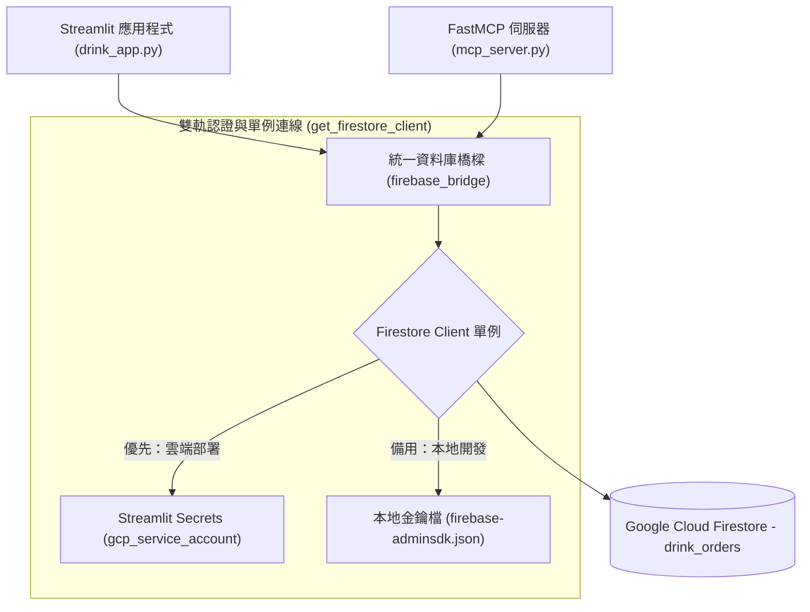

# 🗄️ Firestore 資料庫橋樑 - `db_logic.py` 程式架構與功能詳解

本手冊針對專案的資料存取層 [`db_logic.py`](file:///c:/aiTest/mcp-drink-main/db_logic.py) 進行全方位的架構剖析、連線機制與 CRUD 操作說明。

---

## 📌 程式概述

`db_logic.py` 是本系統與 **Google Cloud Firestore (Firebase)** 溝通的專用橋樑模組 (Database Access Layer)。它採用 **單例模式 (Singleton Pattern)** 管理資料庫連線，並提供 **雙軌認證機制**（本地金鑰檔 / 雲端 Streamlit Secrets），將資料庫的 新增 (Create)、讀取 (Read)、更新 (Update)、刪除 (Delete) 封裝為統一且安全的呼叫介面。



---

## 🧩 核心功能模組與技術特點

### 1. 單例連線管理 (`get_firestore_client`)
* **防止連線過載**：透過全域變數 `_db_client` 確保整個應用程式生命週期內只初始化一次 Firestore Client，避免 Streamlit 頻繁重新整理 (Rerun) 或 MCP 工具高頻呼叫時發生連線洩漏與資源浪費。
* **防呆防崩潰**：若金鑰遺失或連線失敗，會記錄詳細 `logging.error` 並優雅回傳 `None`，防止程式直接 Crash。

### 2. 雙軌認證策略 (Hybrid Authentication)
* **策略 A：Streamlit Secrets 雲端憑證 (優先)**
  - 適用於部署在 Streamlit Community Cloud、Vercel 等雲端 PaaS 環境。
  - 直接從 `st.secrets["gcp_service_account"]` 字典還原 Service Account 憑證，並自動修正私鑰中的換行符號 (`\n`)。
* **策略 B：本地 JSON 金鑰檔 (回退備用)**
  - 適用於本地開發與偵錯環境。
  - 自動搜尋同目錄下的 [`firebase-adminsdk.json`](file:///c:/aiTest/mcp-drink-main/firebase-adminsdk.json) 進行載入。

---

## 🛠️ 函式介面與 API 詳細說明

### 1. 核心溝通橋樑 `firebase_bridge(action, data=None, doc_id=None)`

全系統唯一的 CRUD 統一入口函式，根據 `action` 參數執行不同行為：

```python
def firebase_bridge(action, data=None, doc_id=None):
    ...
```

| `action` 參數 | 說明 | 必填參數 | 回傳值 |
| :--- | :--- | :--- | :--- |
| **`"push"`** | 新增訂單資料 | `data` (字典) | `{"id": doc_ref.id}` (成功時回傳新文件 ID) |
| **`"fetch"`** | 查詢所有訂單 (依時間倒序) | 無 | `[{"id": "...", "name": "...", ...}, ...]` (訂單清單) |
| **`"update"`** | 修改特定訂單欄位 | `doc_id`, `data` | `True` (成功) / `None` (失敗) |
| **`"delete"`** | 刪除特定訂單 | `doc_id` | `True` (成功) / `None` (失敗) |

#### 資料庫集合 (Collection) 與結構規格
* 預設寫入的集合名稱為：**`drink_orders`**
* 資料結構標準範例：
  ```json
  {
    "id": "7kR2X9aB3...",
    "name": "王大明",
    "item": "粉粿桂花檸檬",
    "spec": "三分甜/微冰",
    "toppings": "草菇",
    "price": 75,
    "timestamp": "2026-08-30T10:00:00.000000"
  }
  ```

---

### 2. 便捷輔助函式 (Helper Functions)

為提升程式碼可讀性，模組額外提供了語意化的捷徑函式：

```python
# 獲取雲端所有點餐資料
def fetch_cloud_orders():
    return firebase_bridge("fetch")

# 新增一筆點餐資料到 Firestore
def add_cloud_order(order_data):
    return firebase_bridge("push", data=order_data)
```

---

## 🔒 安全防護與維運守則

1. **金鑰安全規範**：
   - [`firebase-adminsdk.json`](file:///c:/aiTest/mcp-drink-main/firebase-adminsdk.json) 包含 GCP 最高權限之私鑰，專案的 `.gitignore` 必須嚴格忽略此檔案，嚴禁提交至 GitHub 公開倉庫。
2. **時間戳排序保證**：
   - 每次執行 `"push"` 時，系統會自動注入 ISO 8601 時間戳記 (`datetime.now().isoformat()`)。
   - 每次執行 `"fetch"` 時，均使用 `order_by("timestamp", direction=firestore.Query.DESCENDING)`，確保前端與 AI 獲取的始終為最新訂單。
