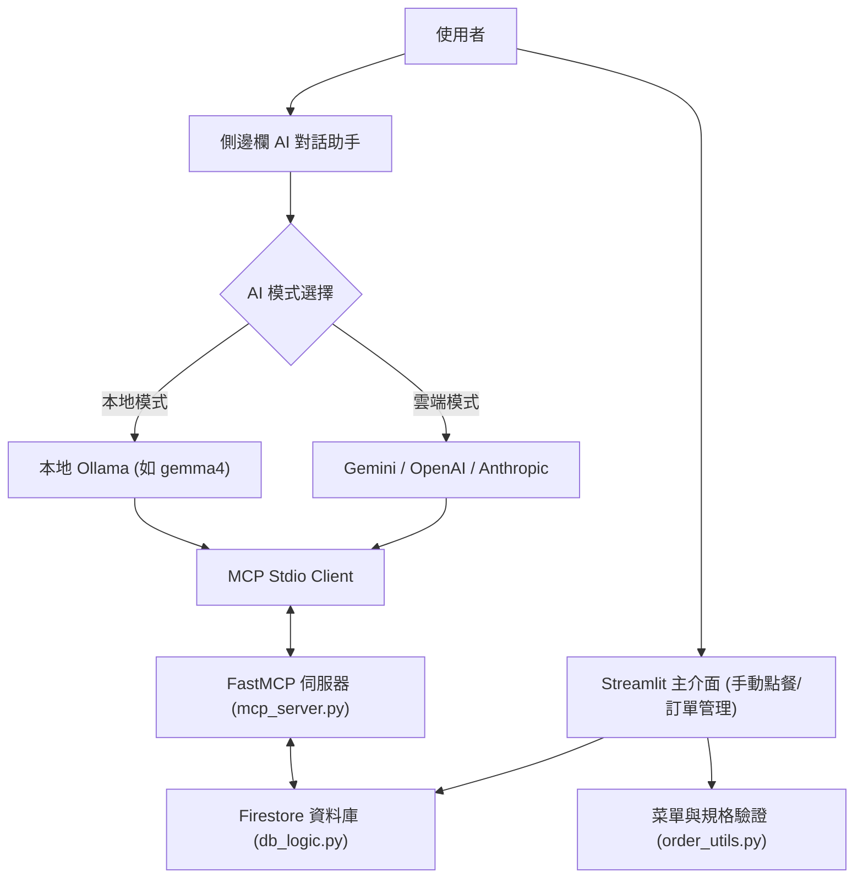

# 🥤 一沐日雲端點餐系統 - `drink_app.py` 程式架構與功能詳解

本手冊針對專案核心應用程式 [`drink_app.py`](file:///c:/aiTest/mcp-drink-main/drink_app.py) 進行全方位的架構剖析與功能說明。

---

## 📌 程式概述

`drink_app.py` 是一個基於 **Streamlit** 開發的互動式 Web 應用程式，專門用於「一沐日飲料點餐與訂單管理」。它結合了傳統的 **圖形化表單 (GUI)** 與最前沿的 **AI 智能對話點餐 (MCP 協定)**，並透過 **Google Cloud Firestore** 達成即時資料庫同步。



---

## 🧩 核心功能模組與技術架構

### 1. 雙模式 AI 引擎支援 (雲端 / 本地)
- **多雲端 AI 支援**：支援 **Google Gemini** (使用官方最新 `google-genai` SDK)、**OpenAI** (`gpt-4o-mini`) 及 **Anthropic** (`claude-3-5-sonnet-latest`)。
- **本地開源模型支援 (Ollama)**：
  - 自動呼叫本地 Ollama API (`http://localhost:11434/api/tags`) 偵測已安裝模型。
  - 支援無網路/免金鑰環境下的離線運行，優先預設推薦 `gemma4` 系列模型。
- **自動偵測金鑰**：優先讀取 `.streamlit/secrets.toml`，次之讀取系統環境變數 (`GOOGLE_API_KEY`, `OPENAI_API_KEY` 等)。

### 2. Model Context Protocol (MCP) 工具整合
- **Stdio 行程間通訊**：前端 Streamlit 透過 `mcp.client.stdio` 自動啟動並連接 [`mcp_server.py`](file:///c:/aiTest/mcp-drink-main/mcp_server.py)。
- **動態工具發現 (Tool Discovery)**：啟動時自動透過 `session.list_tools()` 獲取點餐伺服器支援的所有操作（點餐、改單、刪單、菜單查詢、重複訂單檢查等）。
- **Schema 相容性過濾 (`clean_schema`)**：
  - 遞迴過濾並修正 FastMCP 產生的 JSON Schema，自動移除 Gemini 不支援的 `additionalProperties` 與將 `anyOf` 降級為單一型態，避免觸發 Google Gemini 400 Bad Request 錯誤。

### 3. 圖形化手動點餐與表單連動
- **品項系列連動**：系列選單（如：原茶、奶茶、特調等）與飲品名稱即時雙向連動。
- **即時計價與加料計算**：根據所選加料（粉粿、草菇等）即時計算總金額。
- **編輯狀態管理 (`st.session_state.editing_order`)**：支援從訂單清單一鍵載入特定訂單至上方表單進行「修改」或「取消修改」。

### 4. 訂單清冊與管理維運
- **客製化 CSS 訂單表格**：採用簡潔俐落的 HTML/CSS 表格排版，內建直覺的「🛠️ 修改」與「🗑️ 刪除」按鈕。
- **重複訂單檢查面板**：
  - 🔍 **全局掃描重複訂單**：快速揪出同一人重複下單或同規格多訂的情況。
  - 📊 **查看重複訂單統計**：透過 AI 生成統計摘要。
  - 🔎 **單人重複查詢**：輸入姓名快速查找該人員所有紀錄。
- **CSV 報表匯出**：支援以 UTF-8-SIG 編碼一鍵匯出符合 Excel 格式的訂單清冊。

---

## 🔍 程式碼分段深度解析

### ▍第一段：環境設定與金鑰掃描 (Lines 1 ~ 83)
```python
# 消除 FutureWarning 警告，維持乾淨輸出
warnings.filterwarnings("ignore", category=FutureWarning)

# 自動取得本地 Ollama 模型清單
def get_local_ollama_models(): ...

# 掃描 st.secrets 與 os.environ 取得可用的 AI Provider
```
* **功能**：負責全域例外過濾、動態探測本地 Ollama 伺服器是否在線，並掃描設定檔中的 API 金鑰，建立可用 AI 服務商清單 `available_cloud_providers`。

---

### ▍第二段：MCP 配置與 Schema 轉化 (Lines 84 ~ 154)
```python
def get_mcp_params_from_claude_config(server_name="drink-server"): ...
def clean_schema(d): ...
```
* **`get_mcp_params_from_claude_config`**：優先嘗試讀取 Claude Desktop 的設定檔，若無則以當前 Python 直譯器 (`sys.executable`) 啟動本機專案內的 `mcp_server.py`。
* **`clean_schema`**：關鍵相容函式，將 Pydantic 匯出的完整 JSON Schema 簡化為 Gemini / OpenAI 能夠辨識的函式參數宣告格式。

---

### ▍第三段：AI 核心與非同步處理 (Lines 155 ~ 294)
```python
async def process_with_ai(user_input): ...
def drink_ai_agent(user_message: str) -> str: ...
```
* **`process_with_ai`**：
  1. 連接 MCP Stdio Client 並初始化 Session。
  2. 獲取工具列表並轉為對應 AI 供應商的 Function Calling 格式。
  3. 發送 Prompt 給 LLM，若 LLM 決定調用工具（`function_calls` / `tool_calls`），則由 MCP Client 執行 `session.call_tool`，並將後端執行的真實結果（如 Firestore 寫入成功）回傳給前端。
* **`drink_ai_agent`**：利用 `anyio.run` 或原生 `asyncio.new_event_loop()` 封裝非同步執行緒，確保在 Streamlit 的多執行緒事件迴圈中穩定執行不卡死。

---

### ▍第四段：手動點餐 UI 與狀態邏輯 (Lines 295 ~ 418)
```python
# 狀態管理
if "editing_order" not in st.session_state:
    st.session_state.editing_order = None
```
* 建立表單輸入區，提供「訂購人姓名」、「系列選擇」、「飲品連動」、「甜度/冰量」、「加好料多選」等控制元件。
* 點擊「🚀 同步至雲端」或「💾 儲存修改」時，將組裝好的資料物件寫入 Firestore (`add_cloud_order` / `firebase_bridge`)。

---

### ▍第五段：重複訂單檢查與清冊管理 (Lines 419 ~ 516)
* **重複訂單檢查區**：透過呼叫 `drink_ai_agent("搜尋全部有重複的訂單")` 結合 MCP 工具 `search_all_duplicates` 與 `find_duplicate_orders_by_name`，直觀呈現分析結果。
* **Query Params 操作解析**：解析 URL 參數 `?action=edit&id=xxx` 或 `?action=delete&id=xxx`，實現無跳轉狀態切換與刪除。
* **HTML/CSS 表格與 CSV 下載**：顯示總杯數、總金額統計，並提供 `st.download_button` 下載 CSV。

---

### ▍第六段：側邊欄 AI 對話助理 (Lines 517 ~ 613)
* **模式配置**：提供單選按鈕切換「☁️ 雲端 AI 模式」或「🏠 本地 Ollama 模式」。
* **Chat 聊天介面**：使用 `st.chat_message` 與 `st.chat_input` 呈現對話流，點餐完成後自動刷新訂單清冊畫面。

---

## 🛠️ 常用啟動指令

### 1. 使用 uv 啟動 Streamlit 應用程式 (推薦)
```bash
uv run streamlit run drink_app.py
```
預設將在瀏覽器開啟 `http://localhost:8501`。

### 2. 本地 Ollama 模式準備
若欲使用離線本地模式，請確保 Ollama 服務已啟動並下載模型：
```bash
ollama run gemma4
```

---

## 📋 相關依賴檔案說明

| 檔案 | 角色與用途 |
| :--- | :--- |
| [`mcp_server.py`](file:///c:/aiTest/mcp-drink-main/mcp_server.py) | 後端 FastMCP 服務，定義點餐、改單、刪單、菜單查詢與重複過濾等 Tool |
| [`db_logic.py`](file:///c:/aiTest/mcp-drink-main/db_logic.py) | Google Cloud Firestore 單例資料庫連線與 CRUD 操作橋樑 |
| [`order_utils.py`](file:///c:/aiTest/mcp-drink-main/order_utils.py) | 一沐日菜單資料庫、RapidFuzz 模糊名稱比對與甜度冰量規格驗證 |
| [`firebase-adminsdk.json`](file:///c:/aiTest/mcp-drink-main/firebase-adminsdk.json) | Google Cloud Firebase 管理員憑證金鑰 (注意請勿提交至 GitHub) |
