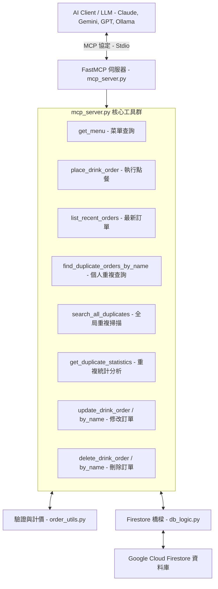

# 🥤 一沐日 MCP 伺服器 - `mcp_server.py` 程式架構與功能詳解

本手冊針對專案的 **FastMCP 後端伺服器** [`mcp_server.py`](file:///c:/aiTest/mcp-drink-main/mcp_server.py) 進行全方位的架構剖析、工具定義與運作機制說明。

---

## 📌 程式概述

`mcp_server.py` 是本系統的核心後端服務，基於 **FastMCP (Model Context Protocol)** 框架開發。它將點餐業務邏輯、RapidFuzz 模糊品項比對、規格安全校驗與 Google Cloud Firestore 資料庫操作，封裝為標準化的 **MCP Tools (工具)** 與 **MCP Resources (資源)**。

這讓各類 AI 代理人（如 Claude Desktop、Cursor、Streamlit 聊天室、LangChain 等）可以直接透過 **Function Calling (工具調用)** 執行真實世界的點餐與資料庫維運操作。



---

## 🧩 核心架構與依賴關係

| 模組 / 檔案 | 職責與協作關係 |
| :--- | :--- |
| **`fastmcp`** | 快速構建 MCP 協議伺服器，負責自動生成 JSON Schema、處理 Tool Call 與 Stdio 訊息傳輸。 |
| [`db_logic.py`](file:///c:/aiTest/mcp-drink-main/db_logic.py) | 提供 `firebase_bridge(action, ...)` 統一資料庫操作介面，以單例模式連線 Firestore 進行 CRUD。 |
| [`order_utils.py`](file:///c:/aiTest/mcp-drink-main/order_utils.py) | 提供 `NESTED_MENU` (完整菜單)、`TOPPINGS_MENU` (加料清單)、`get_drink_info` (模糊品項比對)、`validate_spec` (糖冰規格驗證) 與 `calculate_price` (金額計算)。 |

---

## 🛠️ MCP 工具清單 (Tools) 詳細定義

### 1. 菜單查詢工具
* **`get_menu()`**
  - **說明**：查詢一沐日所有系列品項、單價以及可加料內容。
  - **回傳**：格式化後的完整繁體中文文字菜單。
  - **Resource 對應**：同時提供 `drink://menu` 作為標準 MCP Resource。

---

### 2. 點餐工具
* **`place_drink_order(name: str, drink_name: str, spec: str, topping: str = "無")`**
  - **說明**：執行正式點餐並寫入 Firestore。
  - **參數**：
    - `name`：訂購人姓名（必填）。
    - `drink_name`：飲料品項名稱（支援口語模糊比對，如「粉粿檸檬」自動比對至「粉粿桂花檸檬」）。
    - `spec`：甜度與冰量（例如「微糖微冰」、「半糖少冰」，必須通過 `validate_spec` 校驗）。
    - `topping`：加料內容（如「粉粿」、「草菇」，預設「無」）。
  - **執行流程**：
    1. 透過 RapidFuzz 模糊匹配正確飲品品項名稱與基底價格。
    2. 強制驗證 `spec` 是否包含糖度與冰量。
    3. 計算最終金額 (`base_price + topping_price`)。
    4. 組裝結構化 JSON 資料並調用 `db.firebase_bridge("push", data=...)` 寫入雲端。

---

### 3. 訂單查詢與清單工具
* **`list_recent_orders()`**
  - **說明**：列出最新 10 筆訂單概要，包含 Document ID、訂購人姓名與飲品品項，方便 AI 在進行修改或刪除前確認 ID。

---

### 4. 重複訂單分析與統計工具群
* **`find_duplicate_orders_by_name(name: str)`**
  - **說明**：搜尋指定人名的重複訂單。
  - **演算法**：以 `品項|規格|加料` 組合生成唯一簽名 (Signature)，自動識別下單 2 次以上的群組，並輸出詳細時間戳與訂單 ID。
* **`search_all_duplicates()`**
  - **說明**：全局掃描所有訂單，找出所有有重複訂單的人員清單與重複次數排名。
* **`get_duplicate_statistics()`**
  - **說明**：計算整體重複率（%），並列出前 5 名最常被重複訂購的熱門商品組合（Top 5）。

---

### 5. 訂單修改工具群
* **`update_drink_order(doc_id: str, name: Optional[str] = None, drink_name: Optional[str] = None, spec: Optional[str] = None, topping: Optional[str] = None)`**
  - **說明**：依據 Firestore Document ID 修改指定欄位。
  - **設計規範**：非必填參數均嚴格宣告為 `Optional[type] = None`，避免觸發 Pydantic 類型驗證崩潰。
* **`update_order_by_name(name: str, drink_name: Optional[str] = None, spec: Optional[str] = None, topping: Optional[str] = None)`**
  - **說明**：依據姓名修改該人員之訂單，若未指定的參數會自動沿用舊訂單資料。

---

### 6. 訂單刪除工具群
* **`delete_drink_order(doc_id: str)`**
  - **說明**：依據訂單 Document ID 進行物理刪除。
* **`delete_order_by_name(name: str)`**
  - **說明**：依據姓名尋找對應訂單並進行刪除。

---

## 🔒 設計規範與安全防護機制

1. **Pydantic 參數相容性**：
   - 在 FastMCP 中，若將非必填參數設為 `str = None`，Pydantic 在產生 Schema 時會生成 `anyOf: [{"type": "string"}, {"type": "null"}]`，在部分 AI Client（如 Gemini）會造成解析異常。因此統一使用 `Optional[str] = None` 宣告。
2. **防呆與資料驗證優先**：
   - 點餐與改單操作嚴格執行模糊比對校正與甜度/冰量完整性驗證，若資訊不完整則主動返回提示訊息要求使用者補充，不會將無效資料寫入資料庫。
3. **單例資料庫連線**：
   - 透過 `db_logic.firebase_bridge` 操作 Firestore，避免重複建立資料庫連線造成連線數耗盡。

---

## 🚀 執行與測試方式

### 1. 本地獨立執行 (Stdio 模式)
```bash
uv run python mcp_server.py
```

### 2. 搭配 Claude Desktop 使用
在 Claude Desktop 設定檔 (`claude_desktop_config.json`) 中加入：
```json
{
  "mcpServers": {
    "drink-server": {
      "command": "uv",
      "args": [
        "run",
        "--with", "fastmcp",
        "python",
        "C:\\aiTest\\mcp-drink-main\\mcp_server.py"
      ]
    }
  }
}
```

### 3. 搭配 Streamlit 前端呼叫
在 [`drink_app.py`](file:///c:/aiTest/mcp-drink-main/drink_app.py) 中透過 `mcp.client.stdio.stdio_client` 自動調用此伺服器進行 AI 對話點餐。
