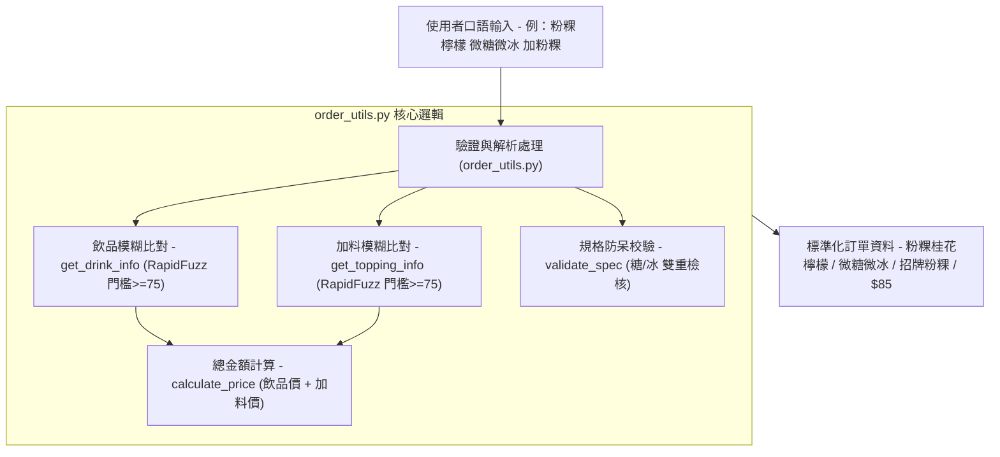

# 🥤 菜單數據與驗證工具 - `order_utils.py` 程式架構與功能詳解

本手冊針對專案的菜單資料模型與比對校驗核心模組 [`order_utils.py`](file:///c:/aiTest/mcp-drink-main/order_utils.py) 進行全方位的架構剖析、比對演算法與規格驗證機制說明。

---

## 📌 程式概述

`order_utils.py` 是本系統的 **業務資料唯一真實來源 (Single Source of Truth, SSOT)** 與 **智慧驗證模組**。
它集中定義了一沐日的官方飲品菜單、分類階層、加料價目表，並利用 **RapidFuzz 模糊比對演算法** 與 **規格防呆規則**，確保使用者透過口語或文字輸入的點餐內容能被正確解析、校正並精確計價。



---

## 🧩 核心資料結構

### 1. 分類樹狀菜單 (`NESTED_MENU`)
提供階層式的分類結構，主要用於 Streamlit 前端畫面的「系列選擇」與「飲品連動」二級選單：

```python
NESTED_MENU = {
    "茶人系列 原味茶": {"輕香烏龍綠": 45, "糯米香茶": 45, "島韻紅茶": 40, ...},
    "講究系列 風味茶": {"粉粿桂花檸檬": 70, "粉粿黑糖檸檬": 70, "牡丹高山青": 60, ...},
    "香醇系列 奶茶": {"逮丸奶茶": 75, "粉粿黑糖奶茶": 70, "烏龍綠奶茶": 60, ...},
    "濃韻系列 芝士奶蓋": {"奶蓋烏龍綠": 75, "奶蓋糯香茶": 75, ...},
    "自然系列 鮮奶茶": {"烏龍綠鮮奶茶": 80, "逮丸鮮奶茶": 90, ...}
}
```

### 2. 扁平化菜單 (`DRINK_MENU`)
透過字典推導式動態將所有分類下的飲品展平為單一字典 `{"飲品名": 價格}`，提供 $O(1)$ 的極速查價與 RapidFuzz 比對清單。

### 3. 加料價目表 (`TOPPINGS_MENU`)
定義所有可選加料與加價規則：
* **無** ($0)
* **招牌粉粿** ($15)、**草仔粿** ($15)、**雙粉** ($15)、**蘆薈** ($15)
* **琥珀粉圓** ($10)、**嫩仙草** ($10)

---

## 🛠️ 核心函式與演算法剖析

### 1. 飲品模糊比對 `get_drink_info(user_input)`
* **演算法**：使用 `rapidfuzz.process.extractOne` 針對所有品項進行 Levenshtein 距離與字串相似度評分。
* **相似度門檻**：設定 `score >= 75`，低於門檻則判定找不到品項，有效避免語意無關的口語輸入被錯誤匹配。
* **比對範例**：
  - 輸入 `"粉粿檸檬"` ➡️ 自動比對為 `("粉粿桂花檸檬", 70)`
  - 輸入 `"糯米茶"` ➡️ 自動比對為 `("糯米香茶", 45)`

---

### 2. 加料模糊比對 `get_topping_info(user_input)`
* **演算法**：針對加料清單進行模糊匹配（門檻 `>= 75`）。
* **比對範例**：
  - 輸入 `"粉粿"` ➡️ 自動匹配為 `("招牌粉粿", 15)`
  - 輸入 `"草菇"` / `"草粿"` ➡️ 自動匹配為 `("草仔粿", 15)`

---

### 3. 甜度與冰量規格校驗 `validate_spec(spec_text)`
* **檢查機制**：強制點餐規格必須同時包含「糖度關鍵字」與「冰量關鍵字」，避免客人漏填規格。
  - **糖度關鍵字**：`["糖", "甜", "原味"]`
  - **冰量關鍵字**：`["冰", "溫", "熱", "常溫"]`
* **驗證結果**：
  - `"微糖少冰"` ➡️ `True`
  - `"無糖常溫"` ➡️ `True`
  - `"微冰"` (缺少甜度) ➡️ `False`
  - `"半糖"` (缺少冰量) ➡️ `False`

---

### 4. 總金額精算 `calculate_price(drink_name, topping_name="無")`
* **功能**：根據比對出的標準飲品名稱與加料名稱，計算單杯應收金額：
  $$\text{總價} = \text{飲品基底價} + \text{加料價格}$$
* **容錯處理**：若 `topping_name` 傳入 `None`，自動視為 `"無"` 處理，回傳正確基底價。

---

## 📋 協作與呼叫關係

| 呼叫端模組 | 使用情境與方法 |
| :--- | :--- |
| [`mcp_server.py`](file:///c:/aiTest/mcp-drink-main/mcp_server.py) | • `get_menu()`：讀取 `NESTED_MENU` 與 `TOPPINGS_MENU`<br>• `place_drink_order()`：執行 `get_drink_info`、`validate_spec` 與 `calculate_price`<br>• `update_drink_order()`：驗證修改後的品項與規格 |
| [`drink_app.py`](file:///c:/aiTest/mcp-drink-main/drink_app.py) | • 畫面連動：讀取 `NESTED_MENU` 產生系列與品項連動下拉選單<br>• 加料多選：讀取 `TOPPINGS_MENU` 動態產生加價標籤 |
