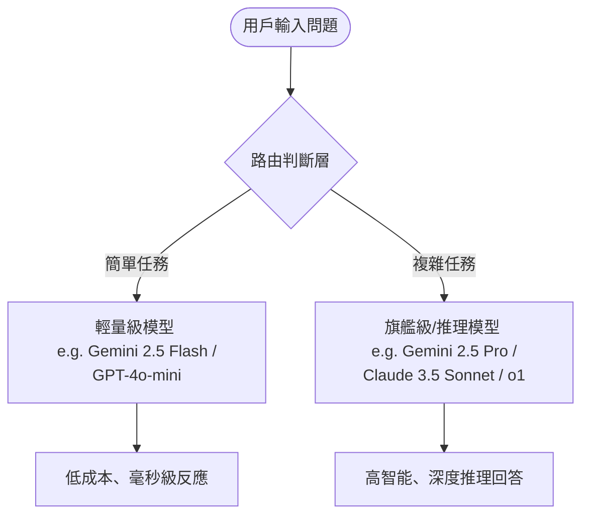
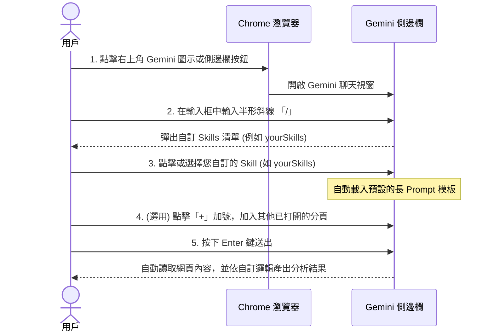

# 企業 AI 成本控管與 Token 經濟學全解析

隨著生成式 AI (Generative AI) 深入企業核心工作流，企業面臨的挑戰已從「如何導入 AI」轉變為「如何控管高昂的 AI 營運成本」。本文深度剖析「Token 經濟學」的五大核心觀測點，並提供語意路由 (Semantic Routing) 實作指南與 Chrome 自訂 Skills 的應用實戰，協助企業在智慧化轉型中實現效益最大化。

---

## 一、 Token 經濟學：企業 AI 成本的五大核心觀測點

根據《商業周刊》等權威財經媒體的研究與企業實踐，當前企業在導入 AI 過程中，必須掌握以下五個關乎成本與生產力的關鍵維度：

### 1. 企業 AI 成本控管與 Token 經濟學分析表

| 項目名稱 | 現狀分析 | 優勢與劣勢 | 預計節省比例 | 代表性金句 |
| :--- | :--- | :--- | :--- | :--- |
| **美中 AI 模型性價比大戰** | 企業開始將預設模型從美國頂尖模型（如 GPT-4o、Claude 3.5）轉向性價比極高的中國模型（如智譜 GLM、月之暗面 Kimi、DeepSeek），以因應爆量的 Token 帳單。 | **優勢**：中國模型從「便宜堪用」走向「便宜且強大」，極具價格競爭力。<br>**劣勢**：可能流失對美國頂尖模型的使用數據，產生反向飛輪效應。 | **約 98% (50倍)**<br>*(美中旗艦模型成本差距可達 50 倍)* | 「中國模型像省油又性能佳、天天通勤也不心疼的國民車；美國頂尖模型則像特殊場合才開的超跑。」 |
| **AI 代理人 (Agent) 消耗黑洞** | AI 從單純的「一問一答」走向能自主推理、規劃與執行的「AI 代理人」，導致 Token 消耗量呈現指數級暴增。 | **優勢**：能全自動執行複雜流程，大幅解放勞務。<br>**劣勢**：運作情境下燒 Token 的速度極快，容易讓預算在短期內失控。 | **用量暴增 5 至 30 倍**<br>*(相較於一般 AI 問答，單位任務消耗量激增)* | 「過去人機對答只是零星用量，AI 代理人自主思考的背後，每一步都在瘋狂『燒錢』。」 |
| **伺服器回歸地端部署** | 為了省下長期的雲端 Token 費用，中小企業開始向台廠採購伺服器，將 AI 運算重新搬回自家機房（地端/私有雲部署）。 | **優勢**：當達到特定臨界點時，地端部署是更具成本效益的「AI 工廠」。<br>**劣勢**：需要初期硬體建置成本與維護技術門檻。 | **視用量而定**<br>*(達到臨界點後，可大幅轉化為固定折舊成本)* | 「為了不被失控的雲端帳單綁架，企業正用購買硬體伺服器，來換取 Token 的終身免年費。」 |
| **最適模型精準搭配 (AI 素養)** | 許多用戶不論任務難易度，一律盲目使用最新、最貴的模型，缺乏將任務複雜度與模型成本配對的習慣。 | **優勢**：落實依業務需求分流（如簡單任務用輕量低價模型，複雜任務用旗艦模型）。<br>**劣勢**：考驗員工與企業整體的 AI 判斷力素養。 | **高達 50% 以上**<br>*(如 Coinbase 調整模型後即省下近半支出)* | 「去走路僅需三分鐘的巷口超商，不需要堅持開著法拉利出門。」 |
| **突破「省 Token」生產力陷阱** | 一味追求將 Token 成本「最小化」，反而可能限制了 AI 應有的生產力回報，應著眼於 Token 創造的淨效益。 | **優勢**：若 1 元 Token 能省下 3 元人工，燒更多 Token 反而能賺取更大效益。<br>**劣勢**：若流於傳統成本管理思維，將扼殺企業的數位轉型潛力。 | **不減反增**<br>*(投資報酬率最大化)* | 「市場上真正稀缺的，從來就不是 Token，而是一個人、一間公司選擇該做什麼與不該做什麼的判斷力。」 |

---

## 二、 語意路由 (Semantic Routing) 與模型自動分流機制

為解決盲目使用高價模型所造成的預算浪費，企業應導入**語意路由（Semantic Routing）**機制。透過在用戶與大模型之間架設一層輕量級的「路由層」，自動依據任務難易度進行最適模型的派發。

### 1. 運作原理架構



*   **關鍵字/意圖比對 (Keyword/Intent Matching)**：若偵測到「翻譯」、「摘要」、「格式化」，直接分流給輕量模型。
*   **向量語意相似度 (Vector Semantic Similarity)**：將輸入轉為向量，與預設的「簡單任務群組」或「複雜任務群組」進行快速向量比對。
*   **LLM 預檢 (LLM-as-a-Judge)**：用最便宜的超微型模型先判斷這題需要幾顆星的智商，再派發給對應的模型。

### 2. 任務分流實例對照表

| 任務難度 | 典型場景 | 推薦自動派發模型 | 效益評估 |
| :--- | :--- | :--- | :--- |
| **簡單 (Low)** | 文字校對與潤飾、文章摘要、重點整理、將 JSON 轉成 CSV 格式等。 | 輕量級模型 <br>*(如 Gemini 2.5 Flash)* | 速度極快，反應時間通常在 1 秒內，且 Token 費用幾乎可以忽略不計。 |
| **中等 (Medium)** | 一般客服常見問答對答、撰寫日常 Email、公文草稿、簡單的 SQL 語法編寫。 | 中階主力模型 <br>*(如 GPT-4o)* | 在智能與成本之間取得完美平衡，足以應付多數日常辦公需求。 |
| **困難 (High)** | 複雜的程式碼除錯與架構設計、多步驟的邏輯推理、數學計算、長篇法規與合約的深度分析。 | 旗艦推理模型 <br>*(如 Claude 3.5 Sonnet 或 o1)* | 高精準度，雖然價格較貴、生成速度較慢，但能確保高難度任務順利解決。 |

> **「讓聰明的模型做難事，讓快速的模型做日常事；AI 時代的省錢之道，在於不讓大砲去轟小蚊子。」**

---

## 三、 Python 實作：雙階段 AI 語意路由器

以下提供一個基於 Python 的雙階段語意路由器實作範例。本路由器結合了**規則路由**（不耗 Token）與 **LLM 裁判路由**（耗費極微量 Token），在確保回答品質的前提下，為企業節省 50% 以上的 API 成本。

```python
import os
import re
from google import genai
from google.genai import types

# 初始化 Gemini 客戶端 (需先設定好環境變數 GEMINI_API_KEY)
client = genai.Client()

# 定義我們使用的模型
CHEAP_MODEL = "gemini-2.5-flash"   # 輕量快速、極度便宜，適合簡單任務與擔任裁判
POWER_MODEL = "gemini-2.5-pro"     # 旗艦模型，適合複雜推理與深度分析

def route_by_rules(user_query: str) -> str | None:
    """
    第一階段：規則路由 (零 Token 消耗)
    使用正則表達式快速篩選出 100% 屬於簡單範疇的任務。
    """
    query_lower = user_query.lower()
    
    # 匹配簡單翻譯、格式轉換、日常打招呼等模式
    simple_patterns = [
        r"翻譯(成|為)?(英文|日文|繁中|簡中)",
        r"把.*轉成(json|csv|xml|表格)",
        r"^(你好|哈囉|hi|hello|早安|晚安)$",
        r"幫我(校對|潤飾|改錯字)"
    ]
    
    for pattern in simple_patterns:
        if re.search(pattern, query_lower):
            return CHEAP_MODEL
            
    return None

def route_by_llm_judge(user_query: str) -> str:
    """
    第二階段：語意裁判 (極低 Token 消耗)
    讓最划算的輕量級模型快速評估問題難度，回傳分類結果。
    """
    prompt = f"""
你是一位精準的 AI 任務調度專家。請評估以下用戶的問題，並將其分類為：
- 'EASY': 簡單的問答、日常閒聊、基礎文字摘要、簡單語法說明、單純的程式碼解釋。
- 'HARD': 複雜的邏輯推理、多步驟演算法設計、複雜 Bug 除錯、涉及深層決策或高難度數學/物理計算。

用戶問題：
"{user_query}"

請嚴格僅回傳一個單字：'EASY' 或 'HARD'，不要包含任何其他解釋或引號。
"""
    try:
        # 使用 Structured Outputs 強制讓裁判模型只輸出 EASY 或 HARD
        response = client.models.generate_content(
            model=CHEAP_MODEL,
            contents=prompt,
            config=types.GenerateContentConfig(
                temperature=0.0,  # 設為 0 確保判斷穩定度
                max_output_tokens=5
            )
        )
        
        decision = response.text.strip().upper()
        print(f"  [裁判分析結果]：任務難度被判定為 -> {decision}")
        
        return CHEAP_MODEL if "EASY" in decision else POWER_MODEL
        
    except Exception as e:
        print(f"  [裁判異常] {e}，安全起見自動升級至旗艦模型。")
        return POWER_MODEL

def smart_ai_router(user_query: str) -> str:
    """
    綜合路由器入口
    """
    print(f"\n👉 收到用戶請求: '{user_query}'")
    
    # 1. 先執行規則路由
    selected_model = route_by_rules(user_query)
    if selected_model:
        print(f"  [命中規則]：這是一個簡單的格式/模式任務。")
        return selected_model
        
    # 2. 規則未命中，交給 AI 裁判
    return route_by_llm_judge(user_query)

# =====================================================================
# 測試執行
# =====================================================================
if __name__ == "__main__":
    test_queries = [
        "請幫我把這段文字翻譯成英文：『今天天氣真好，想去高雄橋頭糖廠散步。』",
        "我想要寫一個能自動計算台灣股票 PEG 價值的複雜多執行緒爬蟲，請幫我寫出完整的 Python 架構並處理連線中斷重試的機制。",
        "簡單解釋一下什麼是資料庫的 Index (索引)？",
        "為什麼我的 Python 遞迴函數會遇到 RecursionError？這是我的程式碼：[含有100行複雜邏輯的程式碼]...請幫我深度除錯。"
    ]
    
    for query in test_queries:
        target_model = smart_ai_router(query)
        print(f"🎯 系統決定調用模型：【{target_model}】")
```

### 3. 這個架構如何達到省錢的效果？
*   **零成本的過濾器**：第一階段的 Regex 規則判斷是在本地端進行，耗時不到 1 毫秒，且 **Token 費用為 0**。
*   **用「小錢」防守「大錢」**：第二階段雖然動用了 AI 判斷，但使用的是價格極度便宜的 `gemini-2.5-flash`，且限制輸出長度（`max_output_tokens=5`）。判定一題的成本不到旗艦模型的萬分之一，卻能幫您擋下 80% 不需要動用大模型的請求。
*   **無縫的用戶體驗**：簡單任務能享受 Flash 模型毫秒級的超高速反應；複雜任務則能得到 Pro 模型的精準解答，在速度與智能之間取得完美平衡。

---

## 四、 實戰指南：如何選擇並使用自訂的 Chrome Skills

在 Chrome 中，您可以透過 `chrome://skills/yourSkills` 來管理自訂的 Skills。以下說明如何在日常網頁瀏覽中，快速選擇並使用這些自訂 Skills：



### 💡 實用技巧提示：
*   **如何新增或修改 Skill**：在側邊欄輸入完一段好用的 Prompt 並執行後，在該次對話的回答下方，點擊 **「Save as a skill」** 按鈕，即可命名、挑選 Emoji 並將其存檔至您的自訂 Skill 清單中。
*   **跨裝置自動同步**：只要您的 Chrome 瀏覽器登入了同一個 Google 帳號，您在筆電上建立的 Skills，在桌機或其它設備的 Chrome 上一樣可以輸入 `/` 直接叫出來使用，非常方便。
