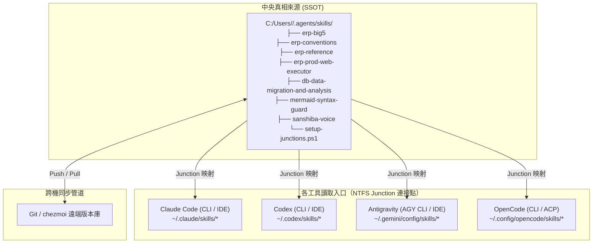

# 跨 Agent（Claude、Codex、Antigravity、OpenCode）技能共用整合實施規劃書

---

## 壹、背景與核心目標

目前本機環境中擁有 7 個核心自訂技能：
1. `erp-big5`
2. `erp-conventions`
3. `erp-reference`
4. `erp-prod-web-executor`
5. `db-data-migration-and-analysis`
6. `mermaid-syntax-guard`
7. `sanshiba-voice`（三師爸專屬語音技能）

**核心目標**：
- **單一真相來源（Single Source of Truth, SSOT）**：全系統僅保留一套實體檔案，編輯任何一處即全數生效。
- **跨工具／跨界面支援**：同時支援 **Claude Code**、**Codex**、**Antigravity**、**OpenCode** 四套體系的 **CLI 終端機** 與 **IDE 擴充插件**。
- **雙機無縫同步**：公司筆電（公司 NB）與家裡筆電（家裡 NB）之間，透過版本控制工具快速同步，免去人工重組設定的負擔。

---

## 貳、現狀盤點與問題點分析

經過對本機檔案系統的實際探測，目前存在以下五項核心問題點：

### 問題點一：檔案散落與重複拷貝，版本出現落差
- **現況**：
  - `C:/Users/ch26788/.gemini/config/skills/`：包含完整的 6 個技能。
  - `C:/Users/ch26788/.claude/skills/`：亦有 6 個技能，但為獨立實體副本。
  - `C:/Users/ch26788/.codex/skills/`：僅有 3 個技能（缺少 `erp-big5`、`erp-conventions`、`erp-reference`）。
  - `C:/Users/ch26788/.config/opencode/skills/`：尚未配置專屬技能目錄。
- **風險**：若在 Claude 修改了某個技能腳本，Antigravity 與 Codex 不會連動，日久必然產生程式碼邏輯分歧與除錯困難。

### 問題點二：各家 Agent 工具預設載入路徑具有封閉性
- **現況**：
  - **Claude Code**：硬性規範只讀取 `~/.claude/skills/`（或專案目錄 `.claude/skills/`），完全不主動掃描其他廠商目錄。
  - **Codex**：只讀取 `~/.codex/skills/`。
  - **Antigravity**：只讀取 `~/.gemini/config/skills/`（或專案目錄 `.agents/skills/`）。
- **瓶頸**：無法僅靠修改環境變數或單一設定檔讓所有工具直接轉向同一個外部自訂目錄。

### 問題點三：跨電腦（公司 NB vs 家裡 NB）之檔案系統指標無法直通
- **現況**：Windows 檔案系統的符號連結（Symlink）或連接點（Junction）均為「本機硬碟磁區指標」，無法隨 Git 倉庫或單純複製直接跨電腦生效。
- **瓶頸**：若無自動化配置腳本，換到家裡 NB 時必須再次手動建立連結，容易遺漏。

### 問題點四：雲端硬碟（Google Drive）與即時讀取的相容性風險
- **現況**：Google Drive 串流硬碟屬於虛擬網路磁區（Virtual File System），若直接將 Agent 技能目錄指向雲端硬碟，在離線或網路延遲時，容易導致 CLI 啟動超時或檔案鎖定異常。
- **解法**：技能本體應置於本機實體硬碟（SSD），跨電腦傳輸則透過 Git 或 `chezmoi` 進行。

### 問題點五：新機冷啟動（Cold Start）檔案缺失與 PowerShell 5.1 編碼陷阱
- **現況**：
  1. 新筆電尚未建立 `~/.agents/skills` 或尚未完成同步時，直接執行腳本會因檔案不存在而噴錯（`-File 參數的引數不存在`）。
  2. 若現有工具目錄（如 `.gemini/config/skills`）已存在舊實體資料夾，若未先複製至中央庫就直接建立 Junction，會導致既有技能被誤刪清除。
  3. Windows 內建的 Windows PowerShell 5.1 讀取無 BOM 的 UTF-8 `.ps1` 腳本時，中文引號或註解常因 ANSI 預設編碼解析錯誤而崩潰（`TerminatorExpectedAtEndOfString`）。
- **解法**：制定新機專用之一鍵冷啟動腳本（Bootstrap），整合「目錄建立＋現有技能安全遷移＋寫入 UTF-8 with BOM 腳本＋建立 Junction」，確保零失誤。

---

## 參、架構設計：中央倉庫 ＋ NTFS Junction

### 一、技術選型：為何採用 NTFS Junction（目錄連接點）？
1. **免系統管理員權限**：在 Windows NTFS 檔案系統中，建立目錄連接點（Junction）不需開啟「開發者模式」，亦不需 Administrator 權限。
2. **零磁碟開銷與雙向即時性**：對作業系統而言，Junction 會被視為本地真實資料夾，任何讀寫操作直接作用於底層實體檔案。
3. **完美欺騙封閉路徑**：Claude 依然讀取它指定的 `~/.claude/skills/`，Codex 讀取 `~/.codex/skills/`，但底層實體全數連往中央目錄。

### 二、中央目錄選定：`~/.agents/skills`
- 您的系統已具備 `C:/Users/ch26788/.agents/skills/`，且已有管理鎖定檔 `.skill-lock.json`。
- **OpenCode** 官方原生即將 `~/.agents/skills/` 列為向後相容的標準掃描路徑。
- **擴充規範統一**：未來若有通用規則（Rules）或外掛（Plugins），可直接置於 `~/.agents/rules`，維持架構整潔。

### 三、系統拓撲架構圖



---

## 肆、詳細實施步驟

### 階段一：本機資料庫整併與中央目錄建立（公司 NB）

1. **整合檔案至中央目錄**：
   以目前最完整的技能目錄為基準，將 7 個技能（`erp-big5`、`erp-conventions`、`erp-reference`、`erp-prod-web-executor`、`db-data-migration-and-analysis`、`mermaid-syntax-guard`、`sanshiba-voice`）完整搬移或同步至中央庫 `C:/Users/<User>/.agents/skills/`。
2. **安全原則**：
   在執行任何連接點置換前，必須先確認實體檔案已 100% 複製至中央庫，嚴禁在中央庫未就緒前直接清空舊工具目錄。

---

### 階段二：建立自動化連接腳本（`setup-junctions.ps1`）

> [!IMPORTANT]
> **PowerShell 5.1 編碼關鍵避坑點（UTF-8 with BOM）**：
> Windows 預設的 Windows PowerShell 5.1 在使用 `-File` 參數執行腳本時，若腳本包含中文字元（如提示字元或註解），**必須採用 UTF-8 with BOM 格式儲存**。若儲存為 UTF-8 without BOM，PowerShell 5.1 會以系統預設 ANSI 字碼頁解析，導致中文字串引號截斷並拋出 `TerminatorExpectedAtEndOfString` 語法錯誤中斷。

在中央庫 `C:/Users/<User>/.agents/skills/setup-junctions.ps1` 建立腳本，以動態取得當前使用者家目錄，具備跨電腦相容性：

```powershell
# setup-junctions.ps1
# 功能：自動將 ~/.agents/skills 下的所有技能以 Junction 連結至各大 Agent 工具目錄
# 注意：此檔案必須儲存為 UTF-8 with BOM 格式
$ErrorActionPreference = "Stop"

$userHome   = [Environment]::GetFolderPath("UserProfile")
$ssotPath   = Join-Path $userHome ".agents\skills"
$clientDirs = @(
    (Join-Path $userHome ".gemini\config\skills"),
    (Join-Path $userHome ".claude\skills"),
    (Join-Path $userHome ".codex\skills"),
    (Join-Path $userHome ".config\opencode\skills")
)

# 確保所有工具技能目標資料夾存在
foreach ($dir in $clientDirs) {
    if (!(Test-Path $dir)) {
        New-Item -ItemType Directory -Path $dir -Force | Out-Null
    }
}

# 抓取中央目錄中所有的技能資料夾（排除以 . 開頭的檔案與隱藏夾）
$skills = Get-ChildItem -Path $ssotPath -Directory | Where-Object { $_.Name -notmatch "^\." }

foreach ($s in $skills) {
    $skillName = $s.Name
    $sourceDir = $s.FullName

    foreach ($clientDir in $clientDirs) {
        $destDir = Join-Path $clientDir $skillName

        if (Test-Path $destDir) {
            $item = Get-Item $destDir
            if ($item.LinkType -eq "Junction") {
                [System.IO.Directory]::Delete($destDir)
            } else {
                Remove-Item -Path $destDir -Recurse -Force
            }
        }

        New-Item -ItemType Junction -Path $destDir -Target $sourceDir | Out-Null
        Write-Host "已建立 Junction: $skillName -> $clientDir" -ForegroundColor Green
    }
}

Write-Host "`n所有 Agent 技能已成功關聯至中央庫！" -ForegroundColor Cyan
```

**在 PowerShell 中產生具備 UTF-8 BOM 之腳本標準語法**：
```powershell
# 使用 .NET 內建 StreamWriter 輸出 UTF-8 with BOM
$scriptPath = "$HOME\.agents\skills\setup-junctions.ps1"
[System.IO.File]::WriteAllText($scriptPath, $scriptContent, [System.Text.Encoding]::UTF8)
```

### 階段三：第二台電腦／新筆電（家裡 NB / 下一台新機）冷啟動與同步步驟

> [!WARNING]
> **新機冷啟動踩坑警示（實戰經驗）**：
> 若在尚未完成中央庫同步或新開箱的電腦上，直接執行 `powershell -File "$HOME\.agents\skills\setup-junctions.ps1"`，必然會遭遇報錯：
> `-File 參數的 'C:\Users\<user>\.agents\skills\setup-junctions.ps1' 引數不存在。`
> 這是因為新電腦尚未建立 `~/.agents/skills/` 目錄，也沒有落地實體腳本。新機部署請嚴格依循以下三種途徑之一進行冷啟動。

#### 途徑一：新機一鍵冷啟動萬能腳本（Zero-to-Hero Bootstrap，最推薦）
本腳本已實體化並存放於 [AI/scripts/bootstrap-skills.ps1](file:///C:/Users/niceh/我的雲端硬碟/Obsidian/AI/scripts/bootstrap-skills.ps1)，隨 Google Drive 串流同步。

**新機執行方式（二選一）**：
1. **直接執行雲端實體腳本（最快）**：
   新機登入 Google Drive 後，在 PowerShell 直接貼上執行：
   ```powershell
   powershell -ExecutionPolicy Bypass -File "$HOME\我的雲端硬碟\Obsidian\AI\scripts\bootstrap-skills.ps1"
   ```
2. **複製貼上內嵌代碼（免檔案前置）**：
   若尚未掛載雲端硬碟，直接複製貼上以下完整腳本代碼至 PowerShell 執行：

```powershell
# === 新機一鍵冷啟動萬能腳本 ===
$ErrorActionPreference = "Stop"
$userHome = [Environment]::GetFolderPath("UserProfile")
$ssot     = Join-Path $userHome ".agents\skills"

# 1. 建立中央庫
if (!(Test-Path $ssot)) { New-Item -ItemType Directory -Path $ssot -Force | Out-Null }

# 2. 安全掃描並遷移現有目錄實體技能（防止既有資料夾被 Junction 覆蓋刪除）
$existingSources = @(
    (Join-Path $userHome ".gemini\config\skills"),
    (Join-Path $userHome "我的雲端硬碟\claude_erp_rule\chs-erp\skills")
)
foreach ($src in $existingSources) {
    if (Test-Path $src) {
        Get-ChildItem -Path $src -Directory | Where-Object { $_.Name -ne ".system" -and $_.LinkType -ne "Junction" } | ForEach-Object {
            $dest = Join-Path $ssot $_.Name
            if (!(Test-Path $dest)) {
                Copy-Item -Path $_.FullName -Destination $dest -Recurse -Force
                Write-Host "已遷移實體技能至中央庫: $($_.Name)" -ForegroundColor Yellow
            }
        }
    }
}

# 3. 寫入具備 UTF-8 BOM 之 setup-junctions.ps1
$scriptContent = @'
$ErrorActionPreference = "Stop"
$userHome   = [Environment]::GetFolderPath("UserProfile")
$ssotPath   = Join-Path $userHome ".agents\skills"
$clientDirs = @(
    (Join-Path $userHome ".gemini\config\skills"),
    (Join-Path $userHome ".claude\skills"),
    (Join-Path $userHome ".codex\skills"),
    (Join-Path $userHome ".config\opencode\skills")
)

foreach ($dir in $clientDirs) {
    if (!(Test-Path $dir)) {
        New-Item -ItemType Directory -Path $dir -Force | Out-Null
    }
}

$skills = Get-ChildItem -Path $ssotPath -Directory | Where-Object { $_.Name -notmatch "^\." }

foreach ($s in $skills) {
    $skillName = $s.Name
    $sourceDir = $s.FullName

    foreach ($clientDir in $clientDirs) {
        $destDir = Join-Path $clientDir $skillName

        if (Test-Path $destDir) {
            $item = Get-Item $destDir
            if ($item.LinkType -eq "Junction") {
                [System.IO.Directory]::Delete($destDir)
            } else {
                Remove-Item -Path $destDir -Recurse -Force
            }
        }

        New-Item -ItemType Junction -Path $destDir -Target $sourceDir | Out-Null
        Write-Host "已建立 Junction: $skillName -> $clientDir" -ForegroundColor Green
    }
}
Write-Host "`n所有 Agent 技能已成功關聯至中央庫！" -ForegroundColor Cyan
'@

$ps1Path = Join-Path $ssot "setup-junctions.ps1"
[System.IO.File]::WriteAllText($ps1Path, $scriptContent, [System.Text.Encoding]::UTF8)

# 4. 執行連接點建立
powershell -ExecutionPolicy Bypass -File $ps1Path
```

#### 途徑二：使用 `chezmoi` 同步（與收工流程一致）
1. **公司 NB（首次發布）**：
   ```powershell
   chezmoi add ~/.agents/skills
   # 收工時隨 chezmoi 自動 commit & push
   ```
2. **新筆電／家裡 NB（首次同步）**：
   ```powershell
   # 必須先執行 chezmoi update 下載檔案至本機實體
   chezmoi update
   # 確認檔案已落地後，再執行關聯腳本
   powershell -ExecutionPolicy Bypass -File "$HOME\.agents\skills\setup-junctions.ps1"
   ```

#### 途徑三：使用獨立 Git Repository 同步
1. **公司 NB（首次發布）**：
   在 `~/.agents/skills/` 初始化 Git 倉庫並推送到遠端 Private Repo。
2. **新筆電／家裡 NB（首次同步）**：
   ```powershell
   # 1. 複製技能庫至本機（確保資料夾落地）
   git clone <REPO_URL> "$HOME\.agents\skills"

   # 2. 執行關聯腳本
   powershell -ExecutionPolicy Bypass -File "$HOME\.agents\skills\setup-junctions.ps1"
   ```
3. **日常更新**：
   未來若在公司修改了技能，家裡電腦只需進入 `~/.agents/skills` 執行 `git pull`，所有四大工具之 CLI 與 IDE 即刻全數生效，**無需再次執行腳本**。

---

## 伍、驗證清單（Checklist）

完成配置後，依序執行以下五項嚴謹驗證，確認各端通暢：

- [ ] **1. 檔案系統連接點驗證**：
  在 PowerShell 執行以下指令，確認 LinkType 為 `Junction` 且 Target 均指向 `~/.agents/skills`：
  ```powershell
  Get-Item ~/.claude/skills/* | Select-Object Name, LinkType, Target | Format-Table -AutoSize
  ```
- [ ] **2. Antigravity CLI / IDE 驗證**：
  確認 `~/.gemini/config/skills` 7 個技能均為 `Junction`，且每個技能底層包含有效的 `SKILL.md`。
- [ ] **3. Claude Code 動態實測驗證**：
  在終端執行無提示靜態查詢，確認 Claude 穿透 Junction 成功列出自訂技能：
  ```powershell
  "" | claude -p "你有什麼自訂 skills 可以使用？請只簡要列出名稱"
  ```
- [ ] **4. Codex 桌面版／外掛驗證**：
  確認 `~/.codex/skills` 內除了內建 `.system` 外，已補齊 7 個自訂技能的 Junction。
- [ ] **5. OpenCode CLI 動態實測驗證**：
  執行 OpenCode 專屬技能除錯指令：
  ```powershell
  opencode debug skill
  ```
  若能輸出技能名稱與路徑，即代表載入成功。
  > **注意**：若終端顯示找不到 `opencode` 指令，表示僅安裝了桌面版 GUI，可透過 `npm i -g opencode-ai` 補裝 CLI 工具以啟用終端動態除錯。

---

## 陸、後續維護準則與實戰避坑指引

### 一、日常維護規範
1. **日常修改技能**：直接在任何 IDE 或文字編輯器中修改技能（無論從中央庫還是從四大工具的 Junction 資料夾打開，底層均為同一份檔案），存檔即全域生效。
2. **新增技能**：在 `~/.agents/skills/` 建立新技能資料夾並寫入 `SKILL.md`，完成後重新執行一次 `setup-junctions.ps1` 即可分發至所有工具。
3. **刪除技能**：直接在 `~/.agents/skills/` 刪除該資料夾，並重新執行 `setup-junctions.ps1` 自動清除無效 Junction。

### 二、實戰避坑精華（Lessons Learned）
1. **PowerShell 5.1 編碼陷阱**：
   Windows PowerShell 5.1 解析無 BOM 的 UTF-8 腳本時，若遇到中文字串（如提示文字、路徑註解）常因字節切分錯誤拋出 `TerminatorExpectedAtEndOfString`。所有自動化腳本寫入時**一律強制採用 `[System.Text.Encoding]::UTF8`（含 BOM）**。
2. **現有實體覆蓋保護**：
   若新機器上某個 Agent（如 Antigravity）已經放了真實資料夾，腳本在建立 Junction 前會執行刪除；因此執行關聯腳本前，**務必先將既有實體複製進 `~/.agents/skills`**，不可直接執行置換。
3. **驗證層次區分（檔案系統 vs 動態 CLI）**：
   檔案系統 Junction 建立成功僅代表「目錄管道暢通」；必須透過 `opencode debug skill` 或 `claude -p` 等指令進行動態實測，方可確認 AI 模型在對話期已順利掛載技能。
