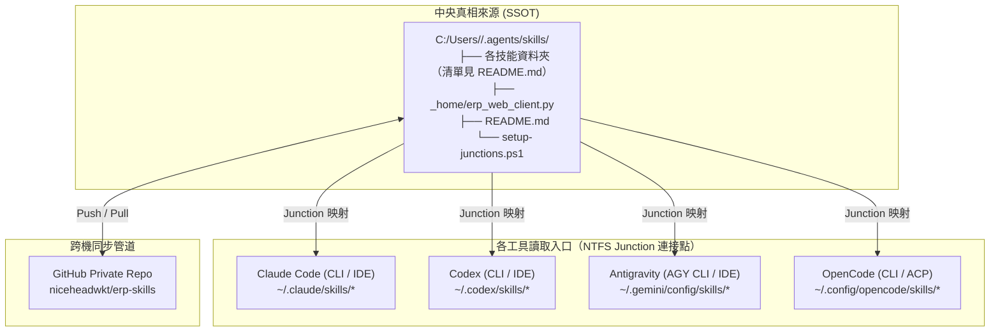

# 跨 Agent（Claude、Codex、Antigravity、OpenCode）技能共用整合實施規劃書

---

## 壹、背景與核心目標

> [!info] 目前狀態（2026-10-06 更新）
> - **技能清單以中央倉庫的 `~/.agents/skills/README.md` 為準**。本文件不再列出完整清單，以免新增技能後文件跟不上。
> - **實際採用的同步方式是途徑三（獨立 Git Repository）**，遠端為 `https://github.com/niceheadwkt/erp-skills.git`。這個 repo 含公司內部資訊，必須維持 Private。**skills 不用 chezmoi 管理**；chezmoi 只管理 `~/.claude/rules` 等全域設定。
> - 2026-10-02 中央倉庫共有 10 個技能：`db-data-migration-and-analysis`、`erp-big5`、`erp-conventions`、`erp-cvs`、`erp-dajju1`、`erp-prod-web-executor`、`erp-reference`、`find-skills`、`mermaid-syntax-guard`、`pdf`。Claude、Codex、Antigravity、OpenCode 四個工具都已經用 Junction 連到中央倉庫。
> - 不納入中央倉庫的技能（2026-10-02 確認）：
>   - `sanshiba-voice`：規劃初期有列入，不納入 repo。家裡 NB（weng）的 `~/.agents/skills/sanshiba-voice` 仍保留實體資料夾，以 `.git/info/exclude` 排除（只在本機生效），四個工具仍透過 Junction 使用；公司 NB 沒有這個技能。
> - 2026-10-06 家裡 NB（weng）的 `~/.agents/skills` 原本是 09/18 複製的普通資料夾（不是 git clone），缺少 `erp-cvs`、`erp-dajju1`、`find-skills`、`pdf`。已原地轉為 repo 的 git checkout（同步到 `148b2fc`），重跑 `setup-junctions.ps1`，舊版備份在 `~/.agents/skills.bak-20261006`。
> - 2026-10-06 已刪除 Google Drive 上的技能散落副本（根目錄的 `db-data-migration-and-analysis`、`erp-cvs`、`erp-prod-web-executor`、`mermaid-syntax-guard`，以及整個 `claude_erp_rule`）。團隊安裝包以 fileserver 上的 `claude_erp_rule` 為準，Google Drive 不再放任何技能。
>   - `finmind-agent`：只留在 `~/.codex/skills/` 作為 Codex 專用的實體資料夾，不納入中央倉庫，也不同步到其他工具或電腦。

規劃初期（建立中央倉庫之前）盤點到的核心自訂技能：`erp-big5`、`erp-conventions`、`erp-reference`、`erp-prod-web-executor`、`db-data-migration-and-analysis`、`mermaid-syntax-guard`、`sanshiba-voice`（三師爸專屬語音技能）。之後新增的技能，請看中央倉庫的 README。

**核心目標**：
- **單一真相來源（Single Source of Truth, SSOT）**：全系統僅保留一套實體檔案，編輯任何一處即全數生效。
- **跨工具／跨界面支援**：同時支援 **Claude Code**、**Codex**、**Antigravity**、**OpenCode** 四套體系的 **CLI 終端機** 與 **IDE 擴充插件**。
- **雙機無縫同步**：公司筆電（公司 NB）與家裡筆電（家裡 NB）之間，透過版本控制工具快速同步，免去人工重組設定的負擔。

---

## 貳、現狀盤點與問題點分析

以下是建立中央倉庫之前，檢查本機檔案系統時發現的五項核心問題。這是當時的紀錄，目前都已依本規劃解決：

### 問題點一：檔案散落與重複拷貝，版本出現落差
- **現況**：
  - `C:/Users/ch26788/.gemini/config/skills/`：包含完整的 6 個技能。
  - `C:/Users/ch26788/.claude/skills/`：亦有 6 個技能，但為獨立實體副本。
  - `C:/Users/ch26788/.codex/skills/`：僅有 3 個技能（缺少 `erp-big5`、`erp-conventions`、`erp-reference`）。
  - `C:/Users/ch26788/.config/opencode/skills/`：尚未配置專屬技能目錄。
- **風險**：若在 Claude 修改了某個技能腳本，Antigravity 與 Codex 不會連動，日久必然產生程式碼邏輯分歧與除錯困難。

### 問題點二：各家 Agent 工具預設載入路徑具有封閉性
- **現況**：
  - **Claude Code**：硬性規範只讀取 `~/.claude/skills/`（或專案目錄 `.claude/skills/`），完全不主動掃描其他廠商目錄。
  - **Codex**：只讀取 `~/.codex/skills/`。
  - **Antigravity**：只讀取 `~/.gemini/config/skills/`（或專案目錄 `.agents/skills/`）。
- **瓶頸**：無法僅靠修改環境變數或單一設定檔讓所有工具直接轉向同一個外部自訂目錄。

### 問題點三：跨電腦（公司 NB vs 家裡 NB）之檔案系統指標無法直通
- **現況**：Windows 檔案系統的符號連結（Symlink）或連接點（Junction）均為「本機硬碟磁區指標」，無法隨 Git 倉庫或單純複製直接跨電腦生效。
- **瓶頸**：若無自動化配置腳本，換到家裡 NB 時必須再次手動建立連結，容易遺漏。

### 問題點四：雲端硬碟（Google Drive）與即時讀取的相容性風險
- **現況**：Google Drive 串流硬碟屬於虛擬網路磁區（Virtual File System），若直接將 Agent 技能目錄指向雲端硬碟，在離線或網路延遲時，容易導致 CLI 啟動超時或檔案鎖定異常。
- **解法**：技能本體應置於本機實體硬碟（SSD），跨電腦傳輸則透過 Git 或 `chezmoi` 進行。

### 問題點五：新機冷啟動（Cold Start）檔案缺失與 PowerShell 5.1 編碼陷阱
- **現況**：
  1. 新筆電尚未建立 `~/.agents/skills` 或尚未完成同步時，直接執行腳本會因檔案不存在而噴錯（`-File 參數的引數不存在`）。
  2. 若現有工具目錄（如 `.gemini/config/skills`）已存在舊實體資料夾，若未先複製至中央庫就直接建立 Junction，會導致既有技能被誤刪清除。
  3. Windows 內建的 Windows PowerShell 5.1 讀取無 BOM 的 UTF-8 `.ps1` 腳本時，中文引號或註解常因 ANSI 預設編碼解析錯誤而崩潰（`TerminatorExpectedAtEndOfString`）。
- **解法**：制定新機專用之一鍵冷啟動腳本（Bootstrap），整合「目錄建立＋現有技能安全遷移＋寫入 UTF-8 with BOM 腳本＋建立 Junction」，確保零失誤。

---

## 參、架構設計：中央倉庫 ＋ NTFS Junction

### 一、技術選型：為何採用 NTFS Junction（目錄連接點）？
1. **免系統管理員權限**：在 Windows NTFS 檔案系統中，建立目錄連接點（Junction）不需開啟「開發者模式」，亦不需 Administrator 權限。
2. **零磁碟開銷與雙向即時性**：對作業系統而言，Junction 會被視為本地真實資料夾，任何讀寫操作直接作用於底層實體檔案。
3. **完美欺騙封閉路徑**：Claude 依然讀取它指定的 `~/.claude/skills/`，Codex 讀取 `~/.codex/skills/`，但底層實體全數連往中央目錄。

### 二、中央目錄選定：`~/.agents/skills`
- 您的系統已具備 `C:/Users/ch26788/.agents/skills/`，且已有管理鎖定檔 `.skill-lock.json`。
- **OpenCode** 官方原生即將 `~/.agents/skills/` 列為向後相容的標準掃描路徑。
- **擴充規範統一**：未來若有通用規則（Rules）或外掛（Plugins），可直接置於 `~/.agents/rules`，維持架構整潔。

### 三、系統拓撲架構圖



---

## 肆、詳細實施步驟

### 階段一：本機資料庫整併與中央目錄建立（公司 NB）

1. **整合檔案至中央目錄**：
   以目前最完整的技能目錄為基準，把所有自訂技能完整搬移或同步到中央倉庫 `C:/Users/<User>/.agents/skills/`。這一步已經在公司 NB 完成，技能清單請看 README.md。
2. **安全原則**：
   在執行任何連接點置換前，必須先確認實體檔案已 100% 複製至中央庫，嚴禁在中央庫未就緒前直接清空舊工具目錄。

---

### 階段二：建立自動化連接腳本（`setup-junctions.ps1`）

> [!IMPORTANT]
> **PowerShell 5.1 編碼關鍵避坑點（UTF-8 with BOM）**：
> Windows 預設的 Windows PowerShell 5.1 在使用 `-File` 參數執行腳本時，若腳本包含中文字元（如提示字元或註解），**必須採用 UTF-8 with BOM 格式儲存**。若儲存為 UTF-8 without BOM，PowerShell 5.1 會以系統預設 ANSI 字碼頁解析，導致中文字串引號截斷並拋出 `TerminatorExpectedAtEndOfString` 語法錯誤中斷。

**腳本以中央倉庫內的 `~/.agents/skills/setup-junctions.ps1` 為準**，本文件不再內嵌完整程式碼，以免兩邊版本不一致。（2026-10-02 曾發現文件內嵌版、冷啟動腳本內嵌版、repo 版三份內容都不一樣）

目前版本的行為：
1. 確保四個工具的技能目錄都存在：`.gemini\config\skills`、`.claude\skills`、`.codex\skills`、`.config\opencode\skills`。
2. **只有含 `SKILL.md` 的資料夾才算技能**。`_home`、`.` 或 `_` 開頭、名稱含 `backup` 的資料夾都會排除。
3. 工具目錄裡已經有同名的 Junction，而且指向正確時，直接跳過，所以重複執行不會有影響。
4. 工具目錄裡有同名的**實體資料夾**時，會先搬到 `~/.agents/skills-backup/<工具>/<技能>-<時間>` 保存，再建立 Junction，不會直接刪除。
5. 不會清除已從中央倉庫移除的技能所留下的舊 Junction，需要手動刪除。

**在 PowerShell 中寫出 UTF-8 with BOM 腳本的標準語法**：
```powershell
# [System.Text.Encoding]::UTF8 會寫入 BOM
[System.IO.File]::WriteAllText($scriptPath, $scriptContent, [System.Text.Encoding]::UTF8)
```
檢查 Windows PowerShell 5.1 能否正確解析（錯誤數應為 0）：
```powershell
powershell -NoProfile -Command "$e=$null; [void][System.Management.Automation.Language.Parser]::ParseFile('$HOME\.agents\skills\setup-junctions.ps1',[ref]$null,[ref]$e); $e.Count"
```

### 階段三：第二台電腦／新筆電（家裡 NB / 下一台新機）冷啟動與同步步驟

> [!WARNING]
> **新機冷啟動踩坑警示（實戰經驗）**：
> 若在尚未完成中央庫同步或新開箱的電腦上，直接執行 `powershell -File "$HOME\.agents\skills\setup-junctions.ps1"`，必然會遭遇報錯：
> `-File 參數的 'C:\Users\<user>\.agents\skills\setup-junctions.ps1' 引數不存在。`
> 這是因為新電腦尚未建立 `~/.agents/skills/` 目錄，也沒有落地實體腳本。新機部署請嚴格依循以下三種途徑之一進行冷啟動。

#### 途徑一：新機一鍵冷啟動腳本（Bootstrap，建議）
腳本放在 [AI/scripts/bootstrap-skills.ps1](file:///G:/我的雲端硬碟/Obsidian/AI/scripts/bootstrap-skills.ps1)，是冷啟動的入口。**技能本身不經過 Google Drive**，一律由 GitHub 取得，符合拓撲架構圖。

> [!warning] 雲端硬碟路徑
> Google Drive 一律使用串流模式，唯一正確的路徑是 `G:/我的雲端硬碟/`。舊的 `C:/Users/<User>/我的雲端硬碟/`（雙向同步模式）已經停用，不可讀寫。

**前置條件**：已安裝 Git for Windows，並能存取 Private Repo `niceheadwkt/erp-skills`。

**執行方式**：
```powershell
powershell -ExecutionPolicy Bypass -File "G:\我的雲端硬碟\Obsidian\AI\scripts\bootstrap-skills.ps1"
```

**腳本流程**（2026-10-02 改版）：
1. **取得中央倉庫**：`~/.agents/skills` 還不是 Git 倉庫時，執行 `git clone` 取得。如果目錄已經存在、不是空的、又不是 Git 倉庫，腳本會停止，避免覆蓋。
2. **搬移既有實體技能**：掃描四個工具目錄（`.gemini`、`.claude`、`.codex`、`.config\opencode`）中，含有 `SKILL.md` 的實體資料夾。中央倉庫沒有同名技能的才搬進去；同名的以 repo 版本為準。腳本內的 `$excludeSkills` 清單（目前只有 `finmind-agent`）不會被搬移。搬進來的技能還沒進 Git，腳本最後會提醒你 commit。
3. **複製 `_home` 檔案**：把 `_home\erp_web_client.py` 等檔案複製到家目錄。家目錄已有不同版本時不覆蓋，只顯示提醒。
4. **建立 Junction**：執行 **repo 內的** `setup-junctions.ps1`。冷啟動腳本不再內嵌、也不再覆寫這支腳本。

> [!note] 沒有 Google Drive 的新電腦
> 直接照途徑三手動操作即可：`git clone` 後執行 `setup-junctions.ps1`，再複製 `_home` 檔案。效果和冷啟動腳本相同。

#### 途徑二：使用 `chezmoi` 同步（未採用）

> [!caution] 未採用
> 實際採用的是途徑三。skill 不要用 `chezmoi add` 納入管理，否則同一份技能會在 chezmoi 和 Git repo 各存一份，違反單一真相來源的原則。以下內容僅保留作為參考。

1. **公司 NB（首次發布）**：
   ```powershell
   chezmoi add ~/.agents/skills
   # 收工時隨 chezmoi 自動 commit & push
   ```
2. **新筆電／家裡 NB（首次同步）**：
   ```powershell
   # 必須先執行 chezmoi update 下載檔案至本機實體
   chezmoi update
   # 確認檔案已落地後，再執行關聯腳本
   powershell -ExecutionPolicy Bypass -File "$HOME\.agents\skills\setup-junctions.ps1"
   ```

#### 途徑三：使用獨立 Git Repository 同步（目前採用）
1. **公司 NB（首次發布）**：
   在 `~/.agents/skills/` 初始化 Git 倉庫，推送到遠端 Private Repo `https://github.com/niceheadwkt/erp-skills.git`。這一步已經完成。
2. **新筆電／家裡 NB（首次同步）**：
   ```powershell
   # 1. 複製技能庫至本機（確保資料夾落地）
   git clone <REPO_URL> "$HOME\.agents\skills"

   # 2. 執行關聯腳本
   powershell -ExecutionPolicy Bypass -File "$HOME\.agents\skills\setup-junctions.ps1"

   # 3. 把 erp-prod-web-executor 使用的用戶端程式複製到家目錄
   Copy-Item "$HOME\.agents\skills\_home\erp_web_client.py" "$HOME\"
   ```
   CVS 密碼不在 repo 內（`.gitignore` 已排除 `*.dpapi`）。第一次使用 `erp-cvs` 時，會跳出 `setpw` 視窗重新設定。
3. **日常更新**：
   - 修改技能後：在 `~/.agents/skills` 執行 `git add -A`、`git commit`、`git push`。收工時如果有修改技能，就在這裡提交。
   - 另一台電腦：執行 `git pull`，四個工具的 CLI 與 IDE 會馬上生效。只有在新增技能時，才需要再執行一次 `setup-junctions.ps1`。
   - 修改 `_home\erp_web_client.py` 後，記得同步到 `%USERPROFILE%\erp_web_client.py`。
   - 新增或移除技能時，同時更新 README.md 的技能清單。

---

## 伍、驗證清單（Checklist）

完成配置後，依序執行以下五項嚴謹驗證，確認各端通暢：

- [ ] **1. 檔案系統連接點驗證**：
  在 PowerShell 執行以下指令，確認 LinkType 為 `Junction` 且 Target 均指向 `~/.agents/skills`：
  ```powershell
  Get-Item ~/.claude/skills/* | Select-Object Name, LinkType, Target | Format-Table -AutoSize
  ```
- [ ] **2. Antigravity CLI / IDE 驗證**：
  確認 `~/.gemini/config/skills` 中，README.md 所列的每個技能都是 `Junction`，而且每個技能底下都有有效的 `SKILL.md`。
- [ ] **3. Claude Code 動態實測驗證**：
  在終端執行無提示靜態查詢，確認 Claude 穿透 Junction 成功列出自訂技能：
  ```powershell
  "" | claude -p "你有什麼自訂 skills 可以使用？請只簡要列出名稱"
  ```
- [ ] **4. Codex 桌面版／外掛驗證**：
  確認 `~/.codex/skills` 中，除了內建的 `.system`，README.md 所列的自訂技能都已經建立 Junction。`finmind-agent` 是 Codex 專用的實體資料夾，刻意不納入中央倉庫。
- [ ] **5. OpenCode CLI 動態實測驗證**：
  執行 OpenCode 專屬技能除錯指令：
  ```powershell
  opencode debug skill
  ```
  若能輸出技能名稱與路徑，即代表載入成功。
  > **注意**：若終端顯示找不到 `opencode` 指令，表示僅安裝了桌面版 GUI，可透過 `npm i -g opencode-ai` 補裝 CLI 工具以啟用終端動態除錯。

---

## 陸、後續維護準則與實戰避坑指引

### 一、日常維護規範
1. **日常修改技能**：直接在任何 IDE 或文字編輯器中修改技能（無論從中央庫還是從四大工具的 Junction 資料夾打開，底層均為同一份檔案），存檔即全域生效。
2. **新增技能**：在 `~/.agents/skills/` 建立新技能資料夾並寫入 `SKILL.md`，重新執行一次 `setup-junctions.ps1` 分發到所有工具，**並更新 README.md 的技能清單**，最後 commit 並 push。
3. **刪除技能**：在 `~/.agents/skills/` 刪除該資料夾，從 README.md 移除這個技能，最後 commit 並 push。注意：`setup-junctions.ps1` 只會為中央倉庫現有的技能建立 Junction，**不會清除已失效的舊 Junction**，各工具目錄中殘留的同名連結要手動刪除。

### 二、實戰避坑精華（Lessons Learned）
1. **PowerShell 5.1 編碼陷阱**：
   Windows PowerShell 5.1 解析無 BOM 的 UTF-8 腳本時，若遇到中文字串（如提示文字、路徑註解）常因字節切分錯誤拋出 `TerminatorExpectedAtEndOfString`。所有自動化腳本寫入時**一律強制採用 `[System.Text.Encoding]::UTF8`（含 BOM）**。
2. **現有實體覆蓋保護**：
   若新機器上某個 Agent（如 Antigravity）已經放了真實資料夾，腳本在建立 Junction 前會執行刪除；因此執行關聯腳本前，**務必先將既有實體複製進 `~/.agents/skills`**，不可直接執行置換。
3. **驗證層次區分（檔案系統 vs 動態 CLI）**：
   檔案系統 Junction 建立成功僅代表「目錄管道暢通」；必須透過 `opencode debug skill` 或 `claude -p` 等指令進行動態實測，方可確認 AI 模型在對話期已順利掛載技能。

---

## 柒、更新紀錄
| 日期 | 內容 |
|---|---|
| 2026-10-06 | 家裡 NB 的 `~/.agents/skills` 轉為 git checkout（資料夾被占用無法改名，改用複製 `.git` 加上 `git reset --hard origin/HEAD` 原地轉換），補齊 `erp-cvs`、`erp-dajju1`、`find-skills`、`pdf` 的 Junction；`_home/erp_web_client.py` 同步到 `~/erp_web_client.py`（新版依序嘗試 `[::1]`、`localhost`、`127.0.0.1`）。`sanshiba-voice` 加入本機 `.git/info/exclude`。刪除 Google Drive 根目錄四個技能副本與 `claude_erp_rule`（逐檔比對過，皆為 repo 舊版或相同內容）。 |
| 2026-10-02 | 冷啟動腳本改版：改成先 `git clone`，再執行 repo 內的 `setup-junctions.ps1`，不再內嵌和覆寫它；只搬移含 `SKILL.md` 的實體技能；新增複製 `_home` 檔案。repo 版 `setup-junctions.ps1` 補上 BOM（原本沒有 BOM，在 PowerShell 5.1 解析會出現 2 個語法錯誤），只把含 `SKILL.md` 的資料夾當成技能（排除 `_home`），遇到實體資料夾時改為先備份到 `~/.agents/skills-backup` 再建 Junction。本文件階段二、途徑一移除內嵌程式碼，改為說明，並指向 repo。 |
| 2026-10-02 | 冷啟動腳本的遷移來源補上 `.config\opencode\skills`，和 setup-junctions.ps1 的四個工具目錄一致；內嵌程式碼也同步改成這四個目錄（.gemini、.claude、.codex、opencode）。 |
| 2026-10-02 | 冷啟動腳本的「既有技能遷移來源」移除 Google Drive 的 `claude_erp_rule\chs-erp\skills`：依架構圖，技能只經由 `~/.agents/skills` 與 GitHub 同步，Google Drive 不在架構內；那裡的 erp-big5、erp-conventions、erp-reference 是舊副本，不應再被搬進中央倉庫。 |
| 2026-10-02 | 技能清單改以中央倉庫 README.md 為準（目前 10 個），補上 erp-cvs、erp-dajju1、find-skills、pdf，並確認 sanshiba-voice、finmind-agent 不納入中央倉庫。註明實際採用途徑三（GitHub Private Repo），途徑二 chezmoi 未採用。雲端硬碟路徑改為 `G:/我的雲端硬碟/`。途徑三補上 `_home\erp_web_client.py`、CVS 密碼與日常同步規範。修正刪除技能的說明：setup-junctions.ps1 不會清除失效的 Junction。 |
