# 多專案 AI Agent 規範讀取與套用架構指南 (做法 B - DRY 最佳實踐)

本文件依據「設定與規範分層」藍圖進行重構，採用**做法 B (抽離專案私有核心規則檔)**。此設計嚴格遵循軟體工程的 **DRY (Don't Repeat Yourself)** 原則，將特定的業務權限（如 Firebase）與完工條件（如 Lint 檢查）收攏於單一檔案中，供不同 AI 代理（Google Antigravity、Claude Code CLI、Codex）共同參考，徹底解決多個 Agent 設定檔內容同步率不一的維護痛點。

---

## 🏗️ 1. 規範讀取與套用架構圖 (Approach B Recreated Diagram)

為了確保您在不支援 Mermaid 渲染的瀏覽器中也能一目了然，以下為您**完全復刻並手繪繪製**的超高解析度 **ASCII 實體視覺流向圖**，完美還原您上傳的《規範讀取與套用架構圖.jpg》所有連線與雙向回饋機制，並完美融入「做法 B (project_rules.md)」單一事實來源：

```text
==================================================================================================================================
                                             【 設定與規範分層 (Configuration Layers) 】
==================================================================================================================================
 ┌──────────────────────────────────────────────────────────────────────────────────────────────────────────────────────────────┐
 │  ┌───────────────────────────────┐      ┌───────────────────────────────┐      ┌────────────────────────────────────────┐  │
 │  │            全域層             │      │          運行規範層           │      │       專案配置層 (Workspace Meta)      │  │
 │  │ ┌───────────────────────────┐ │      │ ┌───────────────────────────┐ │      │ ┌────────────────────────────────────┐ │  │
 │  │ │ 全域設定 (~/.gemini/config)│ │      │ │       AI/schema.md        │◄├──────┼─┤          project_rules.md          │ │  │
 │  │ │ (設定全域 Skills 與 Rules) │ │      │ │ (Wiki 知識庫讀寫工作流規範) │ │      │ │ 🌟(做法B核心: 專案私有核心規則)     │ │  │
 │  │ └─────────────┬─────────────┘ │      │ └─────────────▲─────────────┘ │      │ └──────────────────▲─────────────────┘ │  │
 │  └───────────────┼───────────────┘      └───────────────┼───────────────┘      └────────────────────┼───────────────────┘  │
 │                  │                                      │ (匯入通用規範)                             │                      │
 │                  │                                      ├───────────────────┐                        │                      │
 │                  │                                      │                   │                        │                      │
 │                  │                               ┌──────┴──────┐     ┌──────┴──────┐                 │                      │
 │                  │                               │  AGENTS.md  │     │  CLAUDE.md  │                 │                      │
 │                  │                               │(Antigravity)│     │(Claude Code)│                 │                      │
 │                  │                               └──────┬──────┘     └──────┬──────┘                 │                      │
 │                  │                                      │ (強制前置導引)    │ (強制前置導引)         │                      │
 │                  │                                      └───────────┬───────┴────────────────────────┘                      │
 └──────────────────┼──────────────────────────────────────────────────┼───────────────────────────────────────────────────────┘
                    │                                                  │
            - - - [ 全域加載 ] (虛線)                                  │
                    │                                                  │
                    │                   ┌──────────────────────────────┼─────────────────────────────┐
                    │                   │                              │                             │
                    │          [ 自動注入 <user_rules> ]         [ 啟動自動讀取 ]             - - - [ 參考 / 讀取 ] (虛線)
                    ▼                   ▼                              ▼                             ▼
====================┼───────────────────┼──────────────────────────────┼─────────────────────────────┼===========================
                                                      【 AI 代理核心 】
====================┼───────────────────┼──────────────────────────────┼─────────────────────────────┼===========================
                    │           ┌───────┴────────────┐        ┌────────┴───────────┐        ┌─────────────┴───────┐
                    │           │ Google Antigravity │        │  Claude Code CLI   │        │ Codex / 其他 IDE Agent│
                    │           └───────┬────────────┘        └────────┬───────────┘        └─────────────┬───────┘
                    │                   │                              │                                  │
                    ▼                   ▼                              ▼                                  ▼
========================================┴──────────────────────────────┴──────────────────────────────────┴===========================
                                             【 執行結果 (Execution Results) 】
==================================================================================================================================
                                        ┌──────────────────────────────────────────────────┐
  ┌────────────────────────────────────►│       系統提示詞注入 (System Prompt/Context)      │◄───────────────────┐
  │                                     └────────────────────────┬─────────────────────────┘                    │
  │                                                              │                                              │
  │ [ 執行時遵循與比對 ] (左環回饋路徑)                            ▼                                              │ [ 執行時遵循與比對 ] (右環回饋路徑)
  │ (實時比對 & 限制)                                             ┌──────────────────────────────────────────────────┐                  │ (實時比對 & 限制)
  └──────────────────────────────────────────────────────────────┤        知識庫操作 (Ingest / Query / Lint)         ├──────────────────┘
                                                                 └──────────────────────────────────────────────────┘
```

---

### 📊 2. 補充：Mermaid 動態向量圖 (支援 Cursor / GitHub 直接渲染)

如果您使用 Cursor、Obsidian 或上傳至 GitHub，以下 Mermaid 語法將自動渲染為現代化彩色框線圖：

```mermaid
graph TD
    %% 設定與規範分層 總外框
    subgraph Layer_Group ["設定與規範分層 (Configuration & Specification Layers)"]
        
        subgraph Global_Layer ["全域層 (Global Layer)"]
            Global_Config["全域設定 (~/.gemini/config)<br>(設定全域 Skills 與 Rules)"]
        end

        subgraph Runtime_Layer ["運行規範層 (Database/Workflow Schema)"]
            Schema_MD["AI/schema.md<br>(Wiki 知識庫讀寫與工作流規範)"]
        end

        subgraph Workspace_Layer ["專案配置層 (Workspace Meta)"]
            Project_Rules["project_rules.md<br>🌟【做法 B 核心：專案私有核心規則】<br>(Firebase 權限 / Lint 完工條件)"]
            Agents_MD["AGENTS.md<br>(Antigravity 專用行為規則)"]
            Claude_MD["CLAUDE.md<br>(Claude Code 專用行為規則)"]
        end
        
    end

    %% AI 代理核心 總外框
    subgraph Agent_Core ["AI 代理核心 (AI Agents)"]
        Antigravity["Google Antigravity"]
        Claude_CLI["Claude Code CLI"]
        Codex_Agent["Codex / 其他 IDE Agent"]
    end

    %% 執行結果 總外框
    subgraph Exec_Result ["執行結果 (Execution Results)"]
        Prompt_Injection["系統提示詞注入 (System Prompt/Context)"]
        KB_Ops["知識庫操作 (Ingest / Query / Lint)"]
    end

    %% --- 流程與控制線串聯 ---
    
    %% 1. 全域加載
    Global_Config -.->|全域加載| Agent_Core
    
    %% 2. 做法 B: 專案配置層內部的單一事實來源導引
    Agents_MD -->|強制前置導引| Project_Rules
    Claude_MD -->|強制前置導引| Project_Rules
    
    %% 3. 各代理的加載機制
    Agents_MD ==>|自動注入 &lt;user_rules&gt;| Antigravity
    Claude_MD ==>|啟動自動讀取| Claude_CLI
    Claude_MD -.->|參考/讀取| Codex_Agent

    %% 4. 核心輸出至執行結果
    Antigravity --> Prompt_Injection
    Claude_CLI --> Prompt_Injection
    Codex_Agent --> Prompt_Injection
    
    Prompt_Injection --> KB_Ops

    %% 5. 運行時遵循與比對 (Runtime Compliance Loop)
    Prompt_Injection -.->|執行時遵循與比對| Schema_MD
    KB_Ops -.->|執行時遵循與比對| Schema_MD

    %% --- 視覺樣式定義 ---
    style Global_Config fill:#e1f5fe,stroke:#03a9f4,stroke-width:2px;
    style Schema_MD fill:#e8f5e9,stroke:#4caf50,stroke-width:2px;
    style Project_Rules fill:#fff3e0,stroke:#ff9800,stroke-width:2px;
    style Agents_MD fill:#fafafa,stroke:#757575,stroke-width:1px;
    style Claude_MD fill:#fafafa,stroke:#757575,stroke-width:1px;
    style Antigravity fill:#fffde7,stroke:#fbc02d,stroke-width:2px;
    style Claude_CLI fill:#fffde7,stroke:#fbc02d,stroke-width:2px;
    style Codex_Agent fill:#fffde7,stroke:#fbc02d,stroke-width:2px;
    style Prompt_Injection fill:#f3e5f5,stroke:#9c27b0,stroke-width:2px;
    style KB_Ops fill:#f3e5f5,stroke:#9c27b0,stroke-width:2px;
    style Layer_Group fill:#1e1e1e,stroke:#ffffff,stroke-width:1px;
```



## 📂 2. 做法 B 精準檔案目錄布局

在做法 B 中，`AGENTS.md` 與 `CLAUDE.md` 將縮減為純粹的「工具啟動牽線配置」，真正的專案邏輯全數收攏在 `project_rules.md`：

```text
Project_A/
├── README.md                      # 👥 🚀 人類與 AI Agent 入口總導覽頁
├── readme_Project_A.md            # 👥 📝 專案 A 專屬規格說明
├── project_rules.md               # 🌟【做法 B 核心】專案專屬技術權限與防呆規範
├── AGENTS.md                      # 🤖 🔗 Antigravity 啟動專用牽線檔
├── CLAUDE.md                      # 🤖 🔗 Claude Code 啟動專用牽線檔
└── shared-rules/                  # 📥 【Git 子模組資料夾】
      └── AI/
           └── schema.md           # 🌐 運行規範層：團隊通用工作流與知識庫規範
```

---

## ✍️ 3. 做法 B 各分層設定檔案程式碼範例

### 📄 【專案配置層 - 單一事實來源】`Project_A/project_rules.md`
此檔案為做法 B 的靈魂，所有 AI Agent 進入專案 A 後的實質約束與權限皆寫在此處。
```markdown
# Project A 核心運行權限與防呆規範

## 🗃️ 1. 專案特定存取權限
- 在本專案中，你被授權操作 Firebase 相關資料結構（包含 Firestore 與 Cloud Storage）。
- 本地測試用的金鑰存放於 `config/firebase_secret.json`，嚴禁將此檔案或內容 Commit 提交。

## 🛑 2. 核心寫入紀律
- 進行任何程式碼或文檔的寫入/修改前，必須先比對並完全符合 `./shared-rules/AI/schema.md` 中的通用工作流規範。

## 🛠️ 3. 完工指標與校檢 (Lint)
- 當你完成任何代碼重構或新功能開發後，必須在終端機自動觸發本地的 Lint 檢查機制：
  * Python 專案：執行 `pytest` 與 `flake8`。
  * 確保所有程式碼無相對路徑斷鏈。
```

---

### 📄 【專案配置層 - Antigravity 牽線】`Project_A/AGENTS.md`
此檔案在 Antigravity 啟動時會被自動注入為 `<user_rules>`，其任務是強制 Agent 第一時間轉向讀取 `project_rules.md`。
```markdown
# Google Antigravity Agent Configuration Rules

## 🤖 系統提示詞注入控制 (<user_rules> Injection)
在分析本專案或執行任何任務前，你必須先完整讀取並載入本專案的核心規則與權限邊界。未完全讀取並比對前，嚴禁執行任何寫入與重構指令：
👉 [強制閱讀：專案 A 核心規則與防呆規範](./project_rules.md)
```

---

### 📄 【專案配置層 - Claude Code 牽線】`Project_A/CLAUDE.md`
此檔案在 Claude Code CLI 啟動時會被自動讀取，除了限制 CLI 目錄邊界外，同樣強制引導它讀取核心規則。
```markdown
# Claude Code CLI Configuration Rules

## 🌟 啟動自動讀取與環境約束
- 執行指令範圍嚴格限制在 `Project_A/` 資料夾內，禁止跨目錄執行 `cd ..`。
- 動工前請務打讀取本目錄的 `README.md` 入口導覽。

## 🤖 核心規則強製投射 (與 Antigravity 同步)
- 本專案的 Firebase 授權範圍與完工 Lint 檢驗標準已統一收錄。在執行任何實質修改前，你必須優先讀取並絕對遵循以下檔案之內容：
  👉 [強制閱讀：專案 A 核心規則與防呆規範](./project_rules.md)

## 🛠️ Git 提交行為比對
- 提交 Git Commit 時，訊息必須包含 🤖 符號以資識別，並比對共通規範的變更流程。
```

---

### 📄 【運行規範層 - 全球同步】`shared-rules/AI/schema.md`
這部分保持不變，作為整個團隊多專案運行時的底層比對標準（Linter 目標）。
```markdown
# 團隊通用工作流與資料庫規範 (Schema)

## 📝 知識庫與 Wiki 讀寫操作規範 (Ingest / Query / Lint)
- **Ingest (導入)**: 新增技術文檔時，必須遵循標準 Markdown 階層（#, ##, ###），並附加變更日期。
- **Query (檢索)**: Agent 進行上下文檢索時，應優先尋找當前專案的 `readme_[專案名].md`。
- **Lint (校檢)**: 程式碼提交前，必須通過靜態語法檢查，嚴禁帶有損壞的相對路徑。
```

---

## ⚙️ 4. 運行時自動化執行機制說明

1. **自動注入與啟動自動讀取（第一步）：**
   當您使用 Antigravity 或 Claude Code 進入專案時，它們會分別讀取 `AGENTS.md` 與 `CLAUDE.md`。這兩個檔案會立刻對 Agent 釋放**強制引導訊號**，使它們在執行第一行程式碼前，就已經主動透過工具調用（Tool Call）將 `project_rules.md` 讀入大腦。
   
2. **執行時遵循與比對（Runtime Compliance Loop）：**
   當 Agent 獲取了 `project_rules.md`（專案私有）與 `AI/schema.md`（通用層）後，這兩份規範會在 Agent 內部合併形成高密度的 System Prompt 限制。不論 Agent 是在執行 **Ingest**、**Query** 還是 **Lint**，它輸出的每一行代碼都會在背景進行實時比對，完全重現了您架構圖中的雙向箭頭回饋迴路。
