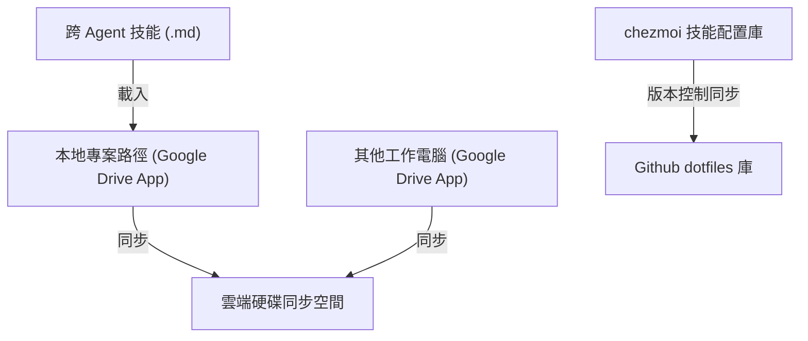

# AI Agent 實戰與 MCP 伺服器整合

本頁面專注於探討 AI Agent（如 [[Ollama]]、ChatGPT APP 與 Antigravity）在本地端與工作區的進階實務，包含 **Model Context Protocol (MCP) 伺服器部署**、**多電腦與多 Agent 的跨裝置工作同步**、以及 **Agent Skills (技能庫) 與安全沙箱 (Sandbox)** 的進階配置。

---

## 1. Model Context Protocol (MCP) 本地整合實務

Model Context Protocol (MCP) 是 Anthropic 推出的開放標準協定，允許 AI Agent 透過 Stdio 管道與本地端之伺服器進行安全的雙向通訊。透過配置 `mcp_config.json`，可授予 AI 控制本地工具的權限。

### 1.1 Google Tasks MCP 伺服器 (`gtasks-mcp`)
*   **用途**：整合 Google 工作表 (Google Tasks)，允許 Agent 自動管理、建立、更新或查詢工作待辦清單。
*   **部署流程**：
    1.  **GCP 控制台設定**：於 Google Cloud Console 建立新專案，啟用 Tasks API 並配置 OAuth 同意畫面（設定為外部/測試模式），建立 OAuth 用戶端 ID 取得 `client_id` 與 `client_secret`。
    2.  **本地部署**：自 Github 下載 `gtasks-mcp` 本地專案，執行 `npm install` 與 `npm run build`。
    3.  **執行授權**：於本地執行 `node dist/auth.js` 完成 Google 帳戶的授權，生成包含 Access Token 與 Refresh Token 的 `token.json`。
    4.  **IDE 配置**：於全域 `mcp_config.json` 寫入 `google-tasks` 伺服器節點。

### 1.2 Obsidian MCP 伺服器 (`mcp-server-obsidian`)
*   **用途**：授予 Agent 讀寫、搜尋、patch、移動、刪除您的 Obsidian 庫 (Vault) 內筆記的權限，實現 AI 對個人知識庫的直接管理。
*   **IDE 配置範例**：
    ```json
    {
      "mcpServers": {
        "obsidian": {
          "command": "node",
          "args": [
            "C:/path/to/obsidian-mcp-server/dist/index.js",
            "--vault",
            "C:/Users/username/Obsidian/Vault"
          ]
        }
      }
    }
    ```
*   **常用工具 (Tools)**：`get_vault_stats` (取得修改紀錄)、`read_multiple_notes` (批次讀取)、`search_notes` (全局檢索)、`update_frontmatter` (後設資料更新)。

---

## 2. 跨裝置與多 Agent 專案協作架構

在涉及多台電腦、多個 Agent (如 OpenCode, ChatGPT App, Antigravity) 的複雜開發場景下，如何維持技能與專案內容的完全同步是核心痛點。



### 2.1 雲端硬碟應用程式同步模式
*   **設定**：必須使用雲端硬碟的**桌面應用程式**（例如 Google Drive 桌面版，將同步模式設定為「串流檔案」或「鏡像檔案」），將專案資料夾直接建在虛擬的雲端磁碟中。
*   **優勢**：所有 Agent 在讀寫專案檔案時，底層的雲端硬碟程式會自動在背景進行即時同步，避免任何代碼丟失或複製貼上的繁瑣操作。

### 2.2 chezmoi 設定與技能同步
*   **概念**：`chezmoi` 是一個強大的 dotfiles (設定檔) 管理器。
*   **做法**：將您的全域設定（如 `mcp_config.json`、`.gitconfig` 等）與 Agent 技能宣告檔納入 chezmoi 中，並使用 Github Git 儲存庫進行版本控制。換電腦時，只需執行 `chezmoi apply` 即可秒速還原所有 Agent 運行環境。

---

## 3. Agent Skills (技能庫) 與三層架構

AI Agent 運作遵循 **技能 (Skills) — 全域 (Global) — 專案 (Project)** 的三層架構：

1.  **技能 (Skills)**：具體的任務說明書（由 Markdown 撰寫），通常放置於 `skills/` 子目錄下，搭配程式碼或外部 API 驅動特定工作流。
2.  **全域設定 (Global Settings)**：每次對話皆會載入的背景習慣，如「語音回答結論 (Edge TTS)」、「語音輸入錯字正規化」等。
3.  **專案規則 (Project Rules)**：特定工作區根目錄的 `.agents/` 或 `CLAUDE.md`，定義該專案的架構規範與程式碼風格。

### 3.1 技能升級心法 (Gems 轉 Skills)
*   **Gemini Gems 的限制**：傳統 Gems 一次只能執行單一對話，且無法調用本地指令或複雜 Python 環境。
*   **解決方案**：使用開源工具 `gem-to-agent-kit` 將 Gems 升級為 Skill 目錄。Skill 中除包含核心提示詞 `SKILL.md` 外，還可包含 `scripts/` (自動化腳本) 與 `resources/` (預設範本)。

### 3.2 報帳與數據處理自動化 Skill 實戰
*   **核心思維**：將人類的「大腦判斷公式」結構化。
*   **實例**：在 X 平台中，HSBC 員工利用 Skill 大量讀取數十頁的官方 PDF 規則，將其轉化為標準 Excel 檢查表，讓原本需要兩天的工作縮短至 10 分鐘。

---

## 4. 安全沙箱環境 (ava_sandbox)

在執行 AI 生成的程式碼或進行網路爬蟲時，為確保主機安全，通常會在隔離的 Python 沙箱中執行。

### 4.1 ava_sandbox 功能定位
*   **核心功能**：執行 Python 代碼、數據分析、以及利用內建的 `Kroki` 引擎生成各式系統架構圖表。
*   **特點**：在一個與主機完全隔離的環境中運作，雖然它是離線的，但提供了極為豐富的預裝套件。

### 4.2 預裝 Python 套件分類與用途
*   **檔案與數據處理**：`pandas`, `openpyxl`, `sqlite3` 等，提供精確的數據運算與 Excel 報表操作。
*   **網路與通訊 (僅限支援 MCP 網路版)**：`requests`, `beautifulsoup4`, `urllib3`。
*   **光學字元辨識與圖像**：`pytesseract`, `Pillow` (PIL)，用於解析複雜架構圖並提取文字。
*   **安全加密與區塊鏈**：`cryptography`, `web3` (以太坊開發套件)。
*   **格式轉換**：`omml` 數學公式庫、`markdown` 處理等。
