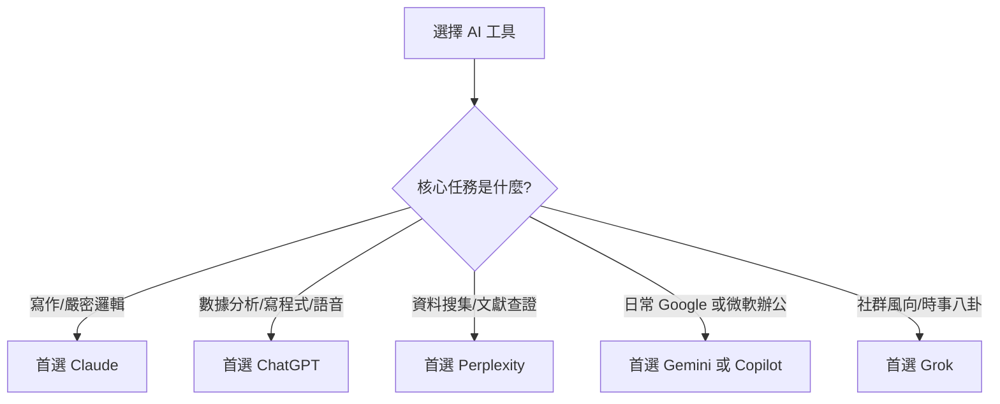

# AI 工具與任務場景橫向評比

**AI 工具與任務場景橫向評比** 旨在系統化對比 2026 年主流的六大 AI 工具（ChatGPT、Claude、Gemini、Copilot、Perplexity、Grok），並針對五大核心辦公任務情境提供選用指南。同時，本頁面也整理了如何利用 AI 設計「互動式比較儀表板（Dashboard）」的工作流，以及老牌 3C 零售商「良興電子」攜手 Data-DI 導入 `[[AI Agent 與 AntiGravity 2.0 基礎入門|AI Agent]]` 進行組織升級的企業轉型案例。

---

## 1. 六大 AI 工具五大任務情境橫向評比

針對日常辦公最常見的五大任務，各款 AI 工具展現出不同的強項與侷限：

### 📌 任務 1：腦力激盪（創意發想、企劃案點子）
需要 AI 具備發散性思考、幽默感或實時對話交互能力，用以激發靈感。
- **Grok**：觀點最不受限，具備獨特幽默感，適合跳脫框架的點子。但言論有時較為激進，需自行過濾。*(⚠️ 需付費 X Premium)*
- **ChatGPT**：**進階語音模式 (Advanced Voice)** 極度流暢自然，非常適合像與真人對話一樣進行靈感碰撞。
- **[[Claude]]**：邏輯非常嚴密，適合幫忙將雜亂無章的想法梳理成精準的企劃架構。但缺乏原生生圖，無法直接提供視覺靈感。

### 📌 任務 2：撰寫文案（郵件、社群貼文、報告、故事）
重視文筆是否自然、語氣是否精準，以及是否能避開生硬的「AI 腔」（如常出現的『值得注意的是』、『總之』等）。
- **[[Claude]] (首選)**：文筆最細膩、自然，最接近優秀人類寫手的質感。但寫作時建議主動餵入背景資料，因其聯網搜尋速度稍慢。
- **ChatGPT**：格式適應力強，配合自訂 GPTs (Custom GPTs) 能定製專屬語氣，但預設生成的文章較常有套路感。
- **Gemini**：與 Google 雲端整合度高，寫完可一鍵匯出至 Google Docs，但文筆較為中規中矩。

### 📌 任務 3：做簡報（架構規劃、內容生成、視覺輔助）
目前 AI 雖無法直接產出完美排版的簡報，但能極大加速簡報大綱與插圖設計。
- **Gemini (首選)**：可直接於 Google Slides 中自動生成大綱與 Imagen 3 圖片。不過內建生成的排版相對陽春。
- **Copilot**：可直接在微軟 PowerPoint (Office 365) 中生成簡報草稿，但需持有 M365 相關付費訂閱。
- **[[Claude]]**：利用 Artifacts 互動視窗能即時生成網頁版 HTML 簡報進行預覽，但無法直接匯出為標準 PPTX。

### 📌 任務 4：整理資料表（數據分析、統計圖表）
需要 AI 讀取 CSV、Excel，進行公式推導、統計或繪製圖表。
- **ChatGPT (首選)**：內建 **進階數據分析 (Advanced Data Analysis)** 功能，可在後台執行 Python 沙盒進行繪圖與精準運算。處理數百 MB 超大檔案時偶爾會逾時。
- **Gemini**：擁有高達 **200 萬 Token** 的超大上下文視窗，能一次吃下整本財報。但其數據計算與邏輯推導精準度稍遜於 ChatGPT。
- **[[Claude]]**：質化資料分類與歸納能力極強，但無法像 ChatGPT 一樣直接生成可下載的 Excel 檔。

### 📌 任務 5：搜集資料（文獻查找、競品分析、即時新聞）
要求 AI 具備即時聯網能力、列出明確引用來源，且不易產生幻覺。
- **Perplexity (首選)**：專為搜尋而生，會列出所有引用來源連結，幾乎沒有幻覺。但在創意寫作上表現一般。
- **Grok**：能即時抓取 X (Twitter) 上的社群時事與風向，但假新聞較多，需使用者自行識讀。
- **ChatGPT**：配備的 **Deep Research** 功能可以執行多步驟、多網頁的深度挖掘，適合進行系統化研究。

---

## 2. 工具選擇「極簡心法」

---

## 3. AI 輔助建立 HTML Dashboard 工作流

利用 AI 的網頁生成與聯網能力，使用者可以透過以下四個步驟，客製化出專屬的「AI 工具比較儀表板」：

1. **選擇聯網工具**：打開具備即時搜尋功能的 AI 工具（ChatGPT、[[Claude]] 或 Gemini 均可）。
2. **發送蒐集 Prompt**：
   > 📝 **Prompt 1**：
   > 「你是 AI 工具研究員。幫我整理以下 AI 工具（ChatGPT、Claude、Gemini 等）的比較資料...依據任務情境整理出適合工具、理由、注意事項、是否付費、核心功能。不確定之處標註 ⚠️需確認 並附上查證連結。」
3. **檢核與追問**：針對 AI 回覆中標註 ⚠️ 的地方進行檢核，追問不懂的細節以完善背景資料。
4. **生成互動網頁**：發送第二段 Prompt，利用 Claude Artifacts 或 GPT 的程式碼生成能力產出單一 HTML 檔案。
   > 📝 **Prompt 2**：
   > 「將上述資料做成互動 HTML dashboard，點選任務即時顯示推薦工具卡片（首選/可用）和理由，並根據狀況推薦訂閱項目與建議。」

### 💡 實測心得
在生成 Dashboard 時，三大 AI 的引導方向不同：**Gemini** 重視釐清使用者的情境與限制；**[[Claude]]** 著重推薦邏輯與訂閱變更彈性；**ChatGPT** 提問最細緻（預算、工作量），產出的 HTML 結構最為複雜。

---

## 4. 實體零售 AI 落地案例：良興 3C x Data-DI

> 🧭 **延伸閱讀與交叉連結**：關於更多全球商業典範轉移與數據驅動出海案例（如 Computex B2B 邊緣運算），請參閱 [[商業案例與投資思維專題]]。

創立於 1973 年的老牌 3C 全通路零售商「良興電子」（年營收破十億），攜手 AI 陪跑型顧問 Data-DI，推動了其組織的第五波轉型——**人機協作與 AI Agent 賦能**。其成功落地案例包含：

### 🎤 案例一：會議記錄與行政自動化
- **痛點**：跨部門會議繁多，人工整理會議記錄耗時，且常遺漏決策或行動項目。
- **解法**：導入 AI 會議記錄系統，以模糊比對技術修正語音辨識錯字，並將產出的報告直接存入既有資料庫。總經理指出，此工具甚至能一鍵將錄音轉文字並整理成簡報，極大釋放行政戰力。

### 🎓 案例二：AI 門市銷售對練系統與知識傳承
- **痛點**：頂尖銷售經驗鎖在資深員工腦中，新人培訓期長達 3 個月，且人員離職會帶走知識資產。
- **解法**：建置 AI 門市教育訓練系統。主管只需審核核心節點，系統自動生成教材；門市新人透過手機進行語音對練，AI 根據回話口吻、專業度及回應力進行六關自動化評分。目標是將新人培訓期縮短至 1 個月。
- **數據提煉**：良興各廠提供的素材品質不一。Data-DI 除了整合內部資料，亦引入外部市場評測，透過人工審核過濾雜訊，再以 Agent 的多層步驟進行知識限定，確保訓練素材的準確度（AI 強調「準」與「合」，而非單純的「大」）。

---

> [!TIP]
> **給企業的 AI 轉型建議**：
> 「未來 AI 導致的落差只會愈來愈大，人會變成超級工作者，企業會變成超級企業。與其急著構建宏大的架構，不如先從小工具、小任務（如三個月的任務）切入，讓員工在實作中建立對 AI 的認同與信任，這正是小步快跑的企業變革思路。」
