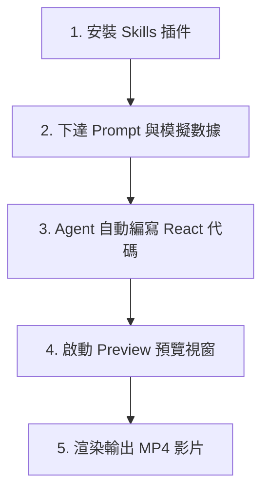

# Antigravity 與 Remotion 影片生成實務

本頁面介紹「影片即程式碼」（Video as Code）的實務應用，探討如何利用 Google Antigravity Agent 調用 Remotion Skills 來實現精準、自動化的影片工程化生產。

---

## 1. 影片生產的兩種思維模式

在 AIGC 時代，影片生成主要分為兩大陣營：

### 畫家模式 (Painter Mode) — 像素猜測
- **代表工具**：Runway、Luma AI、Kling、Sora 等。
- **運作原理**：AI 根據龐大的訓練庫，憑感覺「猜測」下一個像素該如何排列以符合描述。
- **優缺點**：
  - 👍 適合生成氣氛渲染的風景、奇幻寫實人物或抽象藝術。
  - 👎 具備高度隨機性，每次生成的結果可能大相逕庭，無法精準控制。

### 工程師模式 (Engineer Mode) — 邏輯控制
- **代表工具**：**Antigravity + Remotion Skills**。
- **運作原理**：利用 AI Agent 撰寫程式碼（React/TypeScript），再交給 Remotion 影音渲染引擎精確計算出每一幀（Frame）的畫面。
- **優缺點**：
  - 👍 具備**絕對精準度**（例如給予物理公式 $f=ma$，動畫即會完全按照該物理加速度運動，毫無偏差）。
  - 👎 難以呈現有機生命體的細微表情或極其複雜的寫實三維物理碎裂效果。

---

## 2. 影片工程的四大黃金場景與限制

### 適合應用的場景
1. **SaaS 軟體 UI 模擬**：例如展示滑鼠懸停（Hover）效果、貝氏曲線平滑對齊、文字輸入動態等，能達到像素級的流暢感。
2. **數據驅動圖表**：將後端數據與影片組件綁定。一旦數據庫更新，圖表會自動重新計算，自動渲染生成新影片。
3. **抽象邏輯解釋**：解釋純邏輯概念（例如區塊鏈共識機制、ARP 協定運作等流程圖動畫）。
4. **大規模客製化生產**：只需一套範本加上萬名用戶的數據，即可自動為每位用戶渲染出專屬的個性化影片（例如年終回顧影片）。

### 不適合的場景
- 🚫 **有機生物表情**：容易產生恐怖谷效應（建議用 Runway/Luma）。
- 🚫 **極致寫實物理模擬**：如水花四濺、布料飄動（建議用 Blender）。
- 🚫 **電影級特效**：如複雜粒子、光暈特效（建議用 After Effects 或剪映）。
- 🚫 **自然風景渲染**：樹林、海洋（建議用實拍素材）。

---

## 3. 提升影片質感的 3 大秘訣 (Spells)

要避免程式碼生成的影片顯得廉價與死板，應在 Prompt 中對 Agent 強調以下三點：

1. **Spring 物理彈性動畫**：堅決杜絕死板的線性動畫（Linear Animation）。要求所有物件的位移、縮放必須使用 Remotion 內置的 `spring` 函數，這能為動畫帶來極具質感的果凍般 bouncy 效果。
2. **Apple / Stripe 風格的視覺約束**：嚴格禁用 Emoji。指定設計語言為「Dark Mode、2px 細邊線、使用 Heroicons 圖標庫、搭配典雅漸層色」，確立高質感的視覺邊界。
3. **組件模組化（Component Modularity）**：要求 Agent 將每個影片場景拆分為獨立的 React 組件檔案（如 `Scene1.tsx`、`Scene2.tsx`），以便日後進行精確的局部微調。

---

## 4. 自動化影片生產線實操工作流

### 步驟說明
1. **武裝武庫（配置 Skills）**：
   - 到 [SKL LSMT](https://skillsmp.com/) 搜尋並下載 `remotion` 及 Edge TTS `voiceover` 中文語音插件。
   - 將檔案解壓縮後，拖入 Antigravity 工作區的 `skills` 目錄，重啟 Agent 以載入新技能。
2. **生成程式碼**：
   - 向 Agent 發送指令，例如：
     > 請使用 `remotion` 與 `voiceover` 技能製作一個動態行銷報告，配色使用典雅深色調，結合數據圖表，文字與語音需精確同步，物件移動需使用 spring 彈性物理效果。
3. **啟動預覽**：
   - 在選單中點擊 `Terminal -> New`（若不清楚啟動命令，可詢問 Agent）。
   - 執行啟動命令後，瀏覽器會彈出 `http://localhost:3000` 預覽頁面。
4. **檢查與輸出**：
   - 在預覽視窗中確認音軌、字幕與圖表動畫的同步狀況。
   - 點擊「Render」按鈕，等待渲染完成（5分鐘的 30FPS 影片相當於 9000 張高清圖片，會耗費較大 CPU 資源，需耐性等待）。
   - 完成後，可在專案的 `out/` 資料夾中取得最終的 MP4 影片。

---

## 關聯概念與頁面
- **Antigravity 系統原理**：`[[Antigravity 核心概念與五層記憶系統]]`
- **前端常用技術**：`[[前端與系統開發常用技術]]`
- **知識庫首頁**：[[index]]
