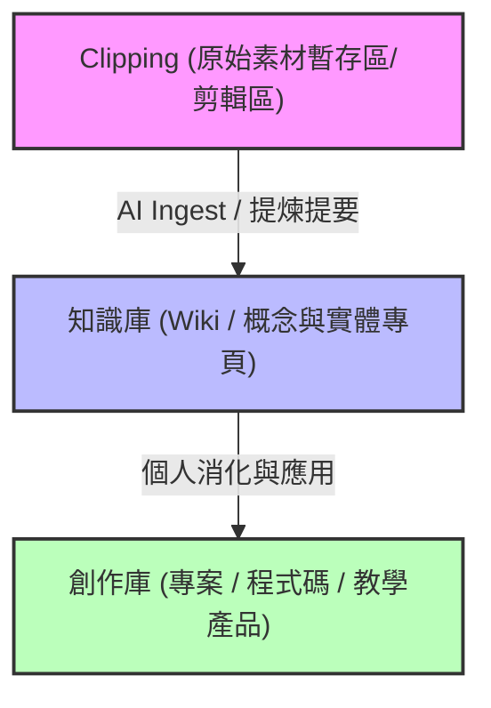

# Claude 基本功與個人 AI 工作流實戰

本頁面系統化地編譯與重整三師爸的 **Claude 基本功（EP01 - EP10）系列課程**，並結合 **Matt Pocock Skills 的本地工程化評估與實踐**，建構出一套完整的個人 AI 輔助開發、知識管理與自動化工作流指南。

---

## 一、 Claude 生態系四大模式對照 (EP01)

在 AI 時代，理解 AI 工具的運作邊界至關重要。Claude 桌面版及 CLI 提供了四種主要模式：

| 模式 | 運作環境 | 核心能力 | 限制與缺點 |
| :--- | :--- | :--- | :--- |
| **Claude Chat** | 雲端虛擬空間 | 適合純對話、答題、Microsoft Office (Word/PPT/Excel/PDF)、SVG 幾何圖表產出。 | 無法讀取本地電腦檔案，亦無法控制本地作業系統。 |
| **Claude Cowork** | 本地使用者目錄 | 可讀取與操作使用者路徑（`User` 目錄）下的檔案、設定定時排程（Scheduled）讀取 Gmail/行事曆，並可透過 Dispatch 驅動網頁瀏覽器。 | 檔案操作權限受限於 `User` 資料夾，無法跨越至其他磁碟區。 |
| **Claude Code (桌面圖形介面版)** | 本地任意選定目錄 | 可指定任何專案目錄，擁有 Plan Mode（計劃模式，按部就班）、Auto Accept（自動執行）及 Bypass Permissions（完全自動執行，需手動啟用）等開發模式。 | 較重度消耗 Token，部分高階功能需要 Pro 以上訂閱。 |
| **Claude Code CLI** | 終端機 (命令行) | 專為工程師設計的極速終端機介面，可與本地編譯器、測試框架深度整合。 | 無圖形化界面，不便於截圖對話與視覺微調。 |

---

## 二、 AI Skills 深度解密與五層擴充機制 (EP02 & Matt Pocock Skills 評估)

### 1. Skills 的本質與 Skill Creator
* **本質**：將「重複使用」且「流程固定」的 SOP 說明書，以 Markdown 格式撰寫並放入特定目錄。AI 在遇到特定任務關鍵字或斜線指令（如 `/teach`）時，會一鍵啟動該 SOP。
* **Skill Creator**：內建的技能建立器，可用自然語言引導 AI 自動生成符合規格的 `.md` 技能檔。

### 2. 五層擴充機制（由內而外層層包裹關係）
1. `CLAUDE.md`：最內層，**全域背景規則與規範**，AI 啟動時即會載入，不宜寫入過多臨時規則。
2. `Skills (技能)`：特定任務的 SOP，按需加載（On-demand），不佔用寶貴的 Context Token。
3. `MCP (Model Context Protocol)`：**外部工具接口**，連接 AI 與本地/雲端服務（如 Obsidian、Google Docs/Tasks）。
4. `Hooks (鉤子)`：自動化指令腳本，定時或在特定事件發生時執行。
5. `Plugin (外掛套件)`：最外層的**打包裝配體**，可將 Skills、Hooks、MCP Servers 與自訂 Commands 打包為單一分發套件。

### 3. Matt Pocock Skills 本地工程化實踐
針對開源技能庫 [mattpocock/skills](https://github.com/mattpocock/skills) 進行評估，其核心思想與本 Wiki 的嚴謹開發模式相契合，但為避免語言衝突（原專案為英文）及測試工具鏈衝突（原預設為 Node.js 生態的 Vitest），我們採取了**「挑選並本地客製化（Cherry-pick）」**策略：
* **客製化內容**：將 Bug 診斷等 5 大核心技能進行繁體中文化，並將測試框架調整為 Python 生態的 `uv run pytest`（具備啟動瞬捷、Assert 語法簡潔與優雅 Fixture 機制等特點）。
* **跨 Agent 相容性**：將客製化 Skills 部署於 `[project-root]/.agents/skills/` 與 `[project-root]/.claude/skills/`。除了 Antigravity，**Claude Code** 與 **OpenCode** 亦能原生讀取並呼叫這些自訂斜線指令。對於無原生支援的編輯器（如 Cursor），使用者可在對話中直接 `@` 該 Skill 文件以供 AI 遵循。
* **全域配置修正**：修正 [mcp_config.json](file:///C:/Users/niceh/.gemini/config/mcp_config.json) 中的 Obsidian MCP 路徑，剔除 `我的雲端硬碟 (antonggewkt@gmail.com)` 的舊亂碼後綴，確保 Obsidian MCP 連接正常（無 ENOENT 報錯）。

---

## 三、 NotebookLM 串接與五大進階應用情境 (EP03 & EP04)

利用 `claude-code-lazy-packs` 懶人包，可將 NotebookLM 與 Claude Code 透過 MCP 連接，擺脫網頁版手動點擊的限制，發揮以下五大自動化威力：

1. **自動化備課技能**：讀取本地教材資料夾後，自動生成 NotebookLM 簡報、摘要影片、資訊圖表與差異化教材，全自動打包。
2. **跨工具雙向同步**：研究報告自動同步寫入 Obsidian，簡報自動上傳 GitHub 備份。
3. **規模化筆記管理**：針對上百本筆記進行批次盤點與重新命名，解決網頁端難以整理大量筆記的痛點。
4. **一鍵擷取逐字稿**：結合 Web Clipper 快擷網頁，免去複製貼上，大尺度文本秒變精確結構化筆記。
5. **資訊圖表克林姆化**：藉由自然語言，讓 AI 自動呼叫代碼與 API，渲染出克林姆藝術風格的知識卡片。

---

## 四、 GitHub 倉庫一鍵部署與教學駕駛艙實作 (EP05 & EP06)

* **GitHub 懶人包**：使用特製 Markdown 檔，引導 Claude 自動註冊 GitHub 帳號並配置 Git CLI。
* **一鍵 Push 部署**：網頁寫完後，直接透過自然語言命令 AI 將 HTML、CSS、JS、圖片與音檔一鍵推送至 GitHub，完成網站發布。
* **教學駕駛艙（Teaching Cockpit）**：
  - 整合備課時繁雜的工具（簡報、白板、評量、影片）。
  - 在網頁中嵌入 NotebookLM 簡報與 YouTube 影片，加入互動式拖拉視窗（Drag-and-drop）與形成性評量。
  - 當網頁出現排版錯亂時，**利用截圖直接餵給 Claude**，讓 AI 自動分析 DOM 並修正 CSS，隨後一鍵 Push 至 GitHub Pages 上線。

---

## 五、 Obsidian 第二大腦與自動成長筆記流 (EP07 & EP08)

### 1. Karpathy 筆記原則與三層資料結構
我們將 Obsidian 的目錄與資料流設計為以下三層，確保靈感不流失、知識能提煉：

* **Clipping (`AI/raw/` 或 `AI/sources/`)**：唯讀，放置網路快擷文章、YouTube 逐字稿等原始無序的靈感素材。
* **知識庫 (`AI/wiki/`)**：AI 全權寫入與維護的概念頁與實體頁，頁面間使用 `[[雙括號]]` 建立關聯，構成大腦的知識圖譜。
* **創作庫 (最終產出)**：使用者的程式專案、教學網頁、文章。

### 2. 自動化重整與週報
透過 Claude Code 的 Scheduled 任務，定期（如每週五）對知識庫執行：
* **健康度檢查 (Lint)**：自動查找無效連結與無入站連結的「孤立頁面」。
* **內容缺口分析 (Content Gap Analysis)**：主動提示使用者目前知識圖譜中缺乏哪些關聯主題，並建議補充。
* **知識週報**：自動分析本週新增素材，產出系統化的學習進度週報。

---

## 六、 Supabase 免費資料庫與 MCP 自然語言操控 (EP09)

在 AI 輔助開發中，**Supabase** 由於具備官方提供的 MCP Server，相比 Firebase 更有利於 AI Code 整合：
* **免代碼串接**：AI 能夠讀取 Supabase 的 MCP 接口，直接使用自然語言對資料庫進行 Table 建立、Schema 設計與數據 Query（例如：「幫我抓取文字雲網頁裡的所有留言，並用 SQL 統計關鍵字」）。
* **自動化防閒置排程**：針對免費版 Supabase 閒置一段時間後會自動暫停（Pause）的痛點，利用 Claude 的排程功能（Scheduled Hook），設定每日自動對資料庫進行一次微量讀寫（Ping），確保資料庫服務永不中斷。

---

## 七、 專案管理「一桌三櫃」法與上下文控制心法 (EP10)

當專案規模擴大時，大模型的 Context Window 容易因為過多零碎的程式碼與歷史對話而「疲勞過載」，導致回答品質崩潰。三師爸提出了**「一桌三櫃」**的架構來完美控制 AI 的上下文記憶：

### 1. 一桌三櫃架構
* **一桌（工作桌）**：**Google Drive 雲端同步資料夾**。作為本地檔案的即時同步中心，確保多台電腦、多個 Agent（如 Antigravity、Claude Code、Cursor）共享完全一致的代碼物理檔案。
* **三櫃（三大儲存庫）**：
  1. **程式櫃 (GitHub)**：專門負責代碼的版本控制與 Pages 發布。
  2. **資料櫃 (Firebase / Supabase)**：負責應用程式運行時的數據儲存。
  3. **記憶櫃 (Obsidian)**：儲存開發筆記、SOP 技能與 Agent 的 CLAUDE.md。

### 2. 上下文（Context）控制心法
* **限制 Context 膨脹**：不要讓 AI 讀取整個 node_modules 或大體積編譯檔。在 `.gitignore` 與 `CLAUDE.md` 中排除不必要的資料夾。
* **狀態同步機制**：在開發複雜專案（如「座標軍艦旗」對戰遊戲）時，每完成一個階段，主動要求 AI 將當前的系統架構與已解決的 Bug 記錄回 Obsidian 筆記中。下一次開啟新對話時，直接讓 AI 讀取該筆記以「繼承記憶」，避免 AI 從零開始猜測。
