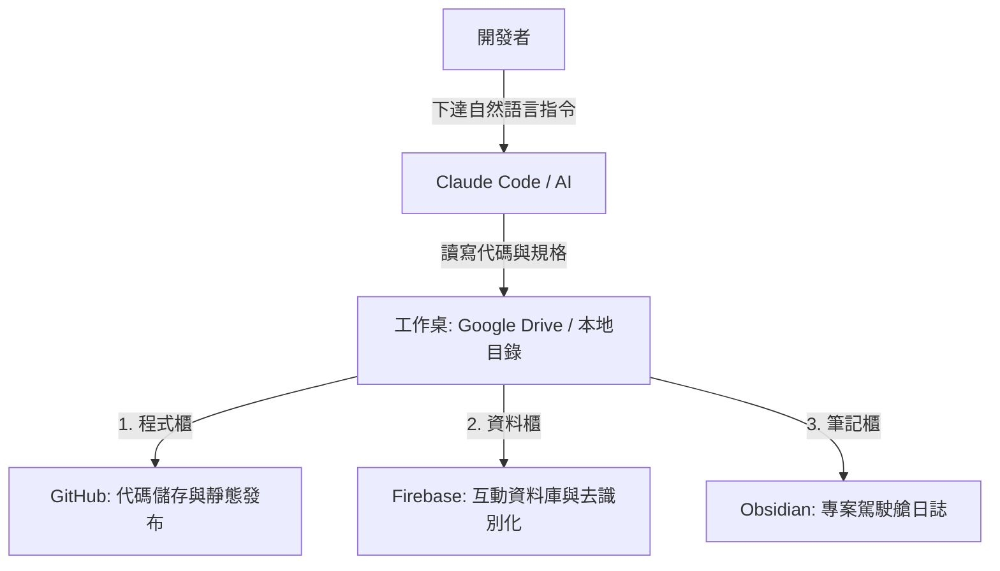

# Claude 專案管理一桌三櫃工作流

**Claude 專案管理一桌三櫃工作流**（又稱「專案駕駛艙」工作流）是由三師爸研發出的 AI 輔助開發專案管理方法。旨在解決使用 [[Claude]] Code、桌面版或 API 進行專案開發時，因對話拉長導致的資訊混亂、AI 上下文记忆體爆量變笨、以及跨裝置同步與資料庫串接混雜等痛點。

---

## 1. 「一桌三櫃」架構定義與環境部署

在開始任何 AI 輔助開發專案前，必須先建立一個分工明確的「一桌三櫃」開發環境：



### 🗄️ 一桌 (One Desk) — 雲端同步工作桌
*   **載體**：本地端專案工作目錄（建議設在 Google Drive 等雲端硬碟下）。
*   **定位**：這是 Claude Code 實際進行代碼讀寫與執行的物理場所。
*   **優點**：藉由 Google Drive 的同步機制，開發者在不同裝置（例如桌機與筆記型電腦）上的程式碼可即時同步，實現跨裝置無縫接軌。
*   **🚨 注意事項**：
    1.  若要將網頁打包成原生電腦 App，雲端磁碟的同步鎖定機制可能導致打包失敗，此時應改用本機實體硬碟（如 C 槽或 D 槽）。
    2.  切勿同時開啟兩台電腦在同一個雲端專案目錄下執行 Claude Code，否則同步延遲會導致嚴重的檔案衝突與飄移。

### 🗄️ 三櫃 (Three Cabinets) — 雲端儲存與備份
1.  **櫃一：GitHub (程式櫃)**
    *   **用途**：管理代碼版本（Git 提交記錄）與發布靜態網頁（如 GitHub Pages，供學生/用戶直接訪問）。
    *   **運作**：開發者只需使用自然語言，Claude Code 會自動在本地執行 `git add`、`commit` 與 `push`，完全不需手動點擊或敲擊繁瑣 Git 指令。
2.  **櫃二：Firebase (資料櫃)**
    *   **用途**：儲存使用者與網頁互動產生的所有動態數據，實現前後端分離。
    *   **資訊安全與去識別化**：開發教學或課堂互動 App 時，**絕對不可收集學生真實姓名**，應僅收集「班級座號」，真實姓名對照表僅留存在教師個人的本機中，落實學生個資安全防護。
3.  **櫃三：[[個人知識管理系統構築|Obsidian]] (筆記櫃 / 專案駕駛艙)**
    *   **用途**：記錄專案想法、開發進度、踩坑記錄與改版決策日誌。
    *   **運作**：Obsidian 的 Markdown 格式是 AI 最友善的結構，不僅人類能閱讀，AI 亦能高效檢索。

---

## 2. 上下文與 AI 記憶管理心法 (Context Management)

### 痛點：AI 越用越笨？
AI 的上下文視窗（Context Window）是有上限的。當對話拉長，或者讀取的代碼庫太大時，上下文會迅速被佔滿。由於大模型的計費與推理機制是每次對話都將「全部歷史+目前指令」打包送給雲端，這會導致：
1.  **推理精準度急劇下滑**，AI 開始胡言亂語或忘記先前的約定。
2.  **Tokens 額度消耗速度呈指數型增長**，造成成本浪費。

### 解決之道：駕駛艙載入法
為了解決此問題，我們必須定期清空對話（New Session），但又不能讓 AI 遺忘專案的進度與約定。

```markdown
1. claude.md (架構藍圖)     --> 放置於專案根目錄，保持輕量，僅定義全局架構、核心技術決策。
2. Obsidian 專案工作流程 (日誌) --> 記錄詳細進度、TODO、已踩坑點與當前改版。
3. 駕駛艙啟動指令            --> 新開對話後輸入：「讀取 [Obsidian專案筆記名稱] 並依據 claude.md 繼續專案。」
```

*   **效果**：新對話一啟動，Claude Code 會優先去讀取 Obsidian 專案筆記與 `claude.md`，這只會佔用約 50k–60k Tokens 的起步記憶，既清空了雜亂的歷史對話，又讓 AI 繼承了完整的進度，瞬間恢復到最聰明、運算成本最低的狀態。
*   **優勢**：因為是標準 Markdown，此方法即使更換其他 AI 工具也能完美通用。

---

## 3. 安全防護與輔助工具實務

*   **金鑰保護 (API Key Safety)**：Claude Code 具備自動把關機制，在提交上傳至 GitHub 時，若偵測到代碼中夾帶有敏感的 API Key，會主動警告並攔截。API 金鑰應安全地保存在本地環境變數或被 `.gitignore` 排除的配置檔中。
*   **chezmoi 跨裝置同步**：若在多台電腦間切換，Claude Code 的「自訂技能 (Skills)」預設不會隨雲端同步。可以使用 `chezmoi` 命令列工具，將不同裝置間的 CLI Settings 與 Skills 進行同步備份。
*   **Claude Design 前端優化**：在專案開發尾聲，可調用 Claude 桌面版的 Claude Design 功能，對生成的 UI/UX 進行視覺美化與樣式修飾（注意：此功能 token 消耗量較高，建議在主要功能開發完成後再行調用）。

*(相關概念延伸閱讀：[[AI 第二大腦與 Claude Cowork 自動化]])*
