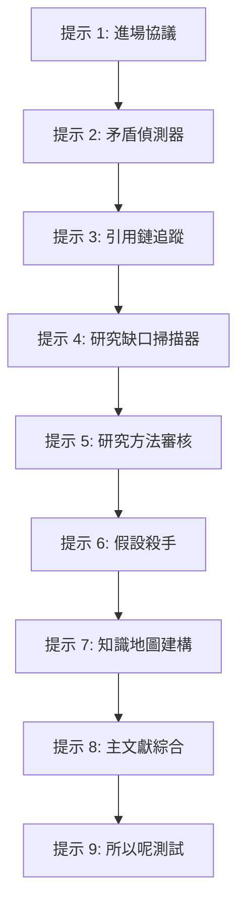

# Claude 高階提示詞與應用場景

**Claude 高階提示詞與應用場景** 系統性地總結了 Anthropic 推出新版模型後，人機協作思維從「一次性提示詞」轉向「長期情境工程（Context Engineering）」的演進，並深度解析如何將 Claude 應用於高難度學術文獻分析、複雜商業決策及日常開發場景。此外，本篇收錄了本地 CLI 工具 [[Claude|Claude Code]] 的完整安裝指南與 13 大類指令/快捷鍵速查。

---

## 1. Claude Opus 4.7 官方提示詞升級與「少即是多」原則

隨着 Claude 模型的疊代，早期為了防止 AI 偷懶或敷衍而設計的提示詞策略已不合時宜。新一代模型展現出更強的前期探索與理解能力，提問策略需要相應重構：

### 🎯 調整一：適應更「字面化（Literal）」的推理
Opus 4.7 在低努力值（effort）設定下，會更嚴格地字面遵守指令，而不會主動去推論你沒有明說的邊界。
*   **舊版問法**：`幫我審查這份合約。`（AI 會自動猜測你的輸出樣式並提供籠統審查）
*   **新版問法**：`請逐條審核此合約，按「潛在風險、權利讓渡、修改建議」三部分進行結構化輸出，並以表格列出。`

> [!NOTE]
> 透過 API 使用新模型時，延伸思考預設是關閉的，必須顯式設定 `thinking: {"type": "adaptive"}` 或 `thinking: {"type": "enabled"}`，並配置 `output_tokens` 以獲取深層邏輯。

### 🌟 調整二：正向指令勝過否定警告
與其花費 Token 告訴 Claude「不要做什麼」，不如直接給出正向範例或明確定義期望的呈現形式。
*   **不推薦（否定）**：`不要使用專業術語。語氣不要像行銷人員。不要列點。`
*   **推薦（正向）**：`請使用大眾易懂的詞彙，撰寫一段語氣真誠、流暢且不帶銷售性質的介紹段落。`

### 💡 調整三：「少即是多」原則，剔除冗餘干擾
新版模型具有極強的主動研究與探索能力。如果使用者在提示詞中不斷強調「請仔細思考」、「一步一步推理」、「不要偷懶」，反而會干涉 AI 正常的思考節奏，導致過度推理，讓反應速度變慢或產生膨脹的答案。
*   **做法**：直接指出要結果，例如 `建立一個完整的數據分析儀表板，包含關鍵指標與互動圖表`，而不需要具體規定「先規劃結構，再逐步設計功能」。

---

## 2. 情境工程 (Context Engineering) 與記憶設定

傳統的提示詞工程（Prompt Engineering）存在根本缺陷：每次新開啟對話，上下文都會完全重置。而**情境工程（Context Engineering）**則主張將「AI 記憶」視作一項基礎建設，透過結構化文件來打造專屬的 AI 同事。

### 📂 1. 建立永久系統指令（三個核心檔案）
在專案目錄或 AI 第二大腦中，建立以下三個基礎 `.md` 檔案，引導 AI 形成對使用者的長期認知：
1.  `about-me.md`：記錄使用者的姓名、職稱、目前主要的核心任務與目標讀者輪廓。
2.  `brand-voice.md`：明確定義偏好的語氣風格（例如：簡潔、對話式）、常用詞彙範例，以及絕對避用的字眼。
3.  `working-rules.md`：指定執行前的確認流程（哪些情境須詢問）、預設輸出格式與品質驗收標準。

### 🔄 2. 結構化進度日誌：`project-state.md`
為瞭解決跨對話記憶丟失，可要求 Claude 在每次任務結束後，將關鍵決策與當前進度寫入一個 `project-state.md`。下次開啟新 Session 時，第一步直接讓 Claude 讀取該檔案，便能無痛銜接上次的工作進度。

### 📲 3. 記憶無痛遷移：從 ChatGPT / Gemini 轉移至 Claude
Anthropic 推出了「記憶轉移」功能（Switch to Claude），免費方案與付費方案用戶均能使用。

*   **第一步：在舊平台（ChatGPT/Gemini）輸入專用提示詞**
    ```markdown
    請分析我們過去的對話歷史，總結出你對我的核心了解。請整理成一份結構化報告，包含我的個人背景、工作職責、溝通風格偏好、常見任務類型，以及我特別重視的品質標準。這份總結將用於設定另一個 AI 系統的長期記憶，請用繁體中文撰寫。
    ```
*   **第二步：匯入至 Claude 記憶設定**
    進入 Claude 「設定（Settings） → 隱私權（Privacy）」，將舊 AI 生成的彙整報告直接貼入「記憶設定（Memory）」頁面即可。

---

## 3. 高難度學術與決策應用場景

### 🎓 史丹佛博士生文獻分析法：9 段提示詞鏈
若要將數十篇甚至上百篇的 PDF 論文快速提煉為高品質研究報告，可依序使用以下 9 個具有內在邏輯鏈的提示詞：



1.  **提示 1｜進場協議 (Intake Protocol)**：
    `我要分享 [X] 篇關於 [主題] 的論文。在讀完所有 PDF 之前，僅以表格形式列出：文件名、作者、出版年份、研究核心問題與樣本量。先不要進行深入總結。`
2.  **提示 2｜矛盾偵測器 (Contradiction Finder)**：
    `在所有上傳的論文中，找出所有兩位或以上作者直接互相矛盾的論點。列出矛盾點、涉及的文獻、以及各方支持的證據。`
3.  **提示 3｜引用鏈追蹤 (Citation Chain)**：
    `找出這些論文中被引用最多次的 3 個核心概念。解釋這些概念在文獻脈絡中是如何被繼承、修正或質疑的。`
4.  **提示 4｜研究缺口掃描器 (Gap Scanner)**：
    `根據所有論文，找出 5 個目前「尚未有人完整回答」的研究缺口。對每個缺口，列出目前最接近的既有研究，並說明為何這仍是缺口。`
5.  **提示 5｜研究方法審核 (Methodology Audit)**：
    `比較所有論文使用的研究方法（如問卷、實驗、模擬等）。分析各方法對所得結論的潛在偏差（Bias）影響。`
6.  **提示 6｜假設殺手 (Assumption Killer)**：
    `列出這些論文中多數人共同預設、但從未在文內被明確論證的假設。這些隱性假設如果失效，會如何推翻其核心結論？`
7.  **提示 7｜知識地圖建構 (Knowledge Map Builder)**：
    `請為這批文獻建立結構化知識地圖。包含：核心共識、主要分歧支流、關鍵邊界條件與未來研究方向。`
8.  **提示 8｜主文獻綜合 (Master Synthesis)**：
    `基於前述的所有分析，撰寫一篇符合學術規範的文獻回顧大綱，長度約 2000 字，必須直接引用文獻中的發現與數據。`
9.  **提示 9｜「所以呢？」測試 (The "So What" Test)**：
    `假設我必須在 5 分鐘內向一位聰明的非專業人士解釋這整批研究。請將其提煉為：一個大眾比喻、三個最重要的實際應用價值，以及對未來生活的一個重大啟示。`

---

### 🤝 決策評估與思考夥伴提示詞
利用以下 3 個實用提示詞，能把 Claude 從普通的「回答機器」升級為「會挑剔反駁」的智囊夥伴：

*   **決策盲點反駁 (Devil's Advocate)**：
    `我已經決定要做 [X]。請你用最強的論據，全力論證這個決定為什麼是錯的。不要客氣，把每一個可能的風險和反對理由都列出來。`
*   **紅隊安全測試 (Red Team Strategy)**：
    `你是一位精明且見過世面的業界老手，看過 50 家公司用完全相同的策略失敗。請檢視以下方案：[貼入策略]。這個計畫會在哪裡崩盤？第 9 個月的失敗場景會是什麼樣子？`
*   **風格仿寫引導 (Style Mimicker)**：
    `（在 Projects 功能中上傳 5-10 篇個人文章後輸入）研究這些寫作範本，學習我的語氣與風格。在這個專案的所有回覆中，都請匹配我的寫作節奏與用語習慣。`

---

## 4. 人機協作本質：AI 「改稿」流暢度量化研究

Anthropic 發表了基於 9,830 則真實對話的「**4D 人工智慧流暢度框架（AI Fluency）**」，研究指出「會打開 AI」與「真正會用 AI」的本質差異：

1.  **「改稿」是流暢度的總開關**：高達 85.7% 的對話顯示，高效能使用者絕不會停在 AI 的第一個答案，而是透過反覆的「迭代與修改（Iteration）」，將初稿轉化為高階成品。
2.  **成品效應的陷阱**：研究發現，一旦 AI 產出了看起來非常精美、完整的成品（如程式碼、排版美觀的簡報、報告），人類的質疑與核對力道會顯著下降 12% 以上。
3.  **五大 AI 實戰守則**：
    *   **守則一**：把 AI 當作長線合作者，而非一次性搜索引擎。
    *   **守則二**：一開始就寫好工作說明書（講清目標、受眾與雷區）。
    *   **守則三**：輸出成品越漂亮，越要刻意啟動「質疑模式」進行事實核對。
    *   **守則四**：事前跟 AI 設定合作條款（如「若發現我的前提有誤，請立刻打臉反駁」）。
    *   **守則五**：將最終的合理性檢查（Sanity Check）留給人類自己，對結果承擔責任。

---

## 5. 附錄：Claude Code CLI 安裝與 13 大類指令/快捷鍵速查

### 🔧 終端機 CLI 安裝步驟
與圖形 Desktop App 相比，CLI 終端機版本支援互動式命令操作，且能直接在終端執行構建與測試腳本，更適合工程化環境。推薦搭配使用 **Warp 終端機**（Mac / Windows）。

1.  **Mac 系統一鍵安裝**：
    ```bash
    curl -fsSL https://gist.githubusercontent.com/oberonlai/f4f6b8a7a2f8e0c70118d2d437e326b5/raw/install-claude-code-mac.sh | bash
    ```
2.  **Windows 系統一鍵安裝**（以系統管理員身分開啟 Warp 終端機）：
    ```powershell
    irm https://gist.githubusercontent.com/oberonlai/61ef05497999adc560600fceaabfe2b8/raw/install-claude-code-windows.ps1 | iex
    ```

---

### 💻 Claude Code 斜線指令大全 (13 大類)

| 類別 | 指令 | 說明 |
| :--- | :--- | :--- |
| **一、對話與上下文** | `/btw <問題>` | 提出側邊問題，**不寫入對話歷史**，不污染主線 |
| | `/compact [焦點]` | 壓縮對話歷史釋放上下文，可指定保留重點 |
| | `/context [all]` | 視覺化上下文使用量，列出膨脹點與優化建議 |
| | `/clear [名稱]` | 清空上下文開啟新對話（舊對話可用 `/resume` 取回） |
| | `/recap` | 生成目前工作階段的單行摘要 |
| | `/export [檔名]` | 匯出對話為純文字或啟動複製對話框 |
| | `/copy [N]` | 複製最後/指定回覆，按 `w` 可將程式區塊寫入檔案 |
| **二、程式變更與版本** | `/diff` | 互動式差異檢視器，左右鍵切換 git diff/每回合變更 |
| | `/rewind` | 將對話和程式碼倒帶到上一個 checkpoint |
| | `/branch [名稱]` | 建立對話分支，實驗不同開發方向 |
| | `/add-dir <路徑>` | 新增額外的工作目錄 |
| | `/security-review`| 審閱當前分支變更，偵測注入、漏洞等安全風險 |
| | `/review [PR]` | 本地審查 Pull Request；深度審查使用 `/ultrareview` |
| **三、任務規劃與自動化**| `/plan [描述]` | 進入計畫模式，Claude 先擬定技術大綱再動手 |
| | `/ultraplan <提示>`| 在網頁端草擬計畫，再遠端執行或回傳終端 |
| | `/goal [條件\|clear]`| 設定持續目標，AI 跨回合工作直至目標達成 |
| | `/schedule [描述]`| 雲端例行排程工作的對話式引導設定 |
| | `/autofix-pr [提示]`| CI 失敗或審查評論時自動修復並推送（需 `gh` CLI） |
| **四、Agent 管理** | `/agents` | 管理 agent 配置與開啟 Agent 管理員 |
| | `/tasks` | 管理目前工作階段背景執行的任務 |
| | `/background [提示]`| 將當前任務分離至背景 agent 執行，釋放命令行 |
| | `/stop` | 停止目前附加的背景工作階段 |
| **五、工作階段管理** | `/rename [名稱]` | 重新命名目前工作階段 |
| | `/resume [Session]`| 繼續之前的對話或開啟工作階段選擇器 |
| | `/desktop` | 將工作階段移至 Claude 桌面 App 執行 |
| | `/teleport` | 將網頁版 Claude Code 工作階段拉入此終端 |
| | `/remote-control` | 允許工作階段從 claude.ai 網頁端進行遠端控制 |
| | `/remote-env` | 配置網頁端對話的預設遠端環境 |
| | `/sandbox` | 切換安全沙箱模式 |
| **六、模型設定** | `/model [模型]` | 切換模型，可用左右鍵微調 efforts 努力程度 |
| | `/effort [級別]` | 調整努力值（low, medium, high, xhigh, max, auto） |
| | `/fast [on\|off]` | 切換快速推理模式 |
| **七、介面個人化** | `/config` | 打開設定面板（主題、模型、輸出樣式等） |
| | `/theme` | 更換色彩主題（深淺色、色盲模式、ANSI 等） |
| | `/color [顏色]` | 自訂本次 Session 提示列的顏色 |
| | `/tui [mode]` | 切換 UI 渲染器（`fullscreen` 啟用 alt-screen） |
| | `/focus` | 切換焦點檢視，隱藏冗長工具日誌（全螢幕專屬） |
| | `/scroll-speed` | 互動式調整滑鼠滾輪捲動速度 |
| | `/keybindings` | 編輯或配置自訂快捷鍵檔案 |
| | `/statusline` | 配置 CLI 狀態列顯示內容 |
| | `/terminal-setup` | 設定 Shift+Enter 等終端專屬快捷鍵 |
| **八、記憶體與權限** | `/memory` | 編輯 `CLAUDE.md` 與管理自動記憶項目 |
| | `/permissions` | 設定工具的允許/詢問/拒絕規則，檢視拒絕紀錄 |
| | `/init` | 用 `CLAUDE.md` 初始化當前專案 |
| **九、外部整合** | `/mcp` | 管理 Model Context Protocol 伺服器與 OAuth 驗證 |
| | `/ide` | 管理並檢視 IDE（VS Code, Cursor 等）連線狀態 |
| | `/chrome` | 配置 Claude in Chrome 連接器設定 |
| | `/install-github-app`| 串接存放庫 GitHub Actions 整合 |
| | `/install-slack-app`| 安裝 Slack App 連線 |
| | `/voice [mode]` | 切換語音聽寫模式（需 claude.ai 帳戶） |
| | `/web-setup` | 本地 `gh` CLI 授權連接網頁版 Claude Code |
| | `/setup-bedrock` | 設定 Amazon Bedrock 雲端模型驗證 |
| | `/setup-vertex` | 設定 Google Vertex AI 雲端模型驗證 |
| **十、Skills & Plugins** | `/skills` | 列出可用 Skills，按 `t` 依 token 排序，`Space` 隱藏 |
| | `/plugin` | 管理與配置 Claude Code 外掛模組 |
| | `/reload-plugins` | 不重啟 CLI 重新載入所有 plugins |
| **十一、診斷與帳戶** | `/doctor` | 診斷安裝設定，按 `f` 由 Claude 自動修復環境 |
| | `/heapdump` | 輸出 JS 堆記憶體快照至桌面以供診斷 |
| | `/usage` | 檢視工作階段成本、Token 限制與統計 |
| | `/extra-usage` | 配置額外付費使用額度，避免頻繁限流 |
| | `/status` | 顯示當前版本、模型、帳戶狀態 |
| | `/insights` | 產生專案分析報告（互動模式、摩擦點診斷） |
| | `/privacy-settings`| 調整數據隱私設定（Pro/Max 專屬） |
| | `/upgrade` / `/login`| 開啟升級頁面／執行登出登入 |
| **十二、團隊協作** | `/team-onboarding`| 根據 30 天歷史生成團隊引導 Markdown 指南 |
| **十三、其他功能** | `/help` / `/powerup`| 顯示說明文檔／開啟互動式動態功能教學 |
| | `/release-notes` | 查看變更日誌 |
| | `/radio` / `/stickers`| 開啟 Lo-Fi 音樂電台／訂購 Claude 貼紙 |
| | `/exit` | 關閉並結束 Claude Code 終端 |

---

### ⌨️ Claude Code 常用快捷鍵速查

| 快捷鍵 | 系統名稱 | 說明 |
| :--- | :--- | :--- |
| **`Ctrl + C`** | `app:interrupt` | 中斷當前 AI 執行或程式輸出（無法重新綁定） |
| **`Ctrl + D`** | `app:exit` | 退出並關閉 Claude Code CLI（無法重新綁定） |
| **`Ctrl + T`** | `app:toggleTodos` | 展開/隱藏當前任務的 TODO 執行清單 |
| **`Ctrl + O`** | `app:toggleTranscript`| 切換詳細的執行日誌與逐字稿檢視 |
| **`Ctrl + J`** | `chat:newline` | 在輸入欄中插入換行，而不直接送出訊息 |
| **`Escape`** | `chat:cancel` | 清空或取消目前正在輸入的提示詞 |
| **`Ctrl + L`** | `chat:clearInput` | 重繪終端畫面；在全螢幕下 2 秒內連按兩次執行 `/clear` |
| **`Cmd + K`** | `chat:clearScreen` | 全螢幕模式下 2 秒內連按兩次執行 `/clear`（macOS） |
| **`Ctrl + G`** / **`Ctrl + X Ctrl + E`** | `chat:externalEditor`| 在系統預設的外部編輯器（如 Vim/Nano）中撰寫提示詞 |
| **`Ctrl + S`** | `chat:stash` | 暫存（Stash）當前輸入框中的草稿內容 |
| **`Ctrl + _`** / **`Ctrl + Shift + -`**| `chat:undo` | 復原上一步在輸入框中的編輯動作 |
| **`Shift + Tab`** | `chat:cycleMode` | 循環切換權限模式（Windows 無 VT 模式時為 `Meta + M`） |
| **`Meta + P`** | `chat:modelPicker` | 快速開啟模型切換滑動面板 |
| **`Meta + O`** | `chat:fastMode` | 快速切換開啟/關閉快速推理模式 |
| **`Meta + T`** | `chat:thinkingToggle` | 快速切換開啟/關閉延伸思考（Thinking）模式 |
| **`Ctrl + X Ctrl + K`**| `chat:killAgents` | 強行終止當前工作階段中運行的所有背景子 Agent |
| **`Ctrl + R`** | `history:search` | 開啟終端輸入歷史紀錄搜尋（以關鍵字回溯舊提示） |
| **`↑` / `↓`** | `history:prev/next` | 循環切換上一筆 / 下一筆歷史輸入記錄 |
