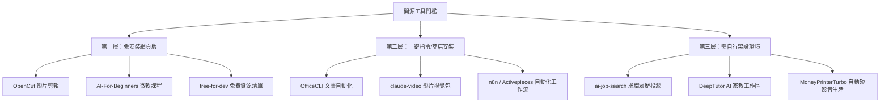

# GitHub 開源工具與 AI Skills 入門指南

## 概述與核心理念

在 AI Agent 時代，**GitHub** 已不僅僅是軟體工程師託管程式碼的平台，更是一座對所有人開放的全球開源工具與 AI 技能庫。透過理解 GitHub 的基礎運作架構，使用者無需具備深厚的程式開發背景，也能透過自然語言請 AI Agent（如 [[Claude]] Code、Codex、Cursor 或 [[OpenCode 新版架構與模型最佳搭配指南|OpenCode]]）協助解讀專案、進行安全評估並自動部署，從而大幅降低商用軟體的訂閱成本。

---

## 一、新手必懂的 GitHub 6 大關鍵詞與 3 大挑選信號

### 1. 核心名詞白話解析

| 名詞 | 英文術語 | 實務概念與白話比喻 |
| :--- | :--- | :--- |
| **倉庫 (儲存庫)** | `Repository / Repo` | 專案的主資料夾，存放該工具的所有程式碼、文件與配置檔。 |
| **自述說明檔** | `README.md` | 專案的「產品說明書」，通常包含功能介紹、Demo 截圖與安裝指令。 |
| **星標數** | `Star` | 類似社群媒體的「按讚/收藏」，反映專案的受關注度與社群認可。 |
| **發行版本** | `Release` | 開發者打包好的正式穩定版安裝檔（如 `.exe`、`.dmg` 或安裝包）。 |
| **本機保存** | `Commit` | 在**自己電腦本機**完成一次進度存檔（尚未同步至雲端）。 |
| **雲端推送** | `Push` | 將本機的 Commit 紀錄真正**上傳**同步至 GitHub 雲端倉庫。 |

> [!TIP]
> **Commit vs. Push**：最容易混淆的觀念是「Commit 只是本機存檔，Push 才是真的上傳」。在請 AI Agent 協作時，釐清這兩個步驟即可精準掌握版本狀態。

### 2. 評估開源專案的 3 大關鍵信號

1. **Star 數量級**：幾百顆星與數萬顆星代表不同的社群檢驗程度與成熟度。
2. **最近更新時間**：若專案超過半年無任何維護更新，需留意依賴套件損壞或斷更風險。
3. **安裝門檻與 Demo**：優先選擇 README 開頭附有**網頁在線體驗版 (Web Demo)** 或**一行安裝指令 (One-line Install)** 的專案。

---

## 二、開源工具三層門檻分類與精選推薦

### 1. 第一層：免安裝，瀏覽器打開即用（零門檻）
- **OpenCut**：開源免費用網頁影片剪輯器，功能對標剪映（CapCut），超過 8 萬顆星，打開瀏覽器即可剪輯。
- **AI-For-Beginners**：微軟開源的 12 週、24 堂課 AI 基礎教材，互動式程式筆記可直接在雲端執行。
- **free-for-dev**：收錄上千個雲端開發、資料庫、信箱與託管服務免費額度清單，為個人專案零成本上線的首選查詢庫。

### 2. 第二層：一行指令或商店式一鍵安裝（低門檻）
- **OfficeCLI**：單一執行檔、免安裝微軟 Office，讓 AI 透過 CLI 操作 Word、Excel、PowerPoint。
- **claude-video**：為 Claude Code 擴充影片解析能力的工具包，丟入影片連結即可提問解析。
- **n8n / Activepieces**：可私有化部署的可視化拖拉自動化平台，串接信箱、表單與 AI 模型，取代 Zapier 等高額付費工具。

### 3. 第三層：需自行架設 Python/Node 環境（進階自架）
- **ai-job-search**：基於 Claude Code 自動蒐集職缺、客製化履歷並追蹤投遞的一站式工具。
- **DeepTutor**：結合家教、解題、出題與研究的完整網頁操作學習工作區。
- **MoneyPrinterTurbo**：輸入主題自動生成文案、配音、字幕與畫面的一條龍短影音生產線。

---

## 三、GitHub AI Skills 4 大資源入口與安全守則

### 1. AI Skills 精選入口
社群慣以 `awesome-主題` 命名高品質精選清單：
1. **Anthropic 官方 Skills**：`anthropics/skills`（原廠示範，安全性高）。
2. **awesome-agent-skills**：收錄破千個跨 Claude Code、Codex、Cursor 之 Skill。
3. **awesome-mcp-servers**：[[LLM 到 Agent 的工程解析|MCP 伺服器]] 綜合目錄，如同 AI Agent 的 App Store。
4. **awesome-copilot**：GitHub Copilot 提示詞與配置擴充庫。

### 2. 下載安裝前之 3 大風險防範

> [!WARNING]
> 1. **資安風險**：AI Skills 本質為外部指令與腳本，切勿隨意安裝來路不明的套件。務必檢查是否有可疑網路請求、惡意資料回傳指令，且絕不將 API Key 或敏感機密交給未驗證工具。
> 2. **隱形成本**：「軟體免費」不代表「使用免費」，需確認是否需自備 GPU、雲端伺服器或商業 LLM API。
> 3. **斷更風險**：開源專案可能因維護者轉移或重構而中斷，核心業務工作流應避免重度綁定單一小型專案。

---

## 關聯頁面
- `[[AI 工具與框架概覽]]`
- `[[Claude Cowork 與 Agent Skill 實務]]`
- `[[LLM 到 Agent 的工程解析]]`
- `[[前端與系統開發常用技術]]`
