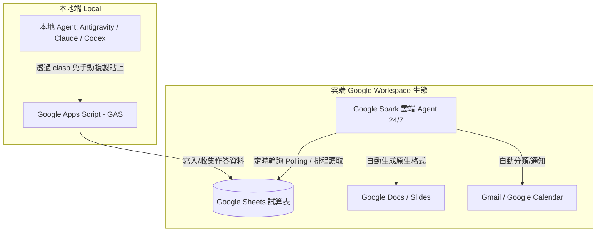

# Google Spark 與 GAS 雲端自動化實務

## 概述與定位

**Google Spark** 是 Google 在 Gemini 生態系中推出的雲端常駐型 AI Agent（Beta 階段，適用於 Google One AI Premium / Pro 訂閱用戶）。不同於在使用者電腦本機運行的 Agent（如 [[Antigravity 核心概念與五層記憶系統|Antigravity]]、[[Claude]] Code、Codex），**Spark 完全常駐於 Google 雲端伺服器**；即使關閉個人電腦，Spark 仍可在背景持續執行**排程 (Scheduling)**、**輪詢 (Polling)** 與 **Google Workspace 檔案批次處理**。

結合本機 Agent 透過 `clasp` 工具直接撰寫並部署的 **Google Apps Script (GAS)**，能形成強大的「前端資料收集 $\rightarrow$ Google 試算表 $\rightarrow$ 雲端 Spark 自動定時處理」無伺服器自動化閉環。

---

## 一、Google Spark 與各類工具之分工矩陣

| 維度 / 工具 | **Google Gemini** | **Google Spark** | **本機 Agent (Claude Code / Antigravity)** |
| :--- | :--- | :--- | :--- |
| **執行環境** | 雲端（即時會話） | **雲端 24/7 背景常駐** | 本機端（依賴電腦開啟） |
| **核心優勢** | 對話問答、Deep Research | **原生 Google 生態排程、檔案整理、輪詢** | 複雜專案重構、本機程式碼/CLI 控制 |
| **檔案生成** | 聊天視窗輸出文字 | 原生 **Google Docs, Sheets, Slides** 格式 | 本地檔案系統讀寫、Git 控制 |
| **程式編寫與部署** | 產生程式碼（需手動複製貼上） | 無法直接部署 GAS | 搭配 `clasp` 一鍵自動上傳部署 GAS |

---

## 二、Spark 核心功能與排程輪詢實戰

### 1. Google 生態系深度授權
在啟用 Spark 前，需於「個人化智慧服務」開啟權限連結：
- **Google 雲端硬碟**：讀取、搬移、整理子資料夾及批次歸檔。
- **Gmail**：定時掃描郵件，按「緊急回覆」、「不緊急但需關注」、「垃圾廣告」三層分類。
- **Google 行事曆**：讀取近期日程、自動提醒或建立新會議。

### 2. 兩大殺手級自動化場景
1. **每日早晨智慧助理（排程 Scheduling）**：
   - 設定每天早上 07:00 自動執行：盤點今日行事曆與未來 3 天行程，並彙整 Gmail 最新重要來信，透過 Gemini App 彈出手機通知或發送每日簡報。
2. **表單與試算表定時輪詢（輪詢 Polling）**：
   - 設定每小時自動檢查特定 Google Sheet 試算表的新增行，對使用者回饋或學生作答進行 AI 摘要與自動回覆草稿撰寫。

---

## 三、本地 Agent ＋ Clasp ＋ GAS 教學神搭配

### 1. 傳統 GAS 開發痛點
過去使用 AI 寫 GAS 時，每次微調程式碼都必須手動開啟瀏覽器、複製貼上 `Code.gs` 與 `Index.html`，既繁瑣又容易出錯。

### 2. Clasp 免複製貼上工作流
- 透過 `mathruffian-dot/clasp-gas-skill` 工具包，本機 Agent 可以在本地專案目錄直接透過 `clasp push` 將腳本推送到 Google Apps Script 雲端。
- 教師僅需於瀏覽器完成首次權限授權與「新增部署」，後續修改皆由 Agent 全自動同步。

### 3. 教師自動化閉環案例
1. **收集端 (GAS Web App)**：學生在線上表單填寫課堂心得或隨堂練習（僅填班級座號，保障個資）。
2. **儲存端 (Google Sheets)**：GAS 將作答即時寫入試算表。
3. **處理端 (Google Spark)**：Spark 雲端排程定時讀取 Sheet，自動批改、分類常犯錯誤，並產出 Google Slide 檢討簡報。

---

## 關聯頁面
- `[[AI Agent 與 AntiGravity 2.0 基礎入門]]`
- `[[AI Agent 實戰與 MCP 伺服器整合]]`
- `[[AI Agent 基本功系列實踐指南 (EP01-EP07)]]`
- `[[Wordwall 與教育科技的 AI Agent 自動化實務]]`
