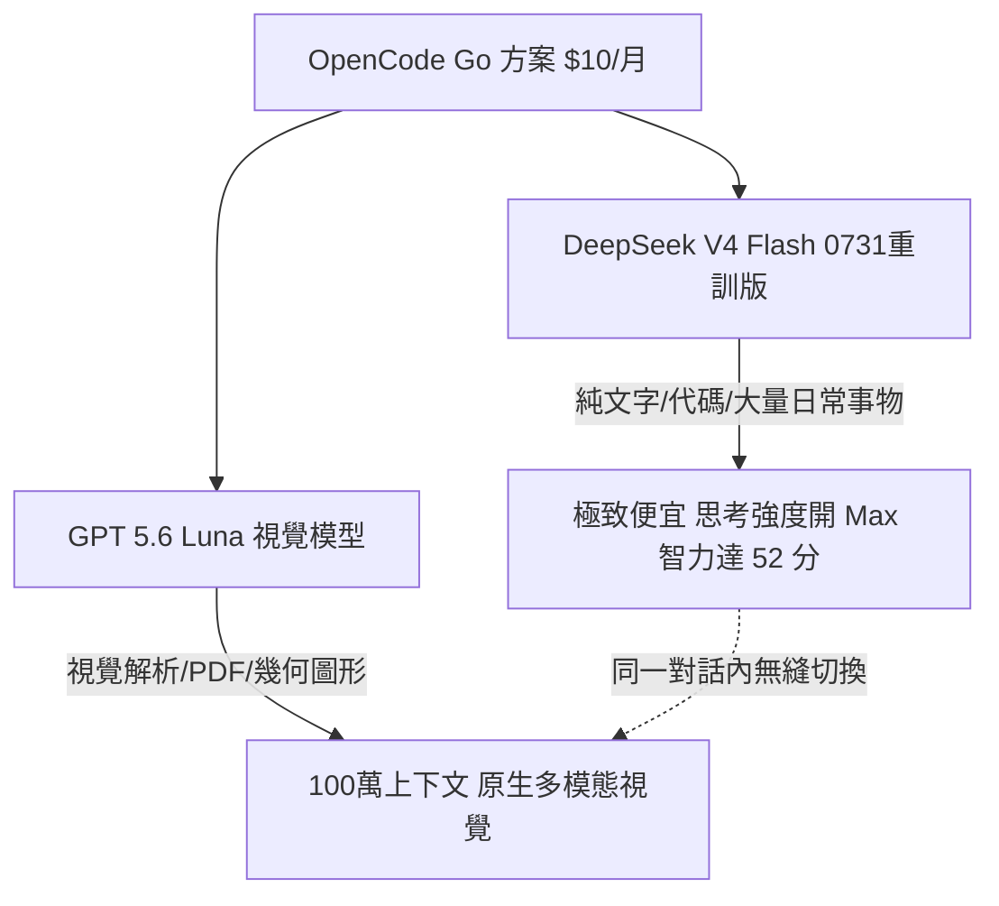

# OpenCode 新版架構與模型最佳搭配指南

## 概述與定位

**OpenCode Desktop** 是一款極具彈性且高性價比的跨平台 AI Agent 開發環境。與 Claude Code、Codex 等強綁定單一廠商模型體系的工具不同，OpenCode 的核心優勢在於：**支援在同一個對話 Session 中隨時自由切換各家頂級商業模型，並允許無縫掛載本地端模型 (Local LLM)**。

在最新版本（EP07 完全體）中，OpenCode 推出了高性價比的 **Go 方案**（每月 $10 美元換取高達 $60 美元的額度），並以 **DeepSeek V4 Flash（重新訓練版）** 與 **GPT 5.6 Luna** 組成黃金搭檔，配合「以時間換取智力」的思考強度配置，提供了極致省錢且強悍的 Agent 開發體驗。

---

## 一、雙模型黃金組合與計費機制



### 1. 模型特性對比

| 模型名稱 | 類別與定位 | 上下文窗口 | 核心優勢與適用場景 |
| :--- | :--- | :---: | :--- |
| **DeepSeek V4 Flash**<br>*(0731 重新訓練版)* | 文本 / 代碼主力 | **100 萬** | 極度便宜且聰明。適合處理大量常規任務、重構代碼、日常文本生成。 |
| **GPT 5.6 Luna** | 原生多模態視覺 | **100 萬** | 西方商業模型中 CP 值第一名。原生支援圖片、PDF 幾何圖形與視覺介面解析。 |

### 2. 計費與 2X Usage 解析
- **Go 方案額度分佈**：每月 $10 享有 $60 總用量（每週 $30 額度、5 小時滾動 $12～15 額度）。
- **2X Usage 標記**：因 DeepSeek V4 Flash 與 Luna 需向原廠伺服器採購，OpenCode 在特定方案下標註 2X Usage（相當於折算為 $30 實質額度），但因模型本身單價極低，日常重度使用仍幾乎用不完。

---

## 二、「以時間換智力」思考強度配置哲學

在 AI Agent 時代，商業模型智力水準已普遍大幅提升，處理例行事務無需盲目使用高價模型（如 GPT SOL 5.6 或 Claude Opus 5）：

```
【成本與智力換算】
• GPT 5.6 SOL (思考強度 Max)：智力 58～59 分（基準成本 100%）
• GPT 5.6 Luna (思考強度 Max)：智力 52 分（成本僅 SOL 的 1/30）
• DeepSeek V4 Flash (思考強度 Max)：智力 52 分（成本僅 SOL 的 1/100）
```

> [!TIP]
> **日常省錢心法**：選用平價模型（DeepSeek V4 Flash 或 Luna），將 **思考強度 (Thinking Budget) 開至 Max 或 X-High**，讓模型多思考數秒鐘，即可用幾十分之一的成本換取逼近頂級大模型的推理表現。

---

## 三、兩大免費外掛技能 (Skills) 實戰

### 1. `image-vision-sidecar`：為 DeepSeek 裝上眼睛
- **GitHub 倉庫**：`mathruffian-dot/image-vision-sidecar`
- **原理**：利用 Groq 提供之免費 Vision API 擔任視覺前處理 Sidecar。當使用純文字的 DeepSeek V4 Flash 時，若遇到 PDF 包含幾何圖形或圖片，自動呼叫 Groq 解析圖形特徵並轉為精準文字描述傳回 DeepSeek。
- **實測效果**：精準辨識國中會考數學試卷之幾何三角形角度與頂點條件。

### 2. `opencode-draw-free`：免費生圖與繁中文字壓印
- **GitHub 倉庫**：`mathruffian-dot/opencode-draw-free`
- **原理**：將繪圖提示詞派發至免費用生圖平台繪製，下載至本機後自動載入思源黑體 (Source Han Sans) 粗體字，於指定對話框位置壓上**繁體中文對話泡泡**。
- **適用場景**：教師研習教材配圖、漫畫教材生成、免 API Key 零成本出圖。

---

## 四、OpenCode 核心優勢總結
1. **跨模型熱切換**：在同一個對話中，可先用 Luna 解析截圖，再切換至 DeepSeek 撰寫代碼，最後切換至其他模型進行交叉審查 (Code Review)。
2. **支援本地模型 (Local LLM)**：可直接串接本機 [[Ollama]] 運行的 [[Qwen 3.8 本地模型部署與企業 ROI 實務|Qwen 3.8]] 等私有模型，彈性超越封閉式 Agent。

---

## 關聯頁面
- `[[AI 工具與框架概覽]]`
- `[[AI Agent 基本功系列實踐指南 (EP01-EP07)]]`
- `[[Qwen 3.8 本地模型部署與企業 ROI 實務]]`
- `[[Claude Cowork 與 Agent Skill 實務]]`
