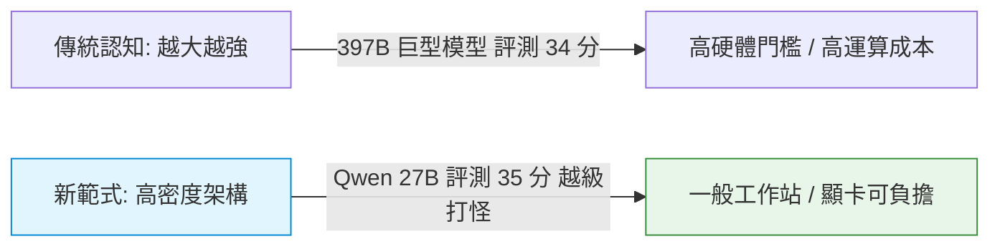

# Qwen 3.8 本地模型部署與企業 ROI 實務

## 概述與核心破局

在開源本地大語言模型 (Local LLM) 生態系中，**阿里巴巴通義千問 (Qwen 3.8)** 系列的發布引發了產業與社群的巨大震動。其中，**Qwen 3.8-27B** 再次打破了「模型參數越大越聰明」的傳統迷思——在多項權威基準評測中，高密度訓練與先進注意力機制的 27B 模型，表現竟超越了參數大上十餘倍的 397B 巨型模型。

這項突破為中小企業帶來了關鍵轉捩點：企業無需購置動輒數百萬的運算機房，即可在**本地端 (On-premise)** 運行具備頂級推理能力的 AI，兼顧**資料安全（機密財報、客戶個資、未公開程式碼不出公司）**與**可負擔的硬體 ROI**。

---

## 一、越級打怪之機制：資料密度與架構效率



- **高密度神經元表徵**：透過更洗鍊的高品質合成數據、密集訓練與改良的 Attention 機制，讓 27B 模型在有限的參數規模內精確捕捉複雜邏輯。
- **黃金交叉平衡點**：27B 具備接近頂級大模型的推理與編程能力，且體積剛好能藉由技術優化放入單張中高階顯示卡（如 24GB 顯存）甚至深度量化擠進 16GB 設備。

---

## 二、本地硬體極限優化技術棧

針對有限的顯示卡記憶體 (VRAM) 與推論速度瓶頸，開源社群提供了四大關鍵落地技術：

### 1. GGUFF 量化技術 (Quantization)
- **原理**：將原本高精度浮點數（如 FP16）壓縮至低精度（如 4-bit、3-bit 量化），犧牲極微小精準度，換取高達 50%～70% 的顯存縮減。
- **效果**：使 24GB 顯存設備能極為流暢地加載 27B 模型，16GB 設備亦可透過深度量化運行。

### 2. MInference 推理加速引擎
- **解決痛點**：克服量化後模型生成緩慢（逐字預測等待過久）的商用障礙。
- **實測效能**：透過優化計算圖與投機解碼機制，在實測中達到每秒 **550～650 Tokens** 的驚人吞吐速度，支援零延遲即時互動。

### 3. llama.cpp 緩衝區優化 Patch
- **AMD ROCm / Vulkan 支援**：最新 Patch 釋放了中轉緩衝區佔用的無效記憶體，將更多 VRAM 留給**上下文視窗 (Context Window)**，讓本地模型能一次分析數十頁法律合約或財報長文而不爆顯存。

### 4. 單機 vs. 多人併發框架選型
- **單機/開發者自用**：首選 `llama.cpp` 或 [[Ollama]]，輕量簡便。
- **企業多人團隊服務**：首選 `vLLM` 框架，具備 PagedAttention 與高效 KV Cache 共享機制，支援數十名員工同時併發查詢。

---

## 三、企業 AI 導入之 ROI 決策哲學

```
【盲目追求大模型之誤區】
企業需求：自動回覆客服日常 Email（現貨、運費、基本問答）
錯誤配置：租用 2.4 兆參數 (2.4T Max) 雲端模型 $\rightarrow$ 成本過高、殺雞用牛刀
正確配置：地端部署 Qwen 3.8-27B（或 9B/7B 量化版）$\rightarrow$ 零雲端 API 成本、資安 100%
```

> [!IMPORTANT]
> **在商業實務上，「剛好」才是最好**：
> 1. **資料安全第一**：金融、醫療與高階製造業之核心資料不可外流至公有雲。
> 2. **計算投入產出比 (ROI)**：工程師的價值不在於抱怨硬體不夠，而在於善用量化、MInference 與 vLLM 等生態工具，將公司現有硬體榨出 120% 效能，打造實質獲利的內部 AI 解決方案。

---

## 關聯頁面
- `[[AI 工具與框架概覽]]`
- `[[生成式 AI 企業應用與成本經濟學]]`
- `[[Ollama]]`
- `[[OpenCode 新版架構與模型最佳搭配指南]]`
