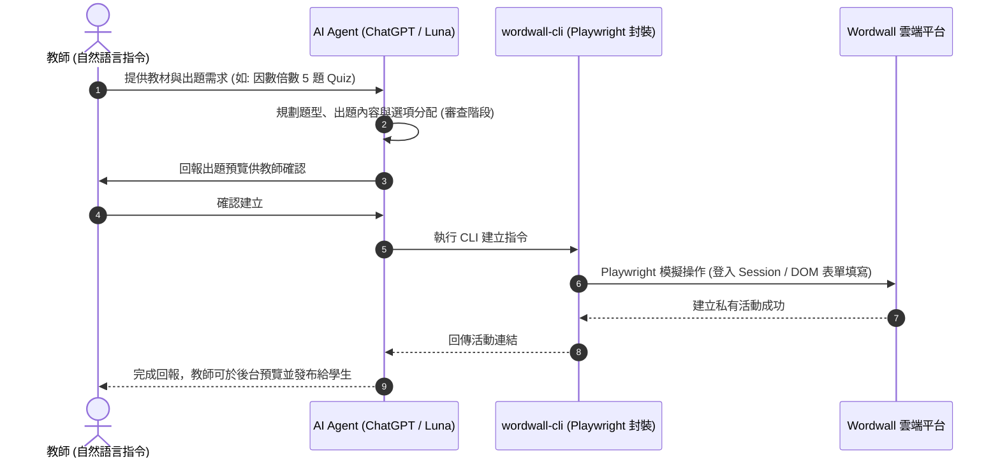

# Wordwall 與教育科技的 AI Agent 自動化實務

## 概述與核心挑戰

在教育科技應用中，許多廣受師生喜愛的互動教學平台（如 **Wordwall**、**LoiLoNote**、**Wayground**、**Quizizz**、**Kahoot**）並未提供公開 API 或官方 MCP 接口。傳統上，教師出題時必須手動逐題複製貼上；一旦想切換題型或重整題目，又必須重覆繁複的工序。

透過 **Playwright 瀏覽器自動化** 技術將網站操作封裝為命令列工具（如 `wordwall-cli`），AI Agent（如 ChatGPT、[[Claude]] Code 或 [[OpenCode 新版架構與模型最佳搭配指南|OpenCode]]）能夠直接模擬人類在瀏覽器上的行為：**「自動開啟網頁 $\rightarrow$ 登入驗證 $\rightarrow$ 選擇模板 $\rightarrow$ 填寫題幹與選項 $\rightarrow$ 儲存與發布」**，實現「將現有教材交給 Agent，全自動生成 30 種互動遊戲」的高效工作流。

---

## 一、AI Agent 操作無 API 平台之架構原理

### 為什麼不自己寫遊戲網站？
1. **資料庫費用與維護**：自行開發並託管互動遊戲需串接 Firebase 或 Supabase，多人同時連線時將產生高額資料庫讀寫費用。
2. **重用成熟生態**：直接利用 Wordwall 現成的遊戲樣式、排行榜與多樣化模板，將資料庫與運算負擔留給平台廠商。

---

## 二、Wordwall 3 級出題模式與 8 大自動化題型

### 1. 三級出題模式演進

| 出題等級 | 模式名稱 | 特點與適用科目 | 技術細節 |
| :---: | :--- | :--- | :--- |
| **Level 1** | **純文字出題** | 最基礎、速度最快。適用於國語文、英文單字句型、歷史事件排序等。 | 題目與選項皆為純文字，透過 DOM 文字輸入框快速注入。 |
| **Level 2** | **考卷截圖出題** | **理科神器**。適用於數學幾何圖形、坐標系、理化實驗電路圖及會考歷屆考卷。 | 題目採用考卷截圖（精確還原根號與圖形），選項維持文字 ABCD。 |
| **Level 3** | **AI 生圖出題** | 視覺解謎、角色情境、歷史地圖、遮擋找錯與型態變化。 | 透過 AI 生成特定風格題目圖，或圖片與圖片互相配對。 |

### 2. 支援之 8 大題型
1. **Quiz 選擇題家族**（標準選擇、迷宮追逐、飛機射擊）
2. **Match up 配對題**（文字對文字、圖文配對）
3. **Random Wheel 隨機輪盤**
4. **True or False 是非判斷**
5. **Group Sort 分類題**（概念與圖片分組）
6. **Cloze 句子填空**
7. **Flip Tiles 翻牌模式**
8. **Labelled Diagram 標籤定位圖**

---

## 三、教學現場資安與 Token 節省實戰

### 1. 學生個資與去識別化安全守則
- **班級座號原則**：派發遊戲作業給學生時，**嚴格要求學生僅輸入「班級座號」（例如：`70105`），禁止輸入真實姓名**。
- **成績下載隱私**：教師透過 Agent 下載成績資料時，資料不含個人可識別資訊 (PII)，確保符合校園資訊安全與去識別化規範。

### 2. Token 節省與模型選用
- **Luna 搭配最大推理強度**：在 ChatGPT 中選用 `GPT 5.6 Luna` 模型並將「推理強度」開至最大，其智力表現逼近頂級 Thinking 模型，但 Token 消耗成本僅約三十分之一，兼具高智力與極低開銷。

---

## 四、多 Agent 段考出題自動化實戰（三師爸直播示範）

除了 Wordwall 遊戲化出題，另一種更直接的教育科技自動化場景，是**用 AI Agent 直接生成 Word 格式的正式段考試卷**，解決數學科出題兩大長年痛點：方程式編輯器排版、幾何圖形繪製。

### 1. 核心工作流：教材索引 → 舊卷格式 → 出題提示詞

1. **教材準備**：下載書商備課用書 PDF（課本＋習作），並準備一份自己出過的舊段考試卷作為格式範本。
2. **建立共享索引**：請 Agent 讀完所有教材與舊卷後，各產出一份 `Markdown` 索引檔——「教材檔案索引」與「考卷格式規格」，供專案內所有 Agent 共用，避免每次都要重新說明格式。
3. **確認考卷規格**：以 **Bloom 認知層次**（記憶、理解、應用、分析）控制整份考卷的難度分布；數學方程式使用 **OMML** 格式（Word 內可編輯），幾何圖形則由 Agent 以 Python 現場計算、繪圖後直接插入 Word。
4. **生成統一出題提示詞**：請最聰明的模型先產出一份完整的出題提示詞（含難度分布、方程式格式、圖形處理方式），再讓多個 Agent 共用同一份提示詞平行生成，確保結果具可比較性。
5. **三件套輸出**：Word 三件套——題目卷、答案卷、教師解答，並自動附上命題雙向細目表；教師只需專注在最後的審題與細修，省去「從 0 到 1」找題庫、改數字、調圖形的重複工時。

### 2. 三家 Agent 實測比較

| Agent / 模型 | 表現與特色 |
| :--- | :--- |
| **AntiGravity**（Gemini 3.8 Flash） | 生成速度最快、非選題品質最高（作者評估完成度約 80 分）。 |
| **Codex**（Astra） | 幾何圖形最精準，可直接輸出 SVG 向量圖；適合需要 AI 生圖（情境圖、地理／歷史圖片）的科目。作者已將主力 Agent 由 [[Claude]] Code 轉為 Codex。 |
| **[[OpenCode 新版架構與模型最佳搭配指南\|OpenCode]]**（Muse Spark 1.3 Free） | 免費模型（Meta），具 100 萬上下文與多模態能力，出圖與排版效果令人驚艷；代價是對話紀錄會被用於訓練資料，不建議輸入隱私內容。 |

### 3. 延伸應用：Math Review Deck 互動複習網頁技能

作者將「國中數學全六冊互動視覺化複習網頁」框架整理成公開 GitHub 技能 **Math Review Deck**：左側概念說明、右側可拖拉滑桿的視覺化圖形，內建畫筆、雷射筆、橡皮擦等課堂教具，數學方程式以 `MathML` 格式正確顯示於網頁。此技能可讓其他科目教師直接套用或「魔改」成自己科目的複習教材。

### 4. 核心觀點：AI Agent 是專業能力的放大器

> [!TIP]
> 教師必須帶著自己的教學專業（如難度分布邏輯、出題格式慣例）去與 Agent 對話，而非空泛提問；唯有輸入具備專業洞察的提示詞，才能換得真正有價值、可直接使用的產出（**Garbage in, garbage out**）。

---

## 關聯頁面
- `[[AI Agent 基本功系列實踐指南 (EP01-EP07)]]`
- `[[Chrome Skills 與瀏覽器自動化實務]]`
- `[[AI Agent 實戰與 MCP 伺服器整合]]`
- `[[OpenCode 新版架構與模型最佳搭配指南]]`
- `[[Claude]]`
- `[[軟體架構與發布自動化]]`（OMML 格式規格）
