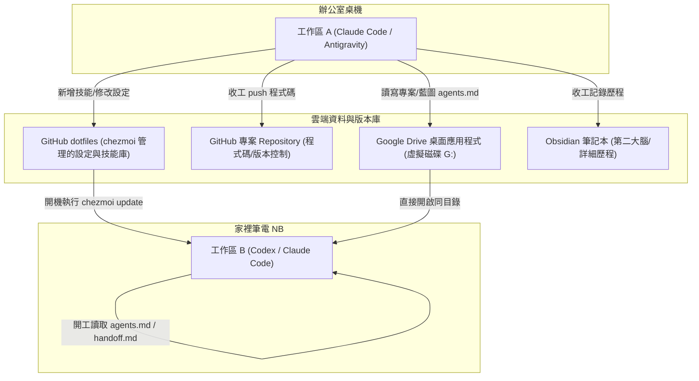

**chezmoi** 是一個非常強大且受歡迎的 **dotfiles（設定檔）管理工具**。

簡單來說，如果你有多台電腦（例如公司筆電、家裡桌機、伺服器），或者經常需要重灌系統，它可以幫你把 Linux/macOS/Windows 上的各種個人化設定（如 `.bashrc`、`.zshrc`、`.vimrc`、Git 設定、甚至 Cursor/VS Code 的設定）安全、跨平台地同步與備份。

以下是 chezmoi 的核心優勢與運作邏輯：

### 核心優勢

- **集中管理與 Git 同步：** chezmoi 會在你的家目錄（`~`）之外，建立一個專屬的本地 Git 儲存庫（預設在 `~/.local/share/chezmoi`）。你可以把這個儲存庫推送到 GitHub/GitLab 等私有或公開機關。
    
- **強大的範本機制（Templates）：** 如果你不同的電腦有不同的需求（例如公司電腦用 A 帳號，私人電腦用 B 帳號），chezmoi 支援使用 Golang text/template 語法，讓同一份設定檔在不同機器上自動生成不同的內容。
    
- **密碼與隱私安全（Secrets Management）：** 這是它超越傳統直接用 Git 管理 dotfiles 的地方。它支援整合各種密碼管理器（如 1Password、Bitwarden、KeePassXC 等）或加密工具（`gpg`、`age`），讓你不會不小心把 API 金鑰或私鑰公開到 GitHub 上。
    
- **跨平台支援：** 不管是 Linux、macOS 還是 Windows (PowerShell/CMD)，都能用同一套邏輯管理。
    

### 基本運作邏輯與常用指令

chezmoi 的運作是「單向覆蓋」的，它在背後維護一份「黃金標準（Source state）」，然後將其應用（Apply）到你的實際家目錄中。

#### 1. 初始化

Bash

```
# 在本地初始化 chezmoi 的儲存庫
chezmoi init
```

#### 2. 開始追蹤設定檔

如果你想管理你的 `.bashrc` 或某個設定檔：

Bash

```
# 這會把檔案複製一份到 chezmoi 的管理目錄中
chezmoi add ~/.bashrc
```

#### 3. 修改設定檔

當你想修改設定時，**不要**直接改 `~/.bashrc`，而是改 chezmoi 管理的版本：

Bash

```
# 這會用你設定的編輯器（如 VS Code、Vim）打開 chezmoi 內部的檔案
chezmoi edit ~/.bashrc
```

#### 4. 應用變更

修改完後，將變更套用到實際的家目錄：

Bash

```
# 查看有哪些差異
chezmoi diff

# 確認沒問題後，應用到系統中
chezmoi apply
```

#### 5. 跨機器同步

當你要在新電腦上復原你的環境時，只需要一行指令（結合了下載、初始化與套用）：

Bash

```
# 替換成你自己的 GitHub 帳號與儲存庫
chezmoi init --apply https://github.com/username/dotfiles.git
```

如果您目前正打算整理多台開發設備的環境、自動化部署工具鏈，或者想找一個乾淨、不污染系統家目錄的設定檔管理方案，chezmoi 是目前（特別是開發者社群中）最推薦的現代化工具之一。

您是有特定的設定檔（例如 Zsh、Git 或特定的 IDE 設定）想要用它來管理嗎？

---
**chezmoi** 是一個專門用來管理點檔案（dotfiles，也就是系統與軟體的各種設定檔，如 `.bashrc`、`.zshrc`、`.gitconfig` 等）的命令列工具。

在三師爸的 AI Agent 自動化與跨電腦協作觀念中，它是用來同步不同電腦之間的「全域設定」與「AI 技能說明書」的核心工具。它的運作邏輯是單向覆蓋的：它會在背後維護一份「黃金標準設定（Source state）」，當你執行更新或套用時，它才會把這些設定覆蓋到你電腦實際的家目錄。

以下是 chezmoi 的安裝方式與基本初始化流程：

### 如何安裝 chezmoi？

根據你使用的作業系統，可以透過各自的套件管理器快速安裝：

#### 1. macOS / Linux

如果你有安裝 **Homebrew**，這是最推薦且最快的方式：

Bash

```
brew install chezmoi
```

_(如果是 Linux 且沒有 Homebrew，也可以使用 `sudo apt install chezmoi` 或官方的一鍵安裝腳本：`sh -c "$(curl -fsLS get.chezmoi.io)"`)_

#### 2. Windows

如果你使用 Windows，建議透過 **PowerShell** 並使用 **winget** 或 **Scoop** 安裝：

PowerShell

```
# 使用 winget 安裝
winget install twpayne.chezmoi

# 或者使用 Scoop 安裝
scoop install chezmoi
```

### 安裝後的快速基本設定

安裝完成後，通常會經過以下三個步驟來開始使用它：

#### 第一步：在本地初始化

在你的主力電腦上，開啟終端機執行初始化。這會在你的電腦裡建立一個隱藏的本地倉庫（預設在 `~/.local/share/chezmoi`）：

Bash

```
chezmoi init
```

#### 第二步：將現有的設定檔納入管理

把你想要同步的設定檔（例如 Zsh 設定檔或你的 AI 技能設定檔）「加」進 chezmoi 的黃金標準中：

Bash

```
chezmoi add ~/.zshrc
```

#### 第三步：套用與同步

未來當你在別台電腦上，想要一鍵下載並套用你在 GitHub 上備份好的這套設定時，只需要執行這行指令，它就會自動下載並完成安裝與套用：

Bash

```
chezmoi init --apply https://github.com/你的GitHub帳號/你的dotfiles儲存庫名稱.git
```

這樣一來，不論你換到哪一台電腦，只要執行 `chezmoi update` 或是 init 套用，所有電腦的開發環境與設定就會完全同步一致了。
---
雖然我身為 AI 無法直接即時播放或深入爬梳 YouTube 影片的完整語音逐字稿，但「三師爸（3PhPa）」在推廣現代開發者工具（特別是與系統自動化、點檔案管理、Linux/macOS 環境建置相關）的系列影片中，對於 **chezmoi** 的說明與核心使用心法，主要圍繞在以下幾個關鍵痛點與解決方案：

### 1. 為什麼三師爸推薦 chezmoi？（為了解決什麼痛點）

在介紹 chezmoi 之前，傳統上大家管理 `dotfiles`（點檔案）不外乎是用軟連結（`ln -s`）配合 Git，或者寫複雜的 Shell 腳本。三師爸通常會指出這些做法的缺點：

- **多台電腦環境不同：** 公司筆電、家裡桌機、雲端 VPS 用的路徑或軟體版本不同，傳統 Git 點檔案很難做到「一份設定，因地制宜」。
    
- **私密資料外洩風險：** 點檔案裡常有 Git 憑證、API Token、甚至是個人私鑰，直接推上公開的 GitHub 儲存庫等於暴露在風險中。
    

三師爸推薦 chezmoi 的原因，就是因為它完美解決了上述兩個問題。

### 2. 核心觀念：單向同步與範本化

三師爸在說明 chezmoi 時，會特別強調它的「黃金標準（Source State）」概念。

- **不要直接改 `~/.zshrc`：** 你的家目錄是「目的地」，chezmoi 的隱藏目錄才是「原始碼」。
    
- **強大的 Template 變數：** 這是他非常推崇的功能。透過 `chezmoi.toml` 定義不同機器的變數（例如 `is_work_pc = true`），就可以在同一個 `.zshrc` 範本檔案裡寫 `{{ if .is_work_pc }} 載入公司環境變數 {{ end }}`。這樣一來，所有電腦都共用同一個 dotfiles 專案，卻能自動長出不同的設定內容。
    

### 3. 三師爸風格的實戰使用流程

在教學中，通常會示範以下最流暢的自動化工作流：

#### 第一步：初始化與推上 GitHub

在主力工作電腦上將現有的設定檔納入管理，並建立遠端備份。

Bash

```
# 初始化並追蹤重要設定
chezmoi init
chezmoi add ~/.zshrc
chezmoi add ~/.config/git/config

# 進入 chezmoi 的本地儲存庫，把它推上自己的 GitHub 私人或公開 repo
chezmoi cd
git id
git add .
git commit -m "feat: init dotfiles with chezmoi"
git remote add origin <你的_github_dotfiles_網址>
git push -u origin main
```

#### 第二步：日常修改（關鍵習慣）

三師爸會提醒，習慣必須改變。想調整設定時：

Bash

```
# 使用 chezmoi edit 來修改，它會自動呼叫你的 VS Code 或 Vim
chezmoi edit ~/.zshrc

# 查看修改了什麼（像 git diff）
chezmoi diff

# 確定沒問題，覆蓋回實際的家目錄
chezmoi apply
```

#### 第三步：新電腦「一鍵流」復原環境

這是整個工具最迷人的地方。當換了新電腦，或是要幫遠端伺服器建置環境時，不需要先 clone 專案再複製，只要這行指令：

Bash

```
# 一行指令：下載、初始化、並直接套用設定
chezmoi init --apply https://github.com/your_username/dotfiles.git
```

_(如果儲存庫是私有的，過程中會提示輸入 GitHub 的帳號密碼或 Token)_

### 4. 進階整合：隱私與套件管理

除了基本操作，三師爸在討論精緻的開發環境時，往往還會延伸提到：

- **密碼管理器整合：** 結合 1Password 或 Bitwarden 的 CLI 工具。在 chezmoi 的範本裡寫 `{{ bitwarden "item" "my-api-key" }}`，執行 `chezmoi apply` 時才會動態把密碼填入，不留痕跡。
    
- **搭配套件管理（如 Homebrew）：** 結合 `chezmoi` 與 `Brewfile`（或其他一鍵安裝腳本），實現連軟體、字體、終端機工具（如 Starship, zsh-autosuggestions）都能在新電腦上「從無到有」完全自動化複製。
    

如果你正打算參考他的影片來實作，建議可以先拿一個最簡單的 `.zshrc` 或 `.gitconfig` 開始做 `chezmoi add` 測試，等熟悉了單向同步（`edit` -> `diff` -> `apply`）的節奏後，再加入 Template 的進階玩法！


https://www.youtube.com/watch?v=mnFdJaAmeUM&t=47s

###chezmoi 是什麼?

chezmoi 是一個「設定檔(dotfiles)管理工具」。它解決的問題是:你有兩台以上的電腦,都想要有同一份 -/.claude/CLAUDE.md settings.json、skills等設定檔,但這些檔案散落在家目錄各處,不方便直接整個用git 管理。
它的運作方式可以想成「設定檔的正本倉庫」: 
1. 它在-/.local/share/chezmoi 維護一份「來源正本」,這個資料夾本身是一個git repo(你的是推到GitHub 的 mathruffian-dot/claude-config)。
2. 你用 chezmoi add ~/.claude/CLAUDE.md 把某個設定檔納入管理→它會複製一份進正本倉庫。 
3. 在另一台電腦執行 chezmoi update →它會從 GitHub 拉最新正本,再把檔案「套用」回那台電腦的實際位置。
也就是說:實際生效的檔案在家目錄,正本在chezmoi 的git repo,兩邊靠add(收進去)和apply/update(放出來) 同步。這正是你 CLAUDE.md 裡「收工」流程做chezmoi status → chezmoi add commit push以及登入腳本做 chezmoi update 的原因。 
你平常會用到的指令就這幾個: Thank you.|
|指令|做什麼|
|chezmoi status |看哪些被管理的檔案和正本不一致 |  
|chezmoi add |<檔案> 把新檔案(或改過的檔案)收進正本 | 
|chezmoi update |從 GitHub 拉最新設定並套用到本機 | 
|chezmoi cd |進入正本repo目錄、做 git commit/push | 
(順帶一提,剛剛 chezmoi status 顯示的兩行R是兩個同步用的.cmd腳本,意思是下次 chezmoi apply 時會執行它們,不是檔案有問題。)
在另一台電腦怎麼安裝? 
Windows 11 上最簡單的方式是用內建的winget,開 PowerShell 執行: 
 ==winget install twpayne.chezmoi== 

---

### 2026-09-16 跨電腦與多 Agent 全域規範同步實務（三師爸配置備忘）

為使公司電腦與家裡筆電（NB）在 Antigravity、Claude Code、Codex 三大 AI 工具下皆具備完全一致的行為（包含「開工」、「收工」、「Edge-TTS 語音播放」與「語音錯字善意還原」），採用了 `chezmoi` 範本與 GitHub 儲存庫進行多端自動分發：

1. **GitHub 設定庫**：`https://github.com/niceheadwkt/dotfiles.git`
2. **多 Agent 規則分發與對應路徑**：
   - **Antigravity (CLI / IDE)**：`dot_gemini/config/AGENTS.md.tmpl` $\rightarrow$ `~/.gemini/config/AGENTS.md`
   - **Claude Code (CLI / IDE)**：`dot_claude/rules/global-rules.md.tmpl` $\rightarrow$ `~/.claude/rules/global-rules.md`
   - **Codex (CLI / IDE)**：`dot_codex/AGENTS.md.tmpl` $\rightarrow$ `~/.codex/AGENTS.md`
3. **跨電腦路徑自適應**：
   - 範本中全面採用 `{{ .chezmoi.homeDir }}`，解決公司電腦（`C:/Users/ch26788`）與家裡筆電不同使用者名稱問題。
4. **家裡 NB 常用同步指令**：
   - 第一次設定（若尚未初始化）：
     `chezmoi init --apply niceheadwkt/dotfiles`
   - 平常同步（拉取公司最新設定）：
     `chezmoi update`

---

### 附錄：AI Agent 基本功 EP06 跨 Agent、跨電腦協作同一個專案 核心摘要

> **來源影片**：[AI Agent 基本功 EP06 跨 Agent、跨電腦協作同一個專案，設定觀念一次到位](https://www.youtube.com/watch?v=mnFdJaAmeUM&t=47s)（講師：三師爸 Sense Bar）  
> **原始逐字稿**：[[AI/raw/2026-07-20T203320+0800-AI Agent 基本功 EP06 跨 Agent、跨電腦協作同一個專案，設定觀念一次到位.md]]

#### 一、核心痛點與架構解法
當開發者有多台電腦（如公司桌機與隨身筆電）、或在同一台電腦中使用多個 Agent（如 Claude Code、Codex、ChatGPT App、AntiGravity、OpenCode）時，面臨兩大核心問題：
1. **專案進度與程式碼如何即時共享？**
2. **AI 的技能（Skills）與全域設定（Global Settings）如何自動同步？**



---

#### 二、三大核心支柱與配置心法

##### 1. 雲端專案工作空間（必須使用「雲端硬碟桌面應用程式」）
- **致命誤區**：不能使用瀏覽器版網頁雲端硬碟。
- **正確做法**：安裝 Google Drive 電腦版客戶端（虛擬出 G: 槽或同步資料夾），將專案資料夾直接建立在雲端磁碟中。
- **效益**：所有本機 Agent 以及不同電腦上的 Agent 均直接讀寫同一個本機鏡像目錄，程式碼與產出即時在背景同步。
- **防坑技巧（大型讀寫限制）**：Google 雲端硬碟若遭遇密集頻繁讀寫可能會短暫阻擋。Agent 通常會先在 `C:\` 槽暫存目錄完成大批次運算，再複製回雲端硬碟。

##### 2. 全域設定與技能同步器（`chezmoi`）
- **本質**：`chezmoi` 是管理設定檔正本的倉庫（以 Git 儲存於 `~/.local/share/chezmoi` 並託管於 GitHub）。
- **日常操作心法**：
  - **這台電腦改了設定/新增 Skill**：告知 Agent 或手動執行 `chezmoi add <檔案>`，並提交推送到 GitHub。
  - **另一台電腦同步**：只需執行一行 `chezmoi update`，立刻拉取最新技能與設定並覆蓋到正確位置。
- **跨 Agent 技能共享**：Skill 本質上就是 Markdown 說明文件，在一個 Agent 寫好後，可要求 Agent 自動複製到其他 Agent 的 skills 目錄，或透過 chezmoi 統一分發。

##### 3. 專案生命週期三部曲（初始化 $\rightarrow$ 開工 $\rightarrow$ 收工）
一套標準的 Agent 專案協同依賴三個核心技能：

| 階段 | 技能名稱 | 核心動作與檔案產出 |
| :--- | :--- | :--- |
| **建案** | **專案初始化** (`init-project`) | 1. 訪談並釐清專案目標。<br>2. 自動產出專案藍圖 `agents.md`（或 `CLAUDE.md`）。<br>3. 建立 `.gitignore` 隔離敏感資訊。<br>4. 視需求關聯 GitHub Repo 與 Obsidian 第二大腦目錄。 |
| **作業** | **開工** (`start-work`) | 1. 讀取專案藍圖 `agents.md`，釐清專案全貌。<br>2. 檢查 Git 狀態（本地改動與遠端是否有新 Commit）。<br>3. 讀取前次留下的「上次做到哪」與「下一步」。 |
| **交接** | **收工** (`finish-work`) | 1. 提交專案 Git 變更並 Push。<br>2. 檢查並同步 `chezmoi` 設定與技能。<br>3. 更新 Obsidian 工作筆記歷程。<br>4. 更新 `agents.md` 中的最新進度。 |

---

#### 三、跨 Agent 交接的終極武器：`handoff.md`（交接檔）
當一個 Agent 額度用盡、或是想派另一個 Agent（如用 ChatGPT App 審核 Claude Code 的程式碼）接手時：
- **作法**：在收工前要求 Agent 產出 `handoff.md`。
- **內容必備**：
  1. 目前完成項目與被中斷的位置。
  2. 接手 Agent 必須執行的精確「下一步清單」。
  3. 已知限制、注意事項與除錯備註。
- **接手流程**：接手的 Agent 進到同一個專案目錄後，直接讀取 `agents.md`（專案藍圖）與 `handoff.md`（交接指令），即可無縫延續工作，完全不遺失上下文細節！
 
